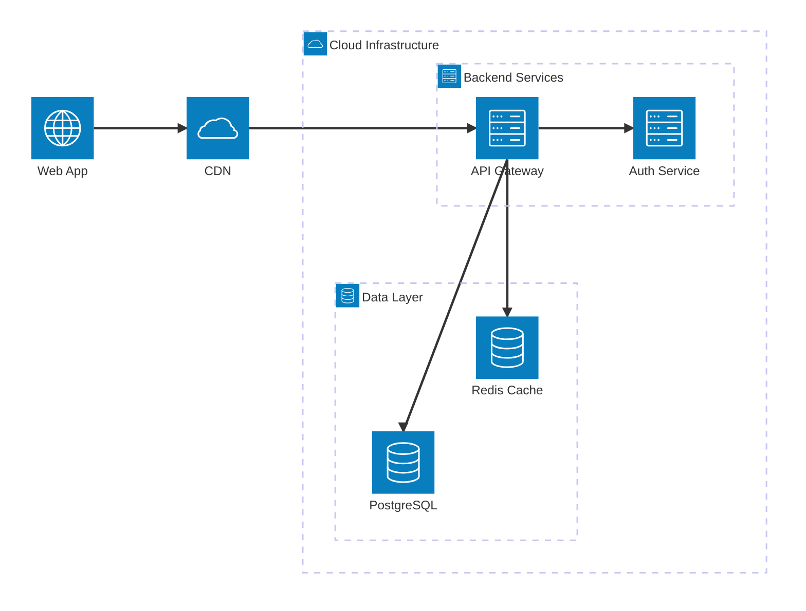
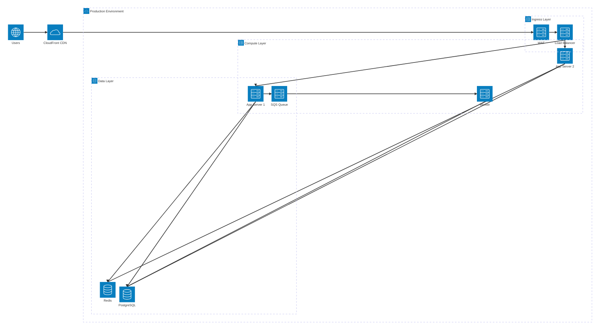

# Mermaid Architecture Diagram Reference

Architecture diagrams visualize system infrastructure with groups, services, and connections using directional ports. Available since mermaid v11.1+.

---

## Directive

```mermaid
architecture-beta
```

The `architecture-beta` directive is required. The "beta" suffix indicates this diagram type is still evolving.

---

## Complete Example



---

## Services

Services are the primary nodes in architecture diagrams. Each service has an icon, a label, and optionally belongs to a group.

### Syntax

```
service <id>(<icon>)[<label>]
service <id>(<icon>)[<label>] in <group-id>
```

### Built-in Icons

| Icon       | Description                    |
| ---------- | ------------------------------ |
| `cloud`    | Cloud/cloud service            |
| `database` | Database/data store            |
| `disk`     | Disk/file storage              |
| `internet` | Internet/globe/external access |
| `server`   | Server/compute instance        |

### Examples

```
service api(server)[API Server]
service db(database)[PostgreSQL]
service files(disk)[File Storage]
service web(internet)[Public Website]
service aws(cloud)[AWS]
```

---

## Groups

Groups visually contain services and other groups, representing boundaries like cloud regions, VPCs, or logical tiers.

### Syntax

```
group <id>(<icon>)[<label>]
group <id>(<icon>)[<label>] in <parent-group-id>
```

### Nesting

Groups can be nested inside other groups to represent hierarchical infrastructure:


### Group Without Icon

Groups can omit the icon:

```
group backend[Backend Services]
```

---

## Connections

Connections link services through directional ports.

### Syntax

```
<service-id>:<port> --> <port>:<service-id>
<service-id>:<port> -- <port>:<service-id>
```

- `-->` creates a directed (arrow) connection
- `--` creates an undirected (plain line) connection

### Port Directions

| Port | Direction |
| ---- | --------- |
| `L`  | Left      |
| `R`  | Right     |
| `T`  | Top       |
| `B`  | Bottom    |

The port before `-->` is the source port, the port after is the target port. Choose ports that match the visual layout to produce clean, non-overlapping lines.

### Connection Examples

```
%% Left-to-right flow
web:R --> L:api

%% Top-to-bottom flow
api:B --> T:db

%% Bidirectional (undirected)
service1:R -- L:service2

%% Right-to-left (reverse direction)
response:L --> R:client
```

### Layout Tips

- Use `L` and `R` ports for horizontal flows
- Use `T` and `B` ports for vertical flows
- Keep port directions consistent across the diagram for cleaner routing
- The layout engine positions services based on connections -- place related services in the same group for better results

---

## Additional Icons with Icon Packs

Beyond the five built-in icons, you can use icons from [Iconify](https://iconify.design/) by registering icon packs.

### Configuration

In mermaid configuration, register icon packs:

```json
{
  "architecture": {
    "iconPacks": ["logos", "mdi"]
  }
}
```

### Using Iconify Icons

Once registered, use iconify icon names as the icon parameter:

```
service k8s(logos:kubernetes)[Kubernetes]
service react(logos:react)[React App]
service redis(logos:redis)[Redis]
service docker(logos:docker-icon)[Docker]
service github(mdi:github)[GitHub]
```

### Common Icon Packs

| Pack      | Description                       | Example Icons                      |
| --------- | --------------------------------- | ---------------------------------- |
| `logos`   | Technology and brand logos        | `logos:aws`, `logos:docker-icon`   |
| `mdi`     | Material Design Icons             | `mdi:github`, `mdi:email`          |
| `devicon` | Developer tool and language icons | `devicon:python`, `devicon:nodejs` |

Browse available icons at [https://icon-sets.iconify.design/](https://icon-sets.iconify.design/).

---

## Full Infrastructure Example



---

## Tips and Limitations

- The `architecture-beta` directive is required -- there is no non-beta version yet.
- Service and group IDs must be unique across the entire diagram.
- Only one icon per service or group.
- Port directions are mandatory on both sides of a connection.
- The layout engine auto-positions elements; you cannot set explicit x/y coordinates.
- Connections cannot have labels in the current syntax.
- Nested groups more than 3-4 levels deep may produce cluttered layouts.
- If icons from icon packs do not render, ensure the pack is registered in the mermaid configuration and the icon name is correct.
