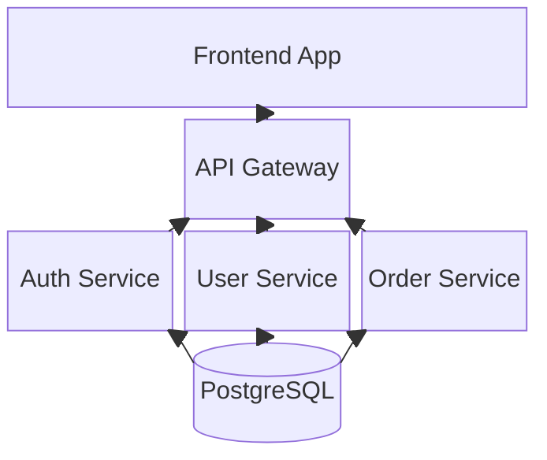
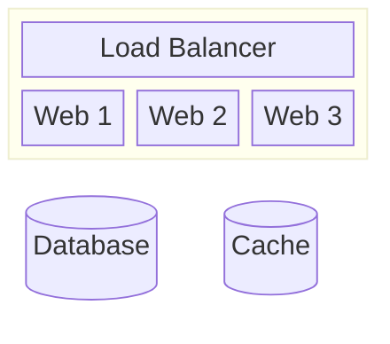
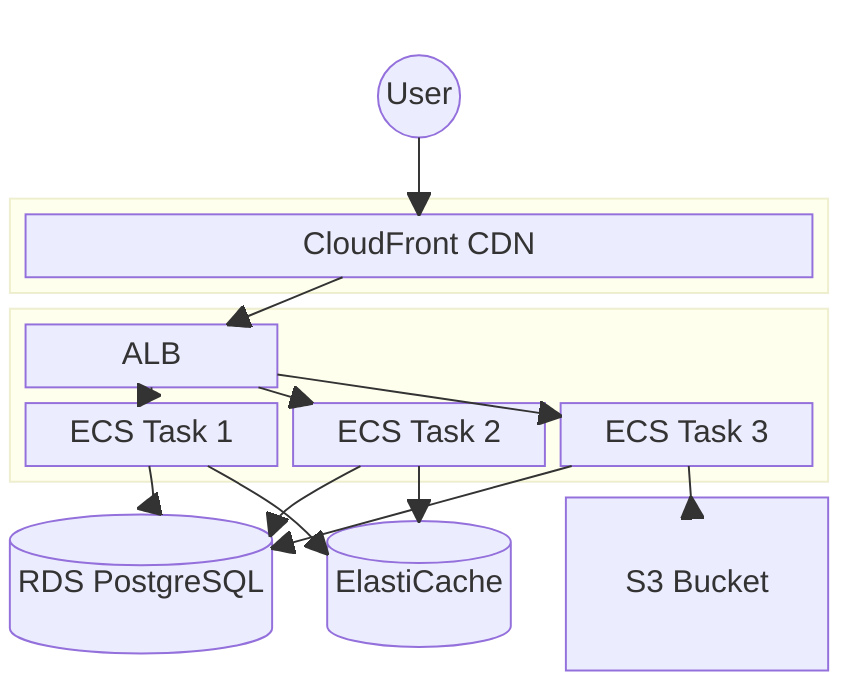

# Mermaid Block Diagram Reference

## Directive

```
block-beta
```

Block diagrams arrange elements in a grid layout, useful for system architecture, infrastructure, and component diagrams where spatial positioning matters.

## Complete Example



## Grid Layout with columns

Define the number of columns in the grid:

```
columns 3
```

Elements are placed left-to-right, top-to-bottom, filling the grid row by row. Each element occupies one cell by default.

## Elements

### Basic elements

```
id["Label"]
```

Elements use standard Mermaid node shapes:

| Syntax          | Shape             |
| --------------- | ----------------- |
| `id["Label"]`   | Rectangle         |
| `id("Label")`   | Rounded rectangle |
| `id{"Label"}`   | Rhombus (diamond) |
| `id[("Label")]` | Cylinder          |
| `id(("Label"))` | Circle            |

### Spanning multiple columns

An element can span multiple columns with the `:N` suffix:

```
header["Load Balancer"]:3
```

This makes `header` span all 3 columns in a 3-column grid, creating a full-width element.

```
left_panel["Sidebar"]:1
main_content["Main Content"]:2
```

This creates a sidebar taking 1 column and main content spanning 2 columns.

## Space

Use `space` to leave empty cells in the grid:

```
columns 3
space
centered_element["Center"]
space
```

This places the element in the center column with empty cells on either side. Multiple spaces can be used:

```
space:2
element["Right-aligned"]
```

The `space` keyword also accepts the `:N` span syntax to skip multiple cells.

## Nested Blocks

Create nested containers with indented blocks:



Nested blocks act as sub-grids with their own `columns` definition. The `:2` after the block name makes the container span 2 columns of the parent grid.

## Arrows

Connect elements with standard Mermaid arrow syntax:

```
A --> B
A --- B
A -.-> B
A ==> B
A -- "label" --> B
```

Arrows are declared after all elements are placed. They connect elements by their IDs regardless of grid position.

## Infrastructure Example



## Best Practices

1. **Plan your grid** -- sketch the layout on paper first. Decide how many columns you need and how elements should span.
2. **Use `space` for alignment** -- empty cells are essential for creating visually balanced layouts. Use `space:N` to skip multiple cells.
3. **Use column spanning for headers** -- full-width elements (`:N` matching total columns) work well for load balancers, gateways, and other entry points.
4. **Nest blocks for logical grouping** -- use nested blocks to represent cloud regions, VPCs, or service clusters.
5. **Keep grids small** -- 3-4 columns is ideal. More than 5 columns becomes hard to manage.
6. **Declare arrows last** -- place all grid elements first, then define connections. This keeps the layout section clean.
7. **Use semantic IDs** -- `api_gateway` not `A`. IDs are referenced in arrows and appear in SVG output.
