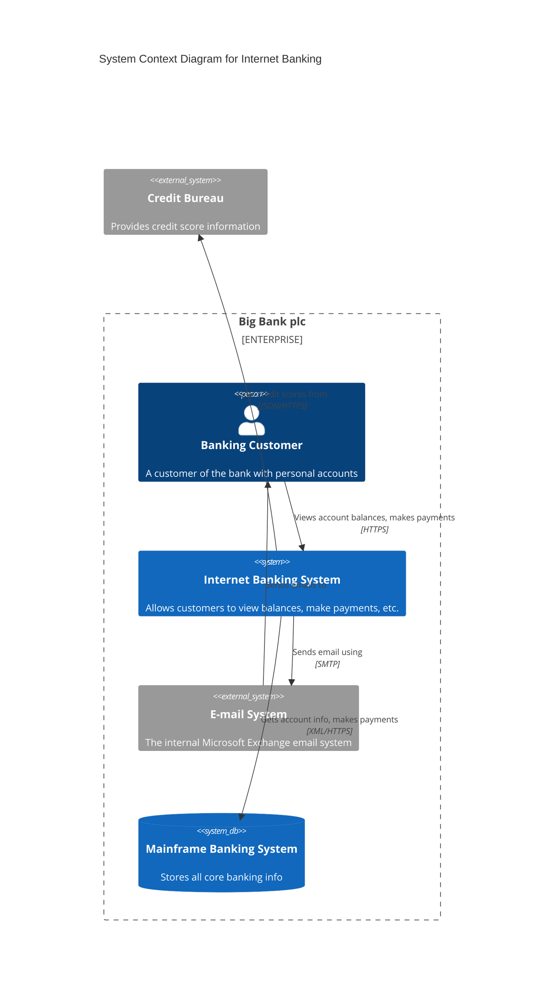
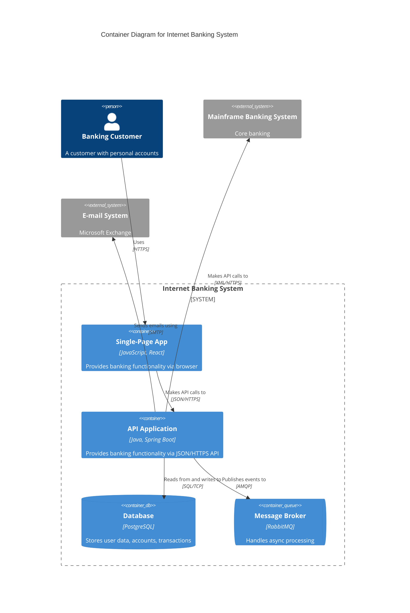
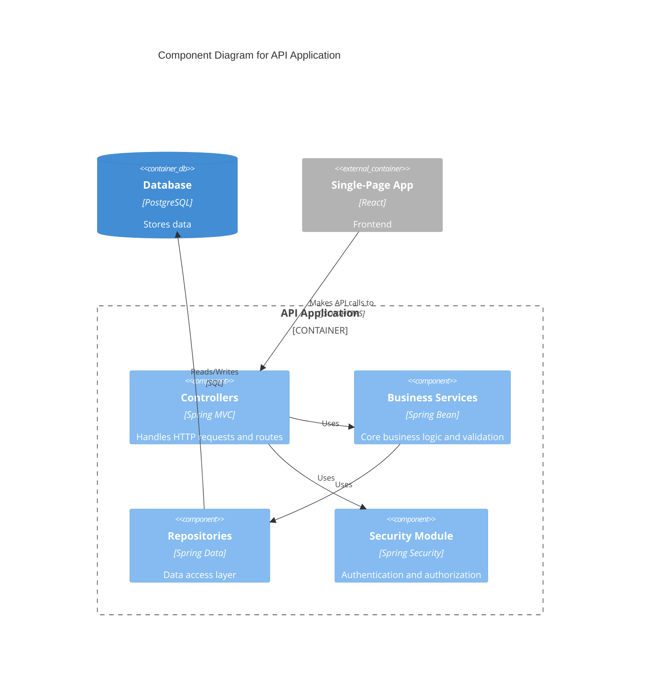
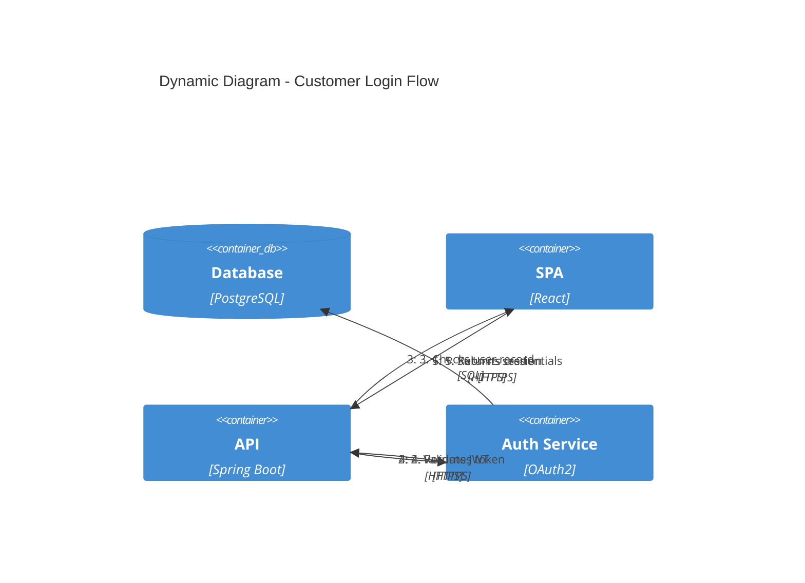
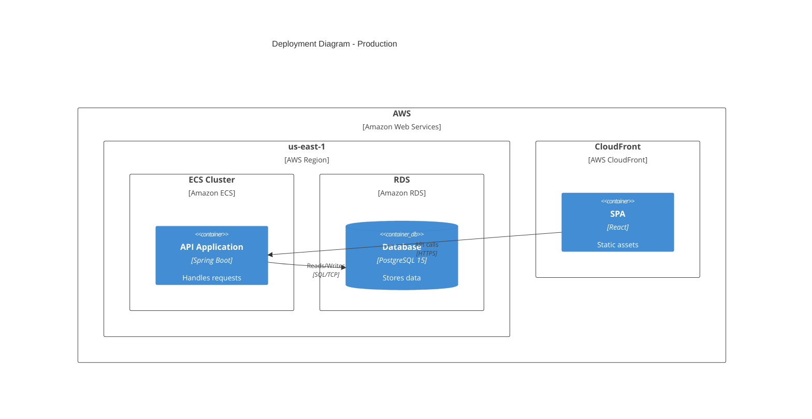
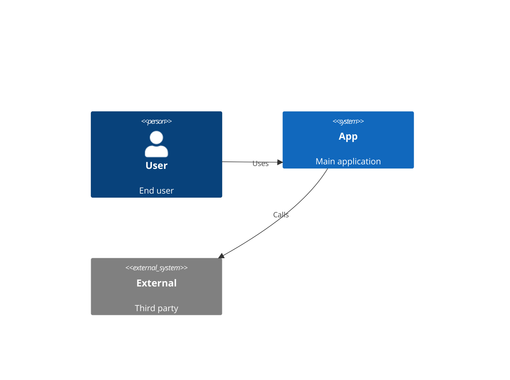

# Mermaid C4 Diagram Reference

C4 diagrams model software architecture at four levels of abstraction: Context, Container, Component, and Code. Mermaid supports C4 through dedicated diagram directives. C4 diagrams in mermaid are experimental -- syntax may change in future versions.

---

## Directives

| Directive      | C4 Level   | Purpose                                   |
| -------------- | ---------- | ----------------------------------------- |
| `C4Context`    | Level 1    | System context -- people and systems      |
| `C4Container`  | Level 2    | Containers within a system                |
| `C4Component`  | Level 3    | Components within a container             |
| `C4Dynamic`    | Dynamic    | Runtime interactions (numbered sequences) |
| `C4Deployment` | Deployment | Infrastructure and deployment nodes       |

---

## C4 Levels Explained

### Level 1: Context (C4Context)

Shows how a system fits into its environment. Depicts people (users) and other systems that interact with the system being described. No internal details -- just the big picture.

### Level 2: Container (C4Container)

Zooms into a single system to show its high-level technical building blocks: web applications, APIs, databases, message brokers, file systems. Each container is a separately deployable/runnable unit.

### Level 3: Component (C4Component)

Zooms into a single container to show its internal components: controllers, services, repositories, modules. Shows how components collaborate and their responsibilities.

### Dynamic Diagrams (C4Dynamic)

Shows runtime behavior by numbering interactions in sequence. Useful for illustrating specific use cases or request flows across containers/components.

### Deployment Diagrams (C4Deployment)

Maps containers to infrastructure: servers, cloud regions, Kubernetes clusters, Docker hosts. Shows where containers run in different deployment environments.

---

## Elements

### People

```
Person(alias, "Label", "Description")
Person_Ext(alias, "Label", "Description")
```

- `Person` -- an internal user of the system
- `Person_Ext` -- an external user (customer, third-party)

### Systems

```
System(alias, "Label", "Description")
System_Ext(alias, "Label", "Description")
SystemDb(alias, "Label", "Description")
SystemDb_Ext(alias, "Label", "Description")
SystemQueue(alias, "Label", "Description")
SystemQueue_Ext(alias, "Label", "Description")
```

- `System` -- the system being described or an internal system
- `System_Ext` -- an external system outside your control
- `SystemDb` -- an internal system that is primarily a data store
- `SystemDb_Ext` -- an external data store
- `SystemQueue` -- an internal system that is primarily a message queue
- `SystemQueue_Ext` -- an external message queue

### Containers (Level 2+)

```
Container(alias, "Label", "Technology", "Description")
ContainerDb(alias, "Label", "Technology", "Description")
ContainerQueue(alias, "Label", "Technology", "Description")
Container_Ext(alias, "Label", "Technology", "Description")
ContainerDb_Ext(alias, "Label", "Technology", "Description")
ContainerQueue_Ext(alias, "Label", "Technology", "Description")
```

### Components (Level 3)

```
Component(alias, "Label", "Technology", "Description")
ComponentDb(alias, "Label", "Technology", "Description")
ComponentQueue(alias, "Label", "Technology", "Description")
Component_Ext(alias, "Label", "Technology", "Description")
```

### Boundaries

```
Boundary(alias, "Label") {
  ...elements...
}

Enterprise_Boundary(alias, "Label") {
  ...elements...
}

System_Boundary(alias, "Label") {
  ...elements...
}

Container_Boundary(alias, "Label") {
  ...elements...
}
```

Boundaries group elements visually. Use `System_Boundary` for Level 2 to wrap the system's containers, `Container_Boundary` for Level 3, and `Enterprise_Boundary` for organizational grouping.

### Deployment Nodes (C4Deployment only)

```
Deployment_Node(alias, "Label", "Technology") {
  ...containers or nested nodes...
}

Deployment_Node(alias, "Label", "Technology", "Description", $instances) {
  ...
}
```

---

## Relationships

### Rel() Syntax

```
Rel(from, to, "Label")
Rel(from, to, "Label", "Technology")
Rel(from, to, "Label", "Technology", "Description")
```

### Directional Relationships

```
Rel_D(from, to, "Label")       %% or Rel_Down
Rel_U(from, to, "Label")       %% or Rel_Up
Rel_L(from, to, "Label")       %% or Rel_Left
Rel_R(from, to, "Label")       %% or Rel_Right
Rel_Back(from, to, "Label")    %% reverse/return relationship
```

Directional hints influence layout but are not guaranteed. Use them to improve readability when the auto-layout places elements poorly.

---

## Complete C4Context Example



---

## Complete C4Container Example



---

## Complete C4Component Example



---

## Complete C4Dynamic Example



In dynamic diagrams, the number prefix in the label determines the sequence order.

---

## Complete C4Deployment Example



---

## Styling with UpdateElementStyle

Override default colors for individual elements or element types:

```
UpdateElementStyle(alias, $bgColor="color", $fontColor="color", $borderColor="color")
```

Example:



---

## Tips and Limitations

- C4 diagrams are marked as experimental in mermaid. Expect syntax changes between major versions.
- Keep descriptions concise -- long text overflows element boundaries.
- Use `_Ext` variants consistently for anything outside your system boundary.
- Boundary nesting is supported but avoid going deeper than 2-3 levels for readability.
- Direction hints (`Rel_D`, `Rel_R`, etc.) are suggestions to the layout engine, not guarantees.
- Each C4 level should tell a complete story at its abstraction level -- do not mix levels in a single diagram.
- Aliases must be unique across the entire diagram, including across boundaries.
