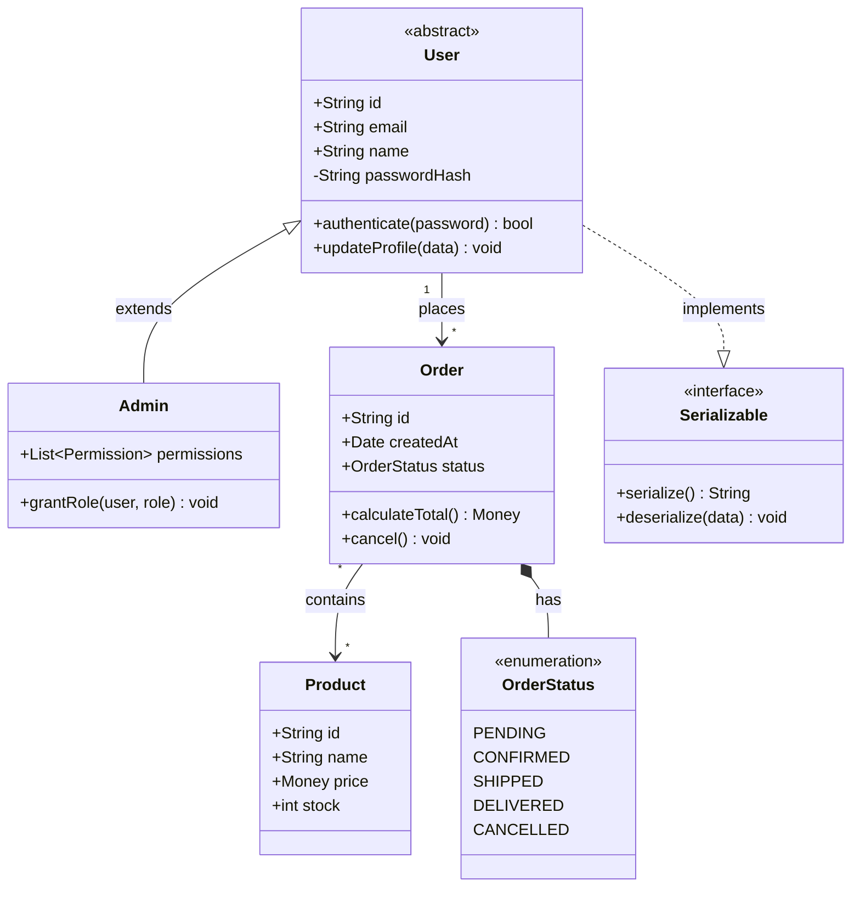
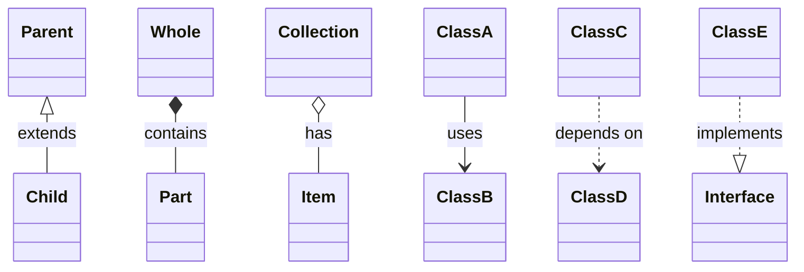
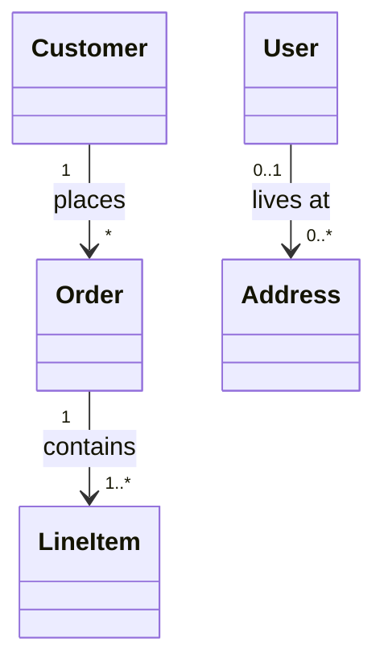
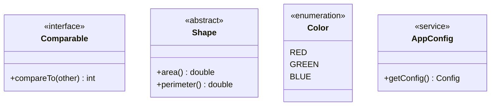
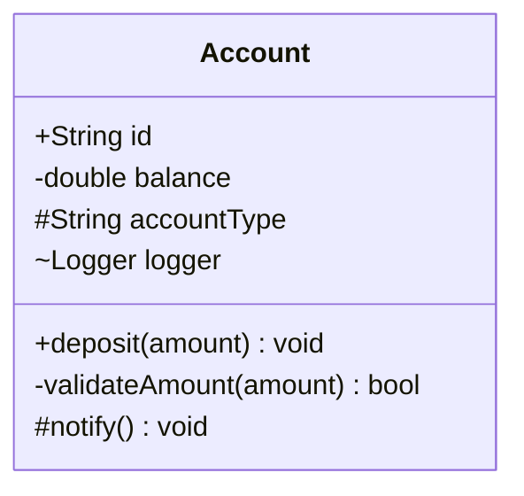
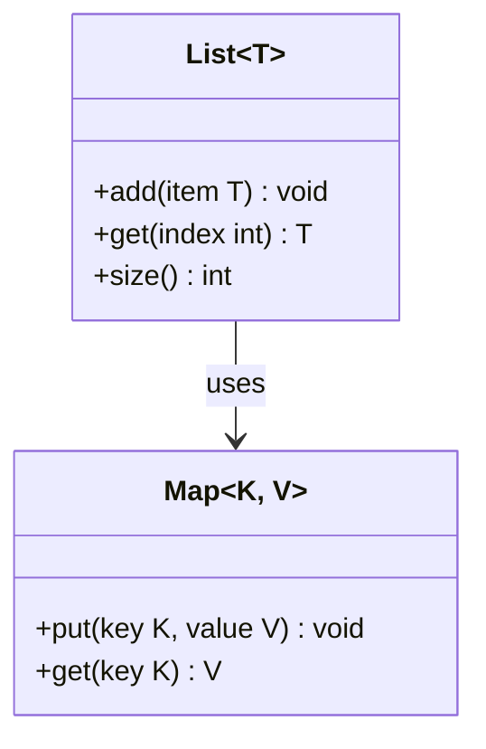
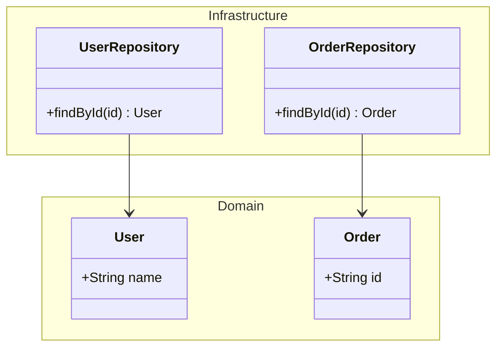
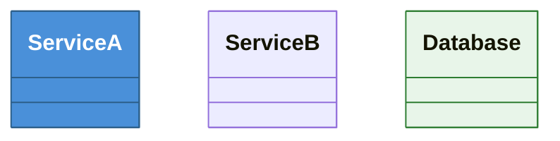

# Mermaid Class Diagram Reference

## Directive

```
classDiagram
```

## Complete Example



## Relationships

| Syntax  | Meaning       | Description                                        |
| ------- | ------------- | -------------------------------------------------- |
| `<\|--` | Inheritance   | Child extends parent (solid line, hollow triangle) |
| `*--`   | Composition   | Part cannot exist without whole (solid diamond)    |
| `o--`   | Aggregation   | Part can exist independently (hollow diamond)      |
| `-->`   | Association   | Directed relationship (solid arrow)                |
| `--`    | Link (solid)  | Undirected relationship                            |
| `..>`   | Dependency    | Uses temporarily (dashed arrow)                    |
| `..\|>` | Realization   | Implements interface (dashed, hollow triangle)     |
| `..`    | Link (dashed) | Undirected dashed relationship                     |

### Reading direction

Relationships are read left-to-right by default. The symbol on the left side is the source, the symbol on the right is the target:



## Cardinality (Multiplicity)

Place cardinality labels in quotes on either side of the relationship:



| Notation | Meaning          |
| -------- | ---------------- |
| `"1"`    | Exactly one      |
| `"*"`    | Zero or more     |
| `"0..1"` | Zero or one      |
| `"1..*"` | One or more      |
| `"0..*"` | Zero or more     |
| `"n"`    | Fixed count of n |

## Annotations

Annotations mark special class types:



Supported annotations: `<<interface>>`, `<<abstract>>`, `<<enumeration>>`, `<<service>>`, or any custom text inside `<< >>`.

## Visibility Modifiers

| Symbol | Visibility       |
| ------ | ---------------- |
| `+`    | Public           |
| `-`    | Private          |
| `#`    | Protected        |
| `~`    | Package/Internal |



## Methods and Attributes

### Attributes

```
+Type attributeName
-String privateField
#int protectedCount
```

### Methods

```
+methodName(param1, param2) ReturnType
-privateMethod() void
+staticMethod()$ String
+abstractMethod()* void
```

- `$` suffix marks a static member.
- `*` suffix marks an abstract member.

## Generic Types

Use `~` to denote generic type parameters:



## Namespaces

Group related classes with `namespace`:



## Styling

Apply styles to individual classes:



## Best Practices

1. **Use annotations** to clearly distinguish interfaces, abstract classes, and enumerations.
2. **Always include visibility modifiers** (`+`, `-`, `#`, `~`) on attributes and methods.
3. **Show cardinality** on associations to communicate multiplicity constraints.
4. **Choose the right relationship type** -- composition vs aggregation vs association conveys different ownership semantics.
5. **Keep class contents focused** -- show only the attributes and methods relevant to the diagram's purpose, not the entire class API.
6. **Use namespaces** to group classes by module, layer, or domain.
7. **Use semantic relationship labels** -- `places`, `contains`, `implements` are clearer than unlabeled arrows.
