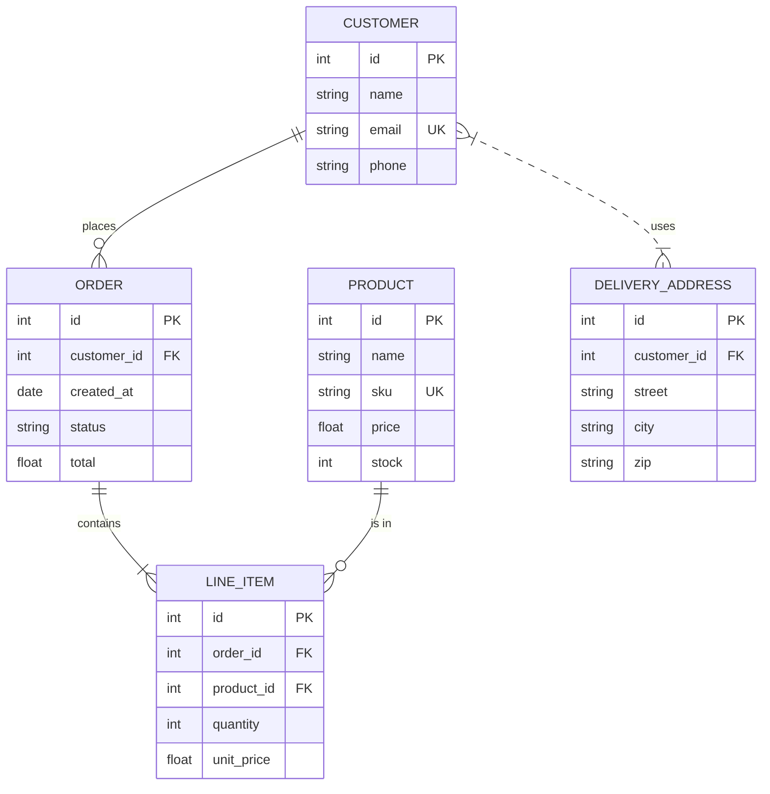
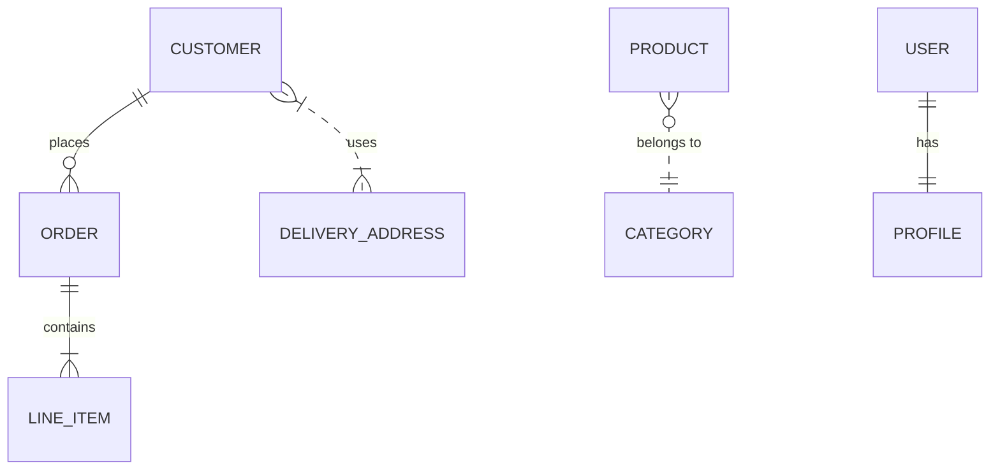
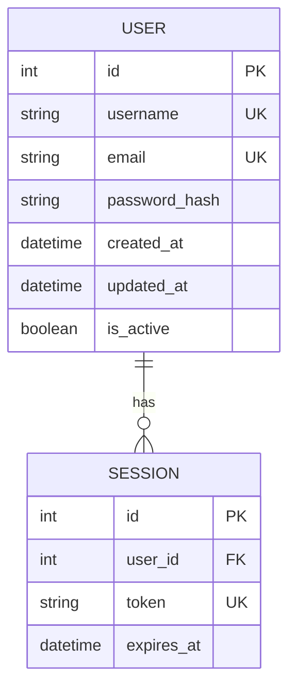
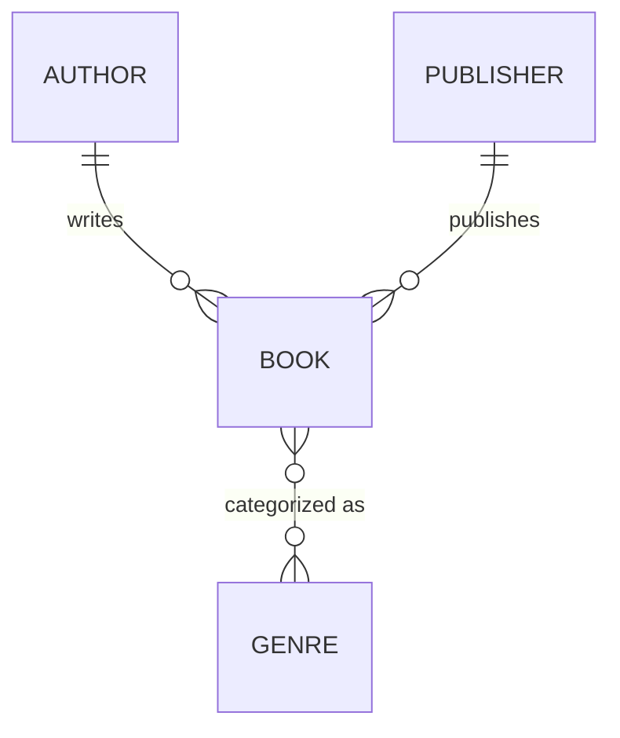
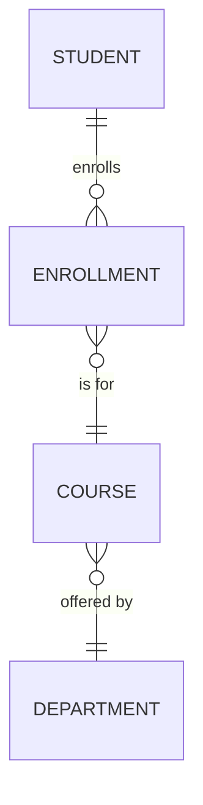
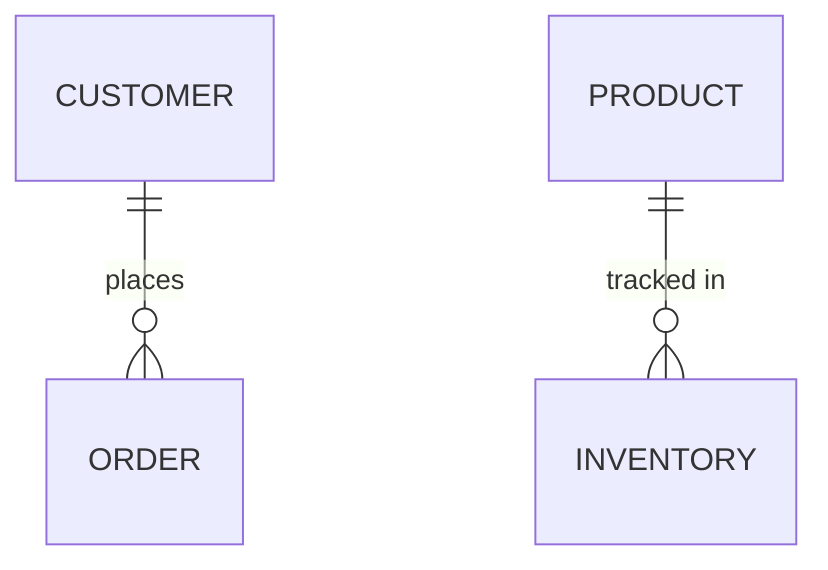

# Mermaid ER Diagram Reference

Complete reference for Entity-Relationship diagrams in Mermaid. ER diagrams model database schemas showing entities, their attributes, and relationships between them.

---

## Directive

```
erDiagram
```

---

## Complete Example



---

## Relationship Syntax

```
ENTITY_A <cardinality><line><cardinality> ENTITY_B : "label"
```

The relationship line connects two entities with cardinality markers on each side and a required label.

### Cardinality Symbols

| Symbol | Meaning      | Description          |
| ------ | ------------ | -------------------- |
| `\|\|` | Exactly one  | One and only one     |
| `o\|`  | Zero or one  | Optional (0..1)      |
| `}\|`  | One or more  | At least one (1..N)  |
| `o{`   | Zero or more | Optional many (0..N) |

Cardinality symbols are placed on each side of the line, read from the perspective of the opposite entity.

### Line Types

| Symbol | Meaning         | Description                                           |
| ------ | --------------- | ----------------------------------------------------- |
| `--`   | Identifying     | Solid line. Child cannot exist without parent.        |
| `..`   | Non-identifying | Dashed line. Child can exist independently of parent. |

### Relationship Examples



### Reading Relationships

Read from left entity to right entity using the right-side cardinality, then from right to left using the left-side cardinality:

```
CUSTOMER ||--o{ ORDER : places
```

- A CUSTOMER places zero or more (`o{`) ORDERs
- An ORDER is placed by exactly one (`||`) CUSTOMER

---

## Entity Attributes

Attributes are defined inside curly braces after the entity name. Each attribute has a type, a name, and an optional constraint keyword.

```
ENTITY {
    type name CONSTRAINT
}
```

### Attribute Constraints

| Keyword | Meaning     | Description                  |
| ------- | ----------- | ---------------------------- |
| `PK`    | Primary Key | Unique identifier for entity |
| `FK`    | Foreign Key | Reference to another entity  |
| `UK`    | Unique Key  | Unique but not primary       |

### Attribute Examples



### Common Attribute Types

Use any string as a type name. Common conventions:

- `int`, `bigint`, `serial` -- integer types
- `string`, `varchar`, `text` -- text types
- `float`, `decimal`, `numeric` -- decimal types
- `boolean`, `bool` -- boolean
- `date`, `datetime`, `timestamp` -- temporal types
- `uuid` -- universally unique identifier
- `json`, `jsonb` -- structured data

---

## Entities Without Attributes

Entities can appear in relationships without defining attributes:



---

## Labels

Relationship labels are required. Multi-word labels must be quoted:



---

## Comments

Use `%%` for single-line comments:



---

## Best Practices

1. **Name entities in UPPER_CASE** -- follows database convention and improves readability.

2. **Always include PK attributes** -- every entity should have an explicit primary key.

3. **Mark foreign keys with FK** -- makes join paths visible in the diagram.

4. **Use identifying relationships (`--`) for composition** -- when the child entity cannot exist without the parent (e.g., ORDER -> LINE_ITEM).

5. **Use non-identifying relationships (`..`) for association** -- when entities are independently meaningful (e.g., CUSTOMER .. DELIVERY_ADDRESS).

6. **Keep labels short and verb-based** -- `places`, `contains`, `has` are better than `is associated with`.

7. **Quote multi-word labels** -- `"belongs to"` not `belongs to`.

8. **Order entities logically** -- place the primary/parent entity on the left side of each relationship.

9. **Group related relationships together** -- use comments to separate logical sections.

10. **Limit diagram scope** -- for large schemas, split into bounded-context diagrams rather than one massive ER diagram. Aim for 5-12 entities per diagram.
