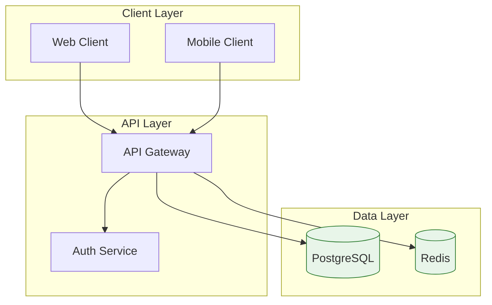
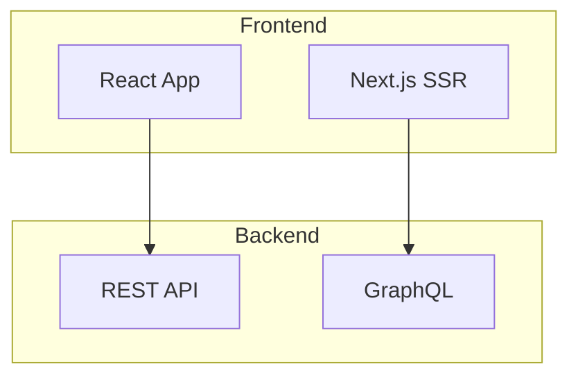
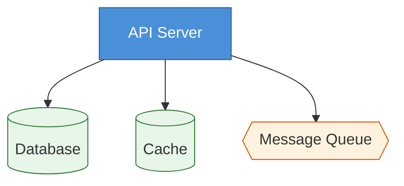
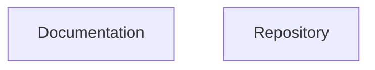

# Mermaid Flowchart Reference

## Directive

```
flowchart TD
```

Use `flowchart` (not `graph`) for access to modern features like subgraph directions and advanced styling.

## Directions

| Direction | Meaning                  |
| --------- | ------------------------ |
| `TB`/`TD` | Top to bottom (top-down) |
| `BT`      | Bottom to top            |
| `LR`      | Left to right            |
| `RL`      | Right to left            |

**When to use which:** Prefer `TD` for hierarchies, org charts, and layered architectures. Prefer `LR` for sequences, timelines, and data pipelines.

## Complete Example



## Node Shapes

| Syntax     | Shape             | Use Case               |
| ---------- | ----------------- | ---------------------- |
| `[text]`   | Rectangle         | Process, action        |
| `(text)`   | Rounded rectangle | Start/end, generic     |
| `{text}`   | Rhombus (diamond) | Decision               |
| `[(text)]` | Cylinder          | Database, storage      |
| `((text))` | Circle            | Event, connector       |
| `>text]`   | Asymmetric (flag) | Input/output           |
| `[[text]]` | Subroutine        | Predefined process     |
| `{{text}}` | Hexagon           | Preparation, condition |

## Edge Types

| Syntax        | Description            |
| ------------- | ---------------------- |
| `-->`         | Arrow (solid)          |
| `---`         | Line (no arrowhead)    |
| `-.->` ` `    | Dotted arrow           |
| `==>`         | Thick arrow            |
| `--text-->`   | Arrow with label       |
| `-->\|text\|` | Arrow with label (alt) |

### Edge conventions

- **Solid arrows** (`-->`) for synchronous calls and direct dependencies.
- **Dotted arrows** (`-.->`) for asynchronous or optional paths.
- **Thick arrows** (`==>`) for critical paths or high-traffic flows.

## Subgraphs

Subgraphs group related nodes and can have their own direction:



Subgraphs can be nested. Each subgraph can have an independent `direction` declaration.

## Styling with classDef

Define reusable styles with `classDef` and apply them with `class`:



## Click Events

Add interactivity with click handlers:



## Best Practices

1. **Use `flowchart` not `graph`** -- `flowchart` supports subgraph directions, newer node shapes, and other modern features that `graph` does not.
2. **Avoid `end` as a node ID** -- it conflicts with the block-closing keyword. Use `End`, `endNode`, or wrap in quotes (`"end"`).
3. **Use subgraphs for logical grouping** -- any time 3+ nodes are conceptually related, group them.
4. **Use `classDef` for consistent styling** -- avoid inline `style` on individual nodes; `classDef` is reusable and easier to maintain.
5. **Use semantic IDs** -- `api_gateway` not `A`, `auth_service` not `B`. IDs appear in SVG output and aid debugging.
6. **Keep diagrams under ~15 nodes** -- split larger systems into multiple focused diagrams.
7. **Avoid hardcoded colors when possible** -- diagramkit's dark mode contrast fix handles default theme colors well. Custom colors may not survive the transformation.
8. **Reserved words** -- `end`, `default` cannot be bare node IDs. Capitalize or quote them.
