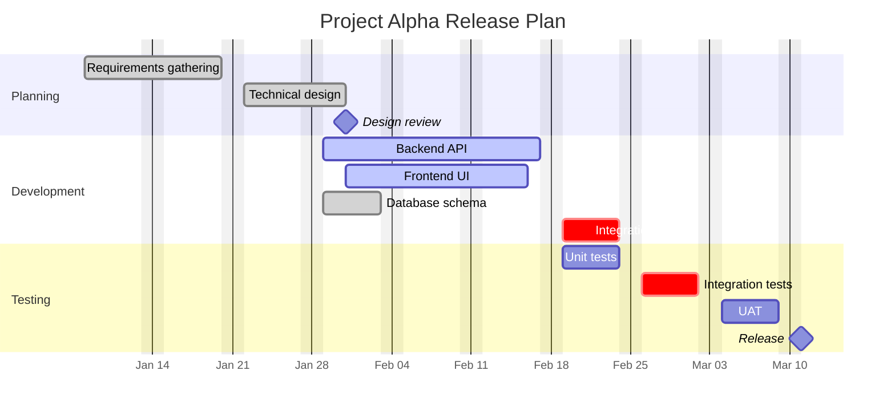
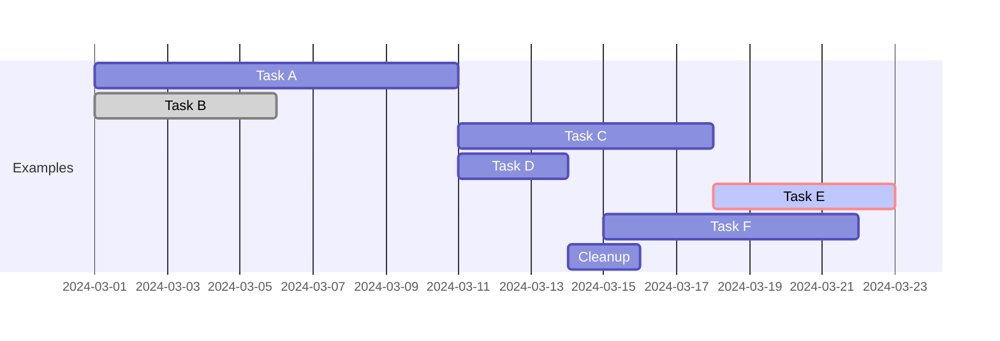
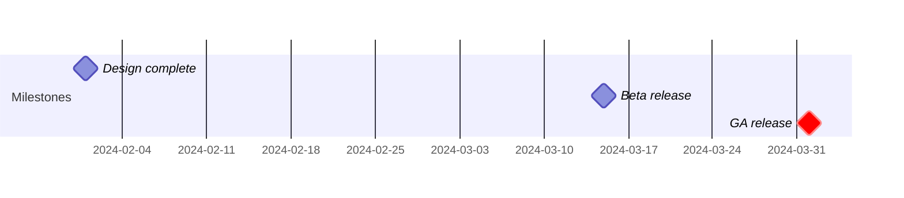
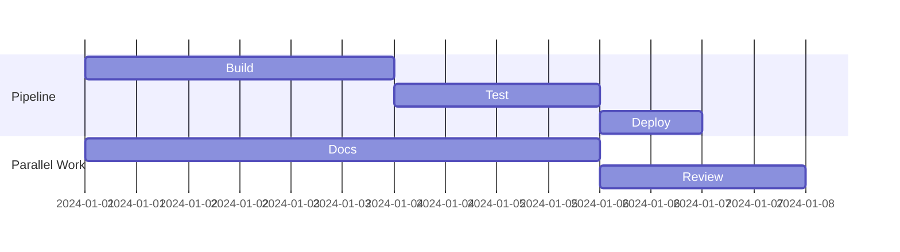
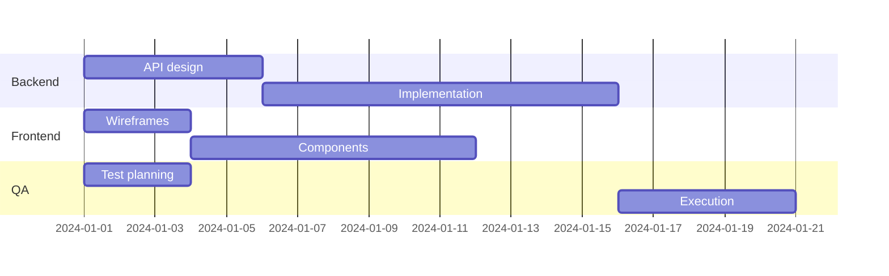
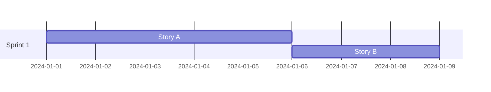

# Mermaid Gantt Chart Reference

Complete reference for Gantt charts in Mermaid. Gantt charts visualize project schedules showing tasks, durations, dependencies, milestones, and progress.

---

## Directive

```
gantt
```

---

## Complete Example



---

## Header Configuration

### dateFormat

Defines the format for parsing date strings in task definitions. Uses [Day.js format tokens](https://day.js.org/docs/en/parse/string-format).

```
dateFormat YYYY-MM-DD
```

| Token  | Meaning       | Example |
| ------ | ------------- | ------- |
| `YYYY` | 4-digit year  | 2024    |
| `YY`   | 2-digit year  | 24      |
| `MM`   | 2-digit month | 01-12   |
| `DD`   | 2-digit day   | 01-31   |
| `HH`   | 24-hour hour  | 00-23   |
| `mm`   | Minute        | 00-59   |

Default is `YYYY-MM-DD`.

### axisFormat

Controls how dates appear on the horizontal axis. Uses [D3 time format specifiers](https://github.com/d3/d3-time-format).

```
axisFormat %Y-%m-%d
```

| Specifier | Meaning      | Example  |
| --------- | ------------ | -------- |
| `%Y`      | 4-digit year | 2024     |
| `%y`      | 2-digit year | 24       |
| `%m`      | Month number | 01-12    |
| `%b`      | Month abbrev | Jan, Feb |
| `%B`      | Month full   | January  |
| `%d`      | Day of month | 01-31    |
| `%a`      | Day abbrev   | Mon, Tue |
| `%A`      | Day full     | Monday   |
| `%H`      | Hour (24h)   | 00-23    |
| `%M`      | Minute       | 00-59    |

### tickInterval

Controls the spacing of axis tick marks:

```
tickInterval 1week
```

Valid intervals: `1day`, `1week`, `1month`.

### excludes

Exclude certain days from task scheduling:

```
excludes weekends
excludes 2024-01-15, 2024-02-19
excludes weekends, 2024-12-25, 2024-12-26
```

### title

```
title My Project Schedule
```

---

## Task Syntax

```
Task name :tags, id, start, duration_or_end
```

All parts after the colon are optional and positional. The parser identifies fields by their format:

| Field    | Format                    | Description                    |
| -------- | ------------------------- | ------------------------------ |
| tags     | `done`, `active`, `crit`  | Status/style tags (combinable) |
| id       | alphanumeric identifier   | Used for `after` dependencies  |
| start    | date or `after taskId`    | When the task begins           |
| duration | `Nd` (days), `Nh` (hours) | How long the task runs         |
| end      | date                      | Absolute end date              |

### Duration Syntax

| Format | Meaning | Example |
| ------ | ------- | ------- |
| `Nd`   | N days  | `5d`    |
| `Nh`   | N hours | `12h`   |
| `Nw`   | N weeks | `2w`    |

### Task Examples



---

## Tags

Tags modify task appearance and are placed immediately after the colon, before the task id.

| Tag         | Effect                                        |
| ----------- | --------------------------------------------- |
| `done`      | Grayed out, indicates completed task          |
| `active`    | Highlighted, indicates in-progress task       |
| `crit`      | Red/critical styling, indicates critical path |
| `milestone` | Rendered as a diamond marker (zero-duration)  |

Tags can be combined:

```
Critical done task   :crit, done, t1, 2024-01-01, 5d
Critical active task :crit, active, t2, after t1, 3d
```

---

## Milestones

Milestones are zero-duration markers. Use the `milestone` tag or set duration to `0d`:



---

## Dependencies

Use `after taskId` to start a task when another finishes. Multiple dependencies are space-separated:



When multiple `after` targets are listed, the task starts after the **latest** of them finishes.

---

## Sections

Sections group tasks visually with a label row:



---

## Comments

Use `%%` for single-line comments:



---

## Best Practices

1. **Always set `dateFormat`** -- makes date parsing explicit and avoids ambiguity.

2. **Use `axisFormat` for readability** -- `%b %d` (e.g., "Jan 15") is usually clearer than `%Y-%m-%d` on the axis.

3. **Assign IDs to tasks that are dependencies** -- unnamed tasks cannot be referenced by `after`.

4. **Use `excludes weekends` for realistic schedules** -- otherwise weekends count as working days.

5. **Mark critical path with `crit`** -- highlights the chain of tasks that determines the minimum project duration.

6. **Use milestones for key checkpoints** -- design reviews, releases, sign-offs.

7. **Group related tasks in sections** -- improves visual organization, typically by team, phase, or component.

8. **Keep task names concise** -- long names compress the chart. Aim for 2-4 words per task.

9. **Use `done` and `active` to show progress** -- makes the chart useful as a status report, not just a plan.

10. **Limit to 15-25 tasks per chart** -- for larger projects, split into multiple charts by phase or workstream.
