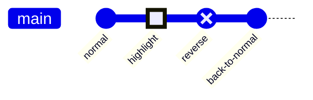
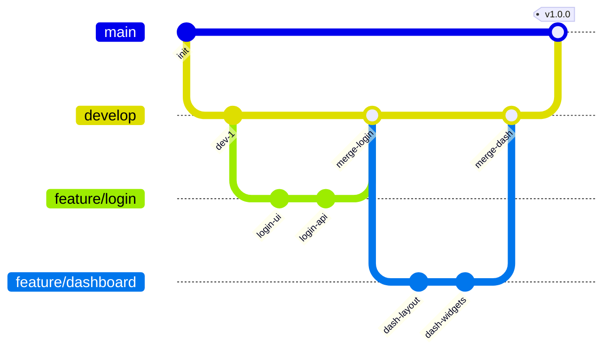
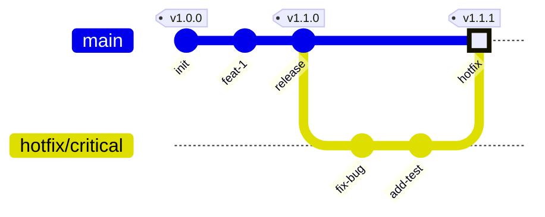
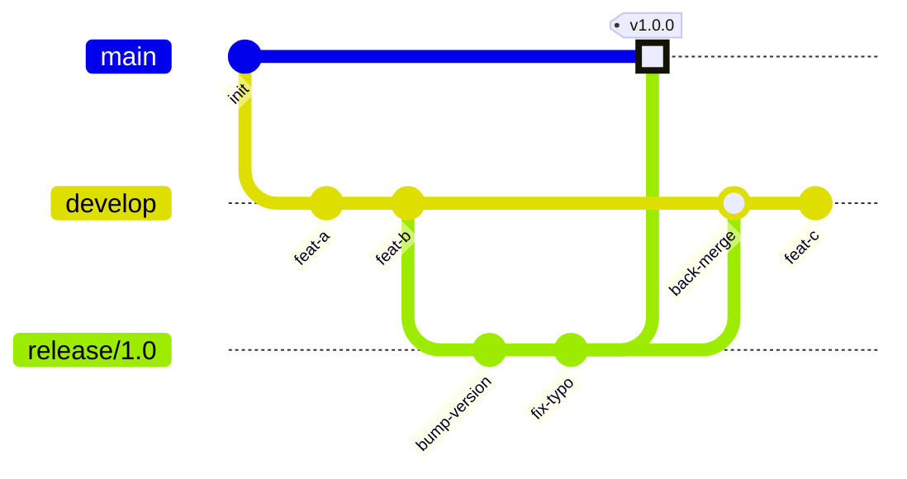
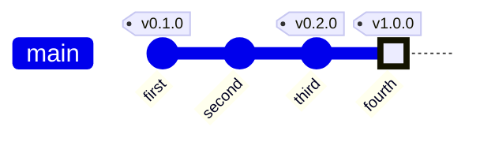
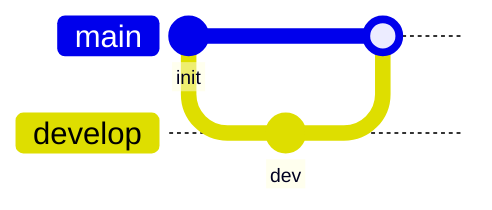
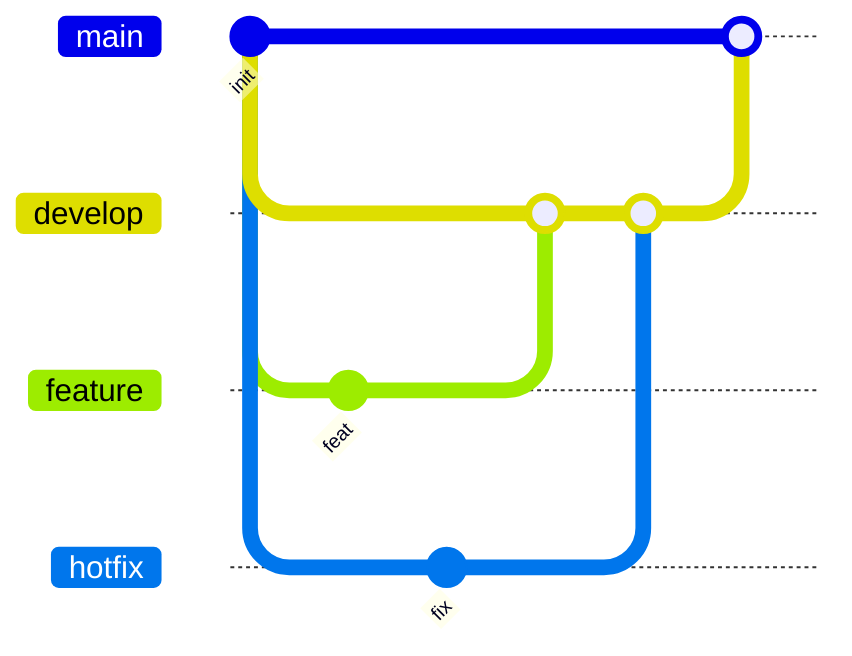
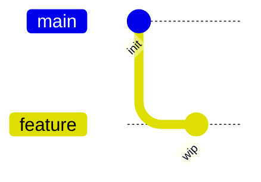

# Mermaid Git Graph Reference

Complete reference for Git graphs in Mermaid. Git graphs visualize branching strategies, merge workflows, and release histories.

---

## Directive

```
gitGraph
```

---

## Complete Example

```mermaid
gitGraph
    commit id: "init"
    commit id: "v0.1" tag: "v0.1.0"

    branch develop
    checkout develop
    commit id: "feat-setup"

    branch feature/auth
    checkout feature/auth
    commit id: "add-login"
    commit id: "add-signup"

    checkout develop
    merge feature/auth id: "merge-auth"

    branch feature/api
    checkout feature/api
    commit id: "api-routes"
    commit id: "api-tests"

    checkout develop
    merge feature/api id: "merge-api"
    commit id: "polish"

    checkout main
    merge develop id: "release" tag: "v1.0.0" type: HIGHLIGHT

    checkout develop
    commit id: "hotfix-prep"
    cherry-pick id: "release"
```

---

## Commands

### commit

Adds a commit to the current branch.

```
commit
commit id: "abc123"
commit id: "feat" msg: "Add feature" tag: "v1.0" type: HIGHLIGHT
```

| Option  | Description                           | Example           |
| ------- | ------------------------------------- | ----------------- |
| `id:`   | Commit identifier (shown on the node) | `id: "abc123"`    |
| `msg:`  | Tooltip message (hover text)          | `msg: "Fix bug"`  |
| `tag:`  | Tag label displayed above the commit  | `tag: "v2.0.0"`   |
| `type:` | Visual style of the commit node       | `type: HIGHLIGHT` |

### branch

Creates a new branch from the current branch at the current position.

```
branch develop
branch feature/login
branch release/v2
```

Branch names can contain `/`, `-`, `_`, and alphanumeric characters.

### checkout / switch

Switches the active branch. `checkout` and `switch` are interchangeable.

```
checkout develop
switch main
```

### merge

Merges the specified branch into the current branch.

```
merge feature/auth
merge develop id: "merge-commit" tag: "v1.0" type: HIGHLIGHT
```

Merge accepts the same options as `commit` (`id:`, `msg:`, `tag:`, `type:`).

### cherry-pick

Cherry-picks a commit by its `id:` into the current branch.

```
cherry-pick id: "abc123"
cherry-pick id: "abc123" tag: "cherry"
```

The target commit must have an `id:` defined. You can optionally add a `tag:` to the cherry-picked commit. Use `tag: ""` to suppress the default "cherry-pick" tag label.

---

## Commit Types

| Type        | Appearance                  | Use Case                    |
| ----------- | --------------------------- | --------------------------- |
| `NORMAL`    | Filled circle (default)     | Regular commits             |
| `REVERSE`   | Cross/X mark                | Reverts or rollbacks        |
| `HIGHLIGHT` | Highlighted/enlarged circle | Important commits, releases |



---

## Branching Patterns

### Feature Branch Workflow



### Hotfix Workflow



### Release Branch Workflow



---

## Tags

Tags are labels displayed above commit nodes. They typically mark releases or important points:



---

## Configuration Options

Git graph appearance can be configured using the Mermaid `%%{init: ...}%%` directive:



| Option              | Default | Description                             |
| ------------------- | ------- | --------------------------------------- |
| `mainBranchName`    | `main`  | Name of the default/first branch        |
| `showCommitLabel`   | `true`  | Show commit id labels on nodes          |
| `showBranches`      | `true`  | Show branch name labels                 |
| `rotateCommitLabel` | `true`  | Rotate commit labels vertically         |
| `mainBranchOrder`   | `0`     | Visual order of the main branch (0=top) |

---

## Branch Ordering

Control the vertical position of branches with the `order:` keyword:



Lower `order` values appear higher in the graph.

---

## Comments

Use `%%` for single-line comments:



---

## Best Practices

1. **Always assign `id:` to commits you will reference** -- `merge` and `cherry-pick` require an `id:` to target. Give meaningful IDs to key commits.

2. **Use `tag:` for releases** -- clearly marks version boundaries in the graph.

3. **Use `type: HIGHLIGHT` for important commits** -- releases, major merges, and milestones stand out visually.

4. **Use `type: REVERSE` for reverts** -- communicates intent at a glance.

5. **Keep branch names realistic** -- use conventions like `feature/name`, `hotfix/name`, `release/version` to match real Git workflows.

6. **Checkout before committing** -- always `checkout` (or `switch`) to the intended branch before adding commits. The current branch context is implicit.

7. **Limit branches to 4-5 per diagram** -- more branches become hard to follow visually.

8. **Show the pattern, not every commit** -- use 2-3 representative commits per branch rather than replicating an actual history.

9. **Use branch ordering for clean layouts** -- `order:` prevents branch lines from crossing unnecessarily.

10. **Merge before checking out** -- merge into the current branch (the branch you are on), not from it. `checkout main` then `merge develop` means "merge develop into main".
