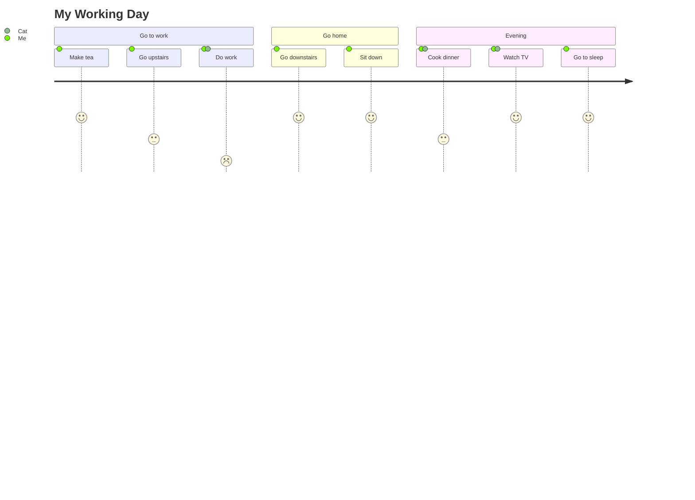
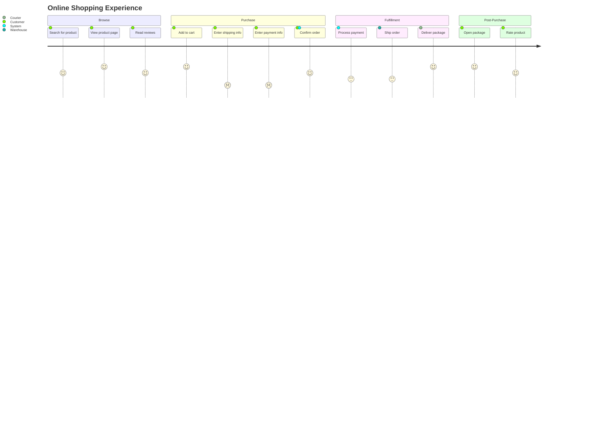

# Mermaid User Journey Reference

## Directive

```
journey
```

User journey diagrams map out the steps a user takes to accomplish a task, showing their happiness at each step and which actors are involved.

## Complete Example



## Title

Optional title displayed above the journey:

```
title User Onboarding Experience
```

## Sections

Sections group related tasks into phases. Each `section` keyword starts a new group:

```
section Discovery
    ...tasks...
section Signup
    ...tasks...
section First Use
    ...tasks...
```

Sections render as labeled columns that visually separate journey phases.

## Tasks

Each task has three parts separated by colons:

```
Task description: happiness_score: actor1, actor2
```

- **Task description** -- free text describing the step (no quotes needed).
- **Happiness score** -- integer from 1 to 5 (1 = frustrated, 5 = delighted).
- **Actors** -- comma-separated list of who is involved in this step.

Examples:

```
Browse landing page: 4: Customer
Fill out signup form: 2: Customer
Verify email: 3: Customer, System
Complete profile: 4: Customer
```

## Happiness Scores

| Score | Meaning    | Color  |
| ----- | ---------- | ------ |
| 1     | Frustrated | Red    |
| 2     | Unhappy    | Orange |
| 3     | Neutral    | Yellow |
| 4     | Happy      | Lime   |
| 5     | Delighted  | Green  |

The score drives the color of each task bar, creating an at-a-glance emotional heatmap across the journey.

## Actors

Actors are assigned per-task after the happiness score. Multiple actors are comma-separated:

```
Review document: 3: Author, Reviewer
Approve changes: 4: Manager
```

Each unique actor gets a distinct color in the diagram. Actors do not need to be declared separately -- they are inferred from task definitions.

## Ecommerce Journey Example



## Best Practices

1. **Use sections to group phases** -- every journey should have at least 2-3 sections to show progression.
2. **Be honest with happiness scores** -- the value of journey maps comes from identifying pain points (low scores). Don't inflate scores.
3. **Keep task descriptions short** -- one line per task. If you need detail, put it in a separate document.
4. **Limit to 10-15 tasks total** -- too many tasks make the diagram hard to read. Focus on key moments.
5. **Name actors consistently** -- use the same actor name across sections so colors are consistent (e.g., always "Customer" not sometimes "User").
6. **Highlight handoffs** -- tasks with multiple actors (e.g., `Submit form: 3: Customer, System`) show interaction points where friction often occurs.
