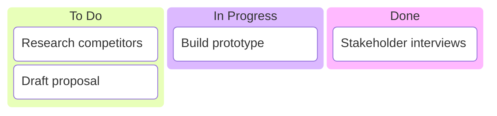

# Mermaid Kanban Board Reference

Kanban boards display work items organized into columns representing workflow stages. Available since mermaid v11.4+.

---

## Directive

```mermaid
kanban
```

---

## Complete Example

```mermaid
kanban
    Backlog
        Design login page
            @{ assigned: "Alice", priority: "High", ticket: "FE-101" }
        Set up CI/CD pipeline
            @{ assigned: "Bob", priority: "Medium", ticket: "OPS-42" }
        Write API documentation
            @{ assigned: "Carol", priority: "Low" }

    In Progress
        Implement auth service
            @{ assigned: "Dave", priority: "High", ticket: "BE-200" }
        Database migration script
            @{ assigned: "Eve", priority: "Medium", ticket: "BE-205" }

    Review
        User profile endpoint
            @{ assigned: "Frank", priority: "Medium", ticket: "BE-180" }

    Done
        Project scaffolding
            @{ assigned: "Alice", ticket: "FE-100" }
        Environment setup
            @{ assigned: "Bob", ticket: "OPS-40" }
```

---

## Column Syntax

Columns are defined as top-level items with no indentation. Each column header becomes a column in the board.

```
kanban
    Column Name 1
        ...tasks...

    Column Name 2
        ...tasks...
```

Common column names follow standard kanban patterns:

- `Backlog`, `To Do`, `Ready`
- `In Progress`, `Doing`, `Active`
- `Review`, `In Review`, `Testing`
- `Done`, `Complete`, `Deployed`

---

## Task Syntax

Tasks are indented under their parent column. Each task has a title and optional metadata.

### Basic Task (No Metadata)

```
kanban
    To Do
        Implement feature X
        Fix bug in login
```

### Task with Metadata

Metadata is specified on the line after the task title using the `@{ key: "value" }` syntax:

```
kanban
    To Do
        Implement feature X
            @{ assigned: "Alice", priority: "High" }
```

### Metadata Properties

Metadata is freeform key-value pairs. Common properties:

| Property   | Description                     | Example              |
| ---------- | ------------------------------- | -------------------- |
| `assigned` | Person responsible for the task | `assigned: "Alice"`  |
| `priority` | Task priority level             | `priority: "High"`   |
| `ticket`   | Ticket or issue ID              | `ticket: "PROJ-123"` |

```
@{ assigned: "Alice", priority: "High", ticket: "FE-101" }
```

---

## Ticket IDs

Use the `ticket` metadata property to associate tasks with issue tracker IDs:

```mermaid
kanban
    Sprint 12
        Payment integration
            @{ ticket: "PAY-301", assigned: "Alice", priority: "High" }
        Email notifications
            @{ ticket: "NOTIFY-88", assigned: "Bob", priority: "Medium" }

    In Progress
        Search indexing
            @{ ticket: "SEARCH-45", assigned: "Carol" }

    Done
        Rate limiting
            @{ ticket: "API-210", assigned: "Dave" }
```

---

## Minimal Example

A kanban board with just columns and tasks, no metadata:



---

## Sprint Board Example

```mermaid
kanban
    Backlog
        Optimize database queries
            @{ assigned: "Eve", priority: "Medium", ticket: "PERF-15" }

    Ready
        Add rate limiting to API
            @{ assigned: "Frank", priority: "High", ticket: "SEC-90" }
        Update user dashboard
            @{ assigned: "Grace", priority: "Medium", ticket: "FE-220" }

    In Progress
        Migrate to PostgreSQL 16
            @{ assigned: "Heidi", priority: "High", ticket: "OPS-55" }

    In Review
        Refactor auth middleware
            @{ assigned: "Ivan", priority: "Medium", ticket: "BE-310" }

    Done
        Fix CORS configuration
            @{ assigned: "Judy", priority: "High", ticket: "SEC-88" }
        Add health check endpoint
            @{ assigned: "Ivan", priority: "Low", ticket: "OPS-50" }
```

---

## Tips and Limitations

- Kanban diagrams require mermaid v11.4 or later.
- Column order in the source determines left-to-right order in the rendered board.
- Task order within a column matches the source order (top to bottom).
- Metadata values must be quoted strings.
- Indentation matters: columns are at the first indent level, tasks at the second, metadata at the third.
- There is no built-in support for WIP (work-in-progress) limits on columns.
- Swimlanes (horizontal grouping) are not supported within kanban boards.
- Tasks cannot link to other tasks or contain nested subtasks.
