# Mermaid Mindmap Reference

Complete reference for mindmaps in Mermaid. Mindmaps visualize hierarchical information radiating from a central concept, useful for brainstorming, knowledge organization, and feature breakdowns.

---

## Directive

```
mindmap
```

---

## Complete Example

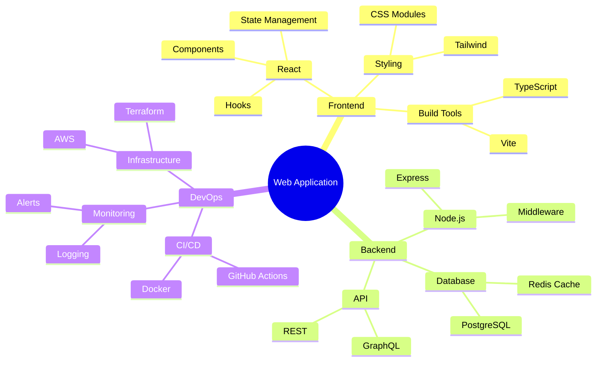

---

## Hierarchy via Indentation

Mindmap structure is defined entirely by indentation. Each level of indentation creates a child node of the parent above it.

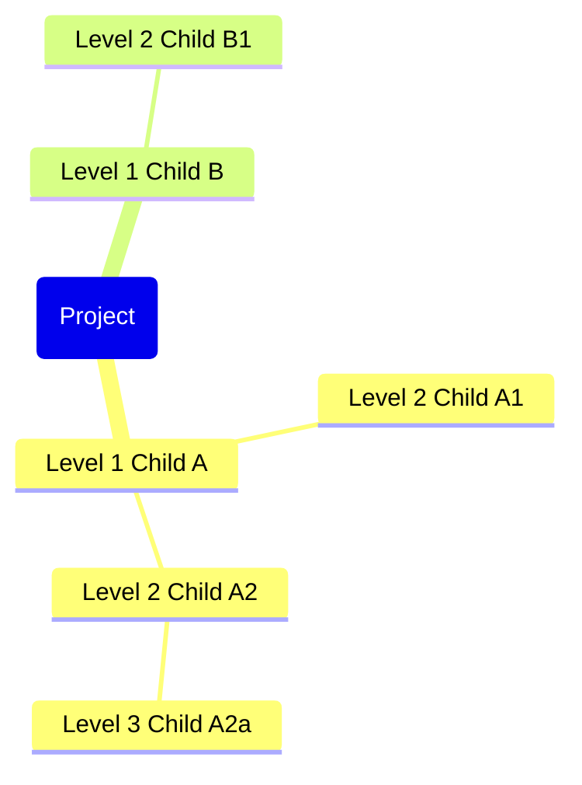

Rules:

- The first node is always the root (center of the mindmap)
- Use consistent indentation (spaces, not tabs)
- Each additional indent level creates a deeper child
- Siblings share the same indentation level
- No explicit connection syntax needed -- hierarchy is purely structural

---

## Node Shapes

Node shapes are controlled by wrapping the label text in different bracket pairs:

| Syntax     | Shape        | Example            |
| ---------- | ------------ | ------------------ |
| `text`     | Default      | `Planning`         |
| `(text)`   | Rounded rect | `(Planning)`       |
| `((text))` | Circle       | `((Central Idea))` |
| `[text]`   | Square       | `[Module A]`       |
| `[(text)]` | Cylinder     | `[(Database)]`     |
| `))text((` | Bang         | `))Alert((`        |
| `{{text}}` | Hexagon      | `{{Decision}}`     |
| `)text(`   | Cloud        | `)Brainstorm(`     |

### Shape Examples

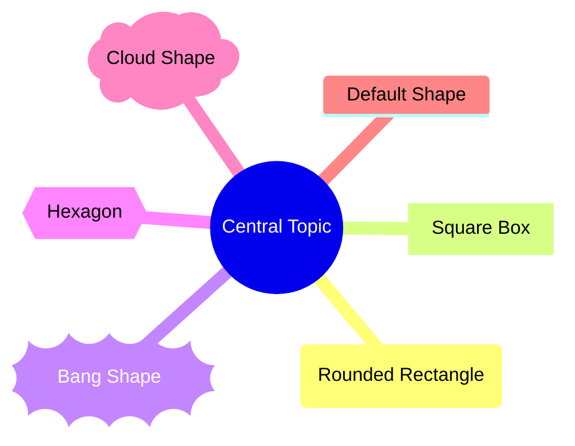

---

## Root Node

The root node is the first entry in the mindmap and becomes the central element. It is typically styled with `(( ))` for a circle shape:

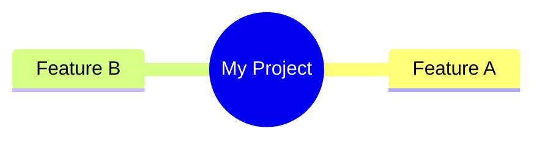

The `root` keyword is the node identifier. The display text comes from the shape syntax. You can use any identifier:

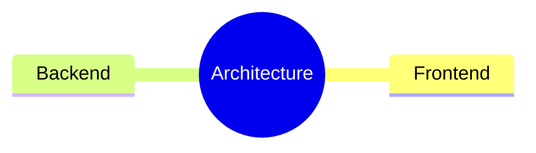

---

## Icons

Add icons to nodes using the `::icon()` syntax. Mermaid supports Font Awesome icons:

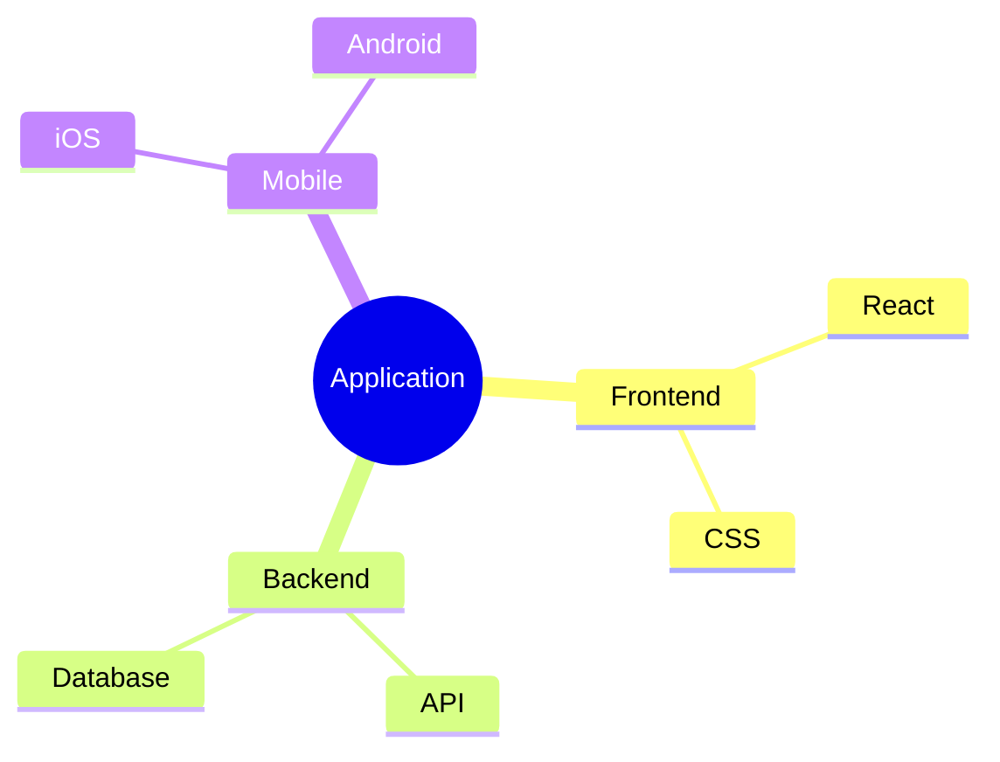

The `::icon()` directive goes on the line immediately after the node it applies to, at the same indentation level as the node's children.

---

## Classes

Apply CSS classes to nodes using the `:::` syntax:

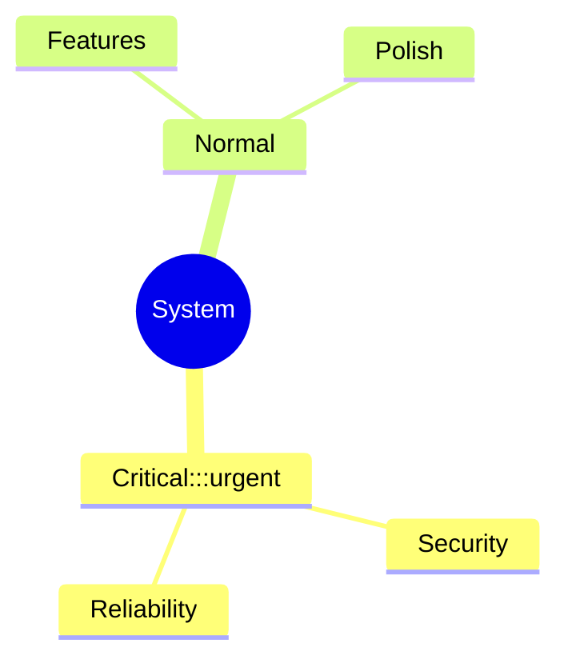

Classes are defined in Mermaid theme configuration or custom CSS. The `:::className` is appended directly to the node text or shape.

---

## Multi-word Node Labels

Node labels can contain spaces. The shape delimiters define the boundary:

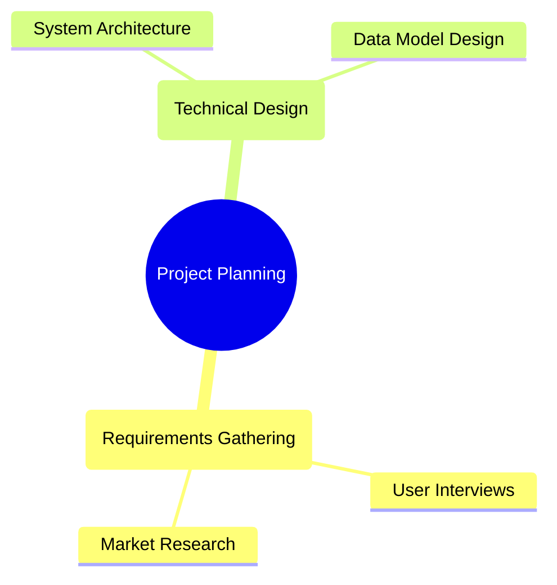

---

## Practical Examples

### Feature Breakdown

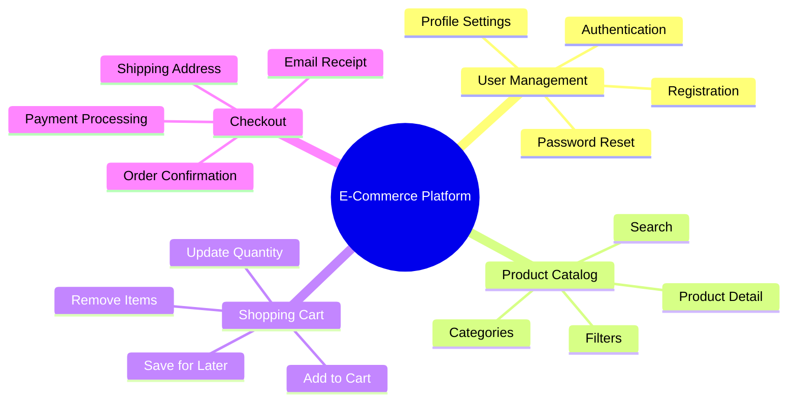

### Sprint Retrospective

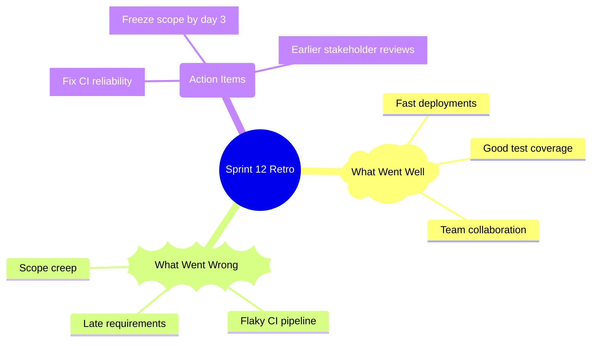

### Technology Stack Decision

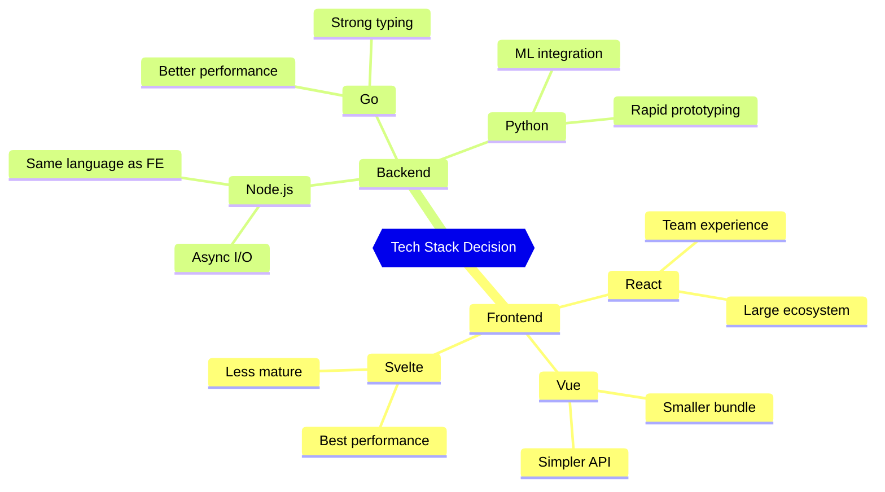

---

## Best Practices

1. **Use a circle `(( ))` for the root node** -- visually distinguishes the central concept from branches.

2. **Limit depth to 3-4 levels** -- deeper hierarchies become hard to read in a radial layout.

3. **Keep node labels to 1-3 words** -- brevity is essential for radial layouts. Use a separate document for details.

4. **Use shapes to encode meaning** -- for example, `(( ))` for topics, `[( )]` for data stores, `{{ }}` for decisions, `)) ((` for warnings.

5. **Balance branch sizes** -- avoid one branch with 15 children and another with 1. Reorganize or split if needed.

6. **Use consistent indentation** -- 4 spaces per level is a good default. Never mix tabs and spaces.

7. **Group related concepts as siblings** -- the spatial proximity in a mindmap implies relatedness.

8. **Start broad, then detail** -- first-level children should be major categories; details go deeper.

9. **Limit to 3-7 first-level branches** -- follows cognitive load principles. More than 7 top-level branches overwhelms.

10. **Use for ideation and overview, not precision** -- mindmaps communicate structure and relationships. For exact sequences, use flowcharts or Gantt charts instead.
