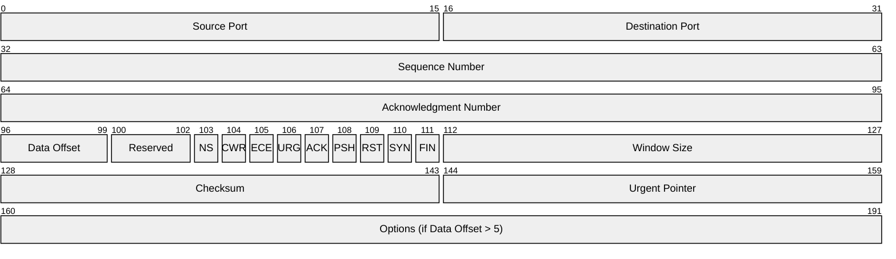
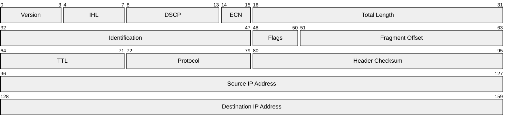

# Mermaid Packet Diagram Reference

## Directive

```
packet-beta
```

Packet diagrams visualize binary protocol headers and data structures with bit-level precision. Available in Mermaid v11+.

## Complete Example (TCP Header)



## Bit-Range Notation

Each line defines a field using the syntax:

```
start-end: "Label"
```

- `start` and `end` are zero-indexed bit positions (inclusive).
- The label is a quoted string.

Examples:

```
0-15: "Source Port"
32-63: "Sequence Number"
```

## Single Bit Fields

For single-bit flags, use the same bit number for start and end, or just the bit number alone:

```
103: "NS"
104: "CWR"
105: "ECE"
```

Single bit fields render as narrow columns, useful for flag fields in protocol headers.

## Multi-Row Layouts

Rows are 32 bits wide by default. Fields automatically wrap to the next row when they cross a 32-bit boundary. Plan your bit ranges so fields align to row boundaries for clean layouts:

- Row 1: bits 0-31
- Row 2: bits 32-63
- Row 3: bits 64-95
- Row 4: bits 96-127

A field that spans `32-63` fills an entire row. A field spanning `0-15` fills the left half of the first row.

## IPv4 Header Example



## Best Practices

1. **Use zero-indexed bit positions** -- bits start at 0, not 1.
2. **Align fields to 32-bit rows** for clean visual output. Avoid fields that unnecessarily span row boundaries.
3. **Keep labels concise** -- long labels will overflow narrow fields. Use abbreviations for small bit ranges.
4. **Order fields sequentially** -- define fields from lowest to highest bit position.
5. **Use single-bit syntax for flags** -- protocol flags like SYN, ACK, FIN are typically single bits and render best individually.
6. **Reference the protocol spec** -- packet diagrams are most useful when they accurately reflect real protocol headers (TCP, UDP, IPv4, DNS, etc.).
