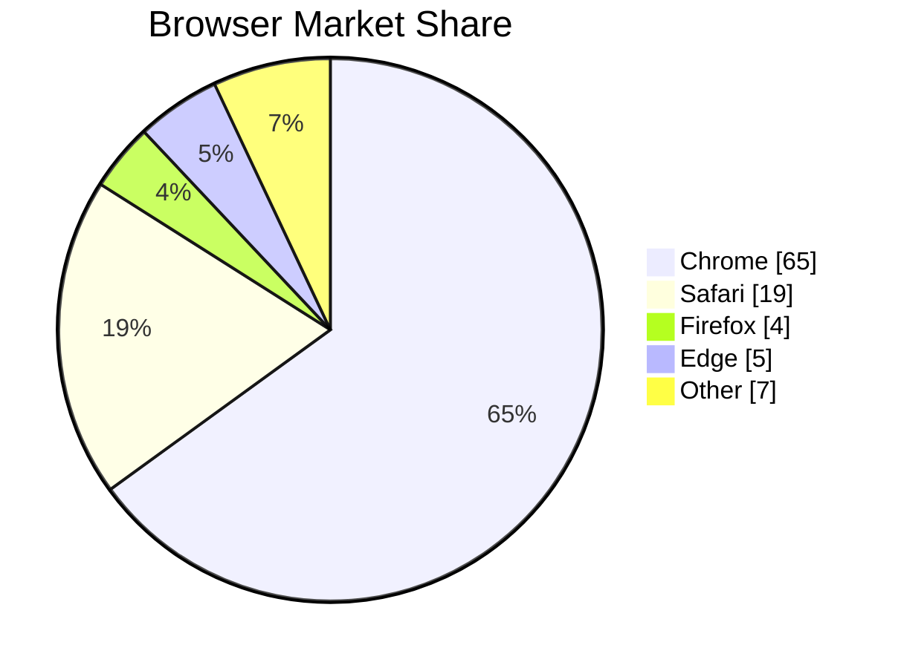
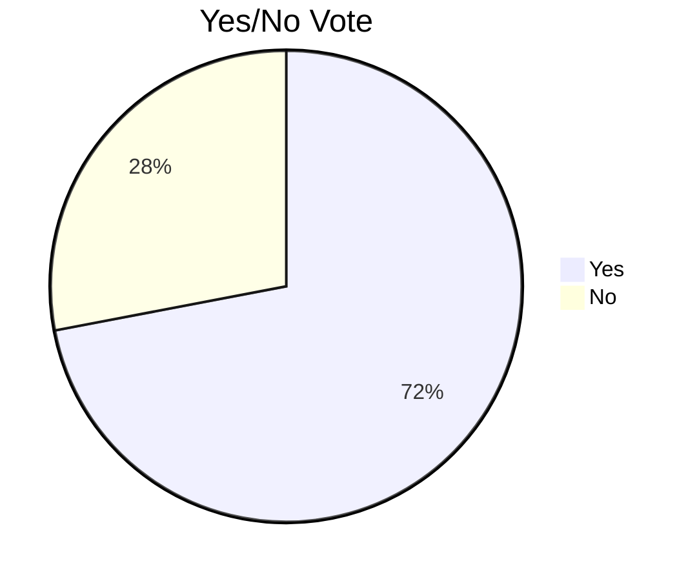
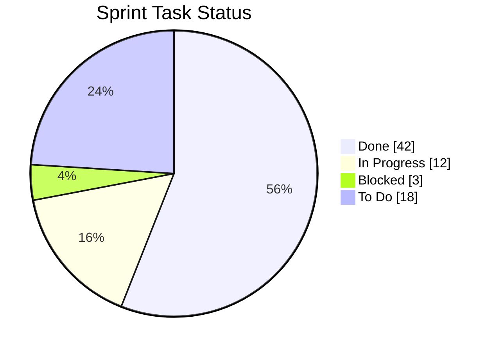

# Mermaid Pie Chart Reference

## Directive

```
pie
```

Pie charts display proportional data as slices of a circle.

## Complete Example



## Title

Optional title displayed above the chart:

```
pie
    title Project Time Allocation
```

## showData Option

Add `showData` after the `pie` keyword to display the raw values alongside each slice:

```
pie showData
    title Budget Breakdown
    "Engineering" : 45
    "Marketing" : 25
    "Operations" : 20
    "Other" : 10
```

Without `showData`, only percentages and labels are shown.

## Data Entry Syntax

Each data entry follows the pattern:

```
"Label" : value
```

- **Label** -- a quoted string identifying the slice.
- **value** -- a positive number (integer or decimal). Values are automatically converted to percentages based on the total.

Examples:

```
"Completed" : 75
"In Progress" : 15
"Not Started" : 10
```

Values do not need to sum to 100 -- Mermaid calculates percentages from the total of all values.

## Minimal Example



## Project Status Example



## Best Practices

1. **Limit to 5-7 slices** -- too many slices make the chart hard to read. Group small categories into "Other".
2. **Use `showData` for precision** -- when exact values matter (budgets, counts), enable `showData` so readers don't have to guess from slice sizes.
3. **Order slices by size** -- list the largest slice first for consistent visual hierarchy (Mermaid renders slices in definition order).
4. **Avoid pie charts for comparison** -- if you need to compare values precisely, use an `xychart-beta` bar chart instead. Pie charts are best for showing parts of a whole.
5. **Use descriptive labels** -- labels should be self-explanatory without needing a legend or external context.
6. **Keep labels short** -- long labels crowd the chart. Abbreviate where possible.
