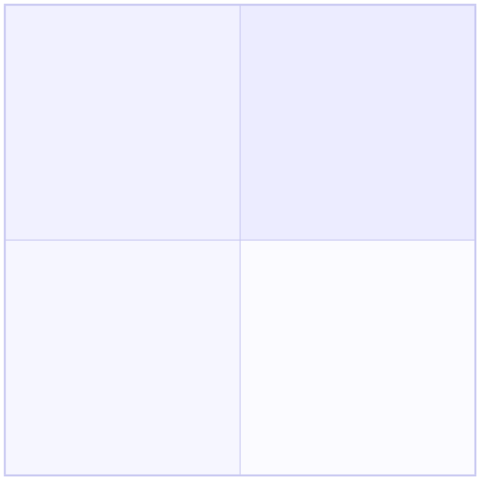
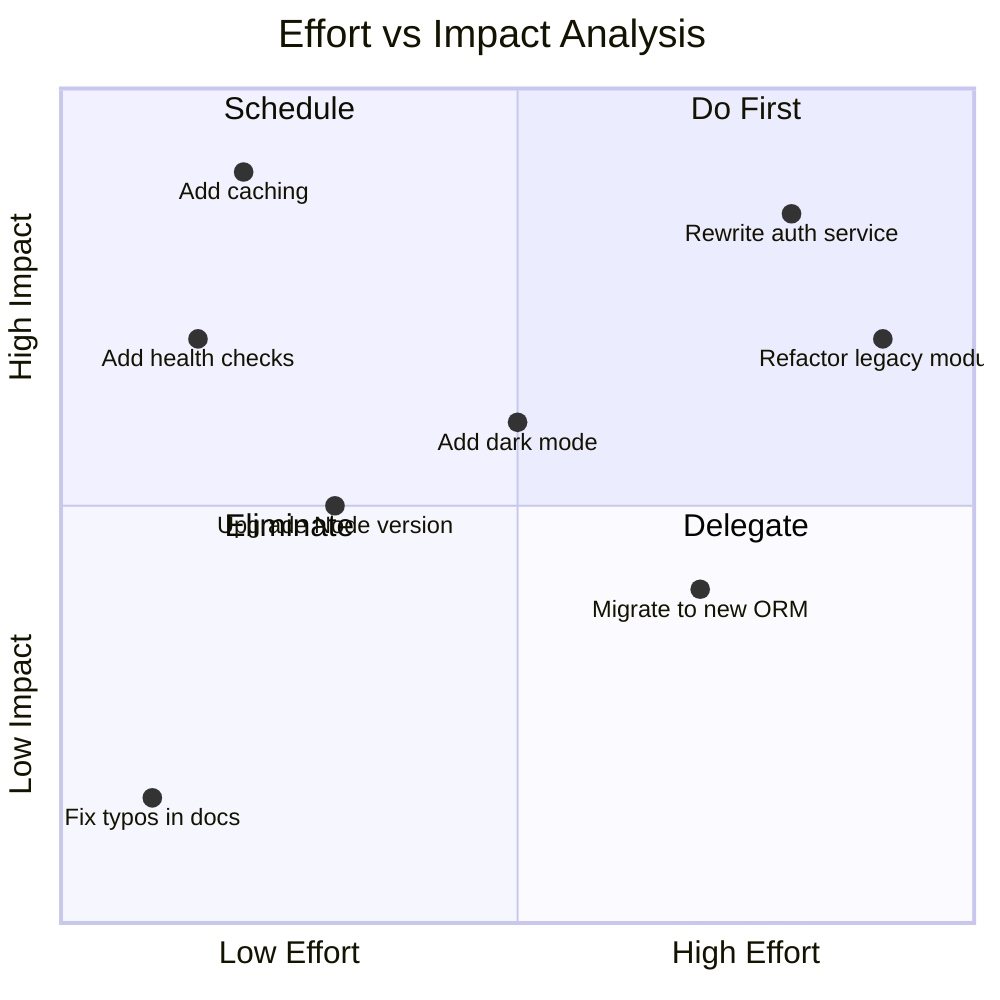
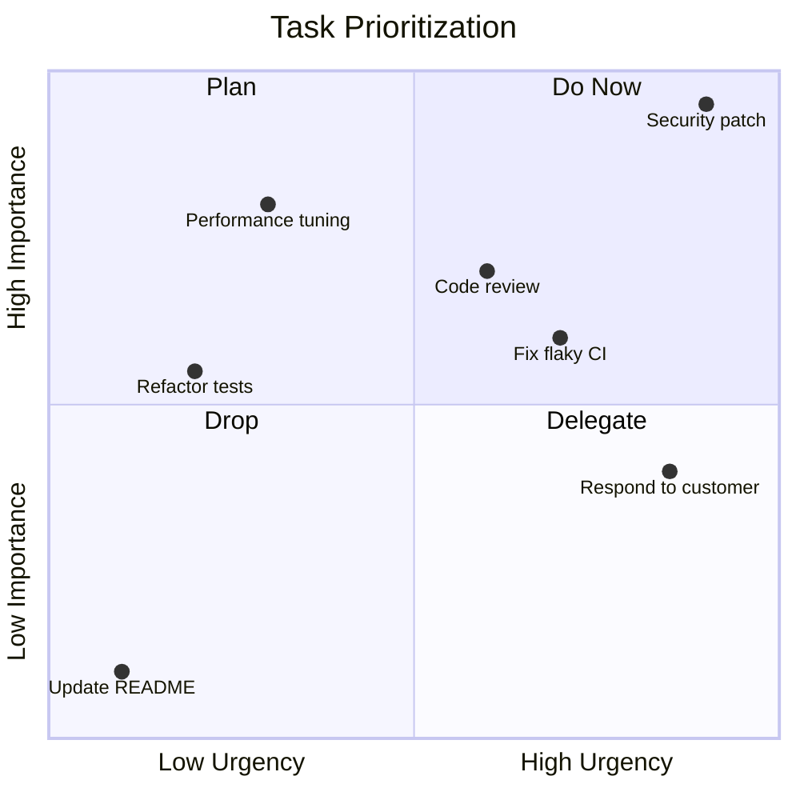
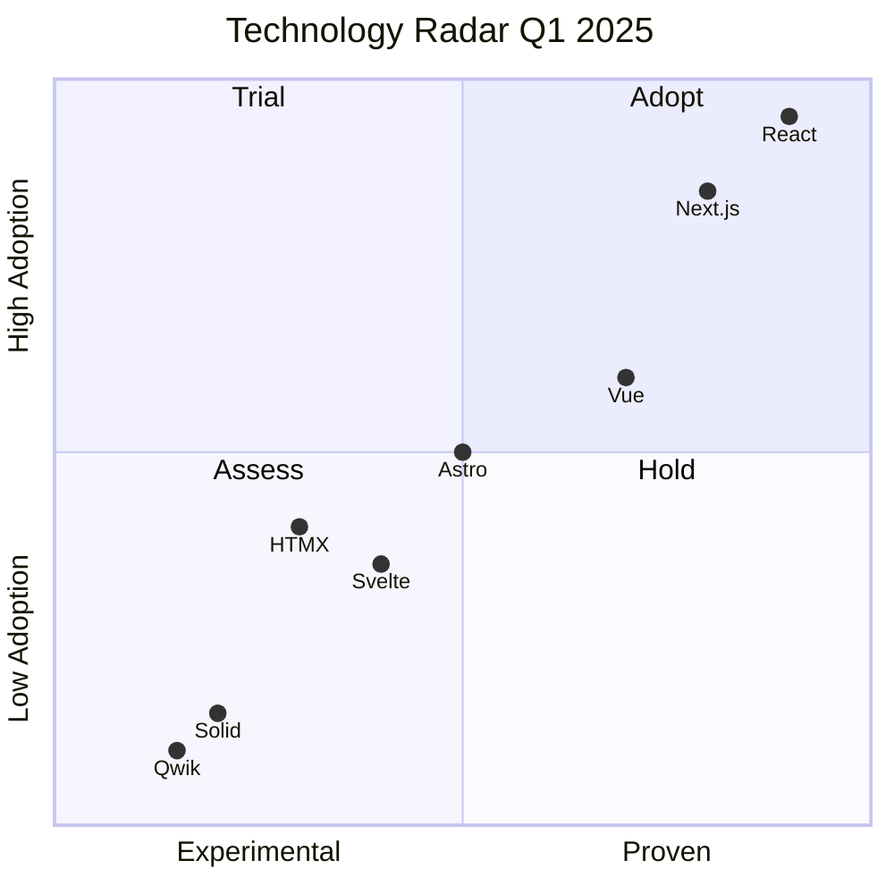

# Mermaid Quadrant Chart Reference

Quadrant charts plot items on a two-dimensional grid divided into four labeled quadrants. Useful for priority matrices, effort/impact analysis, risk assessment, and technology radar visualizations.

---

## Directive



---

## Complete Example



---

## Quadrant Numbering

Quadrants are numbered starting from the top-right and moving counter-clockwise:

```
              y-axis
              ^
              |
  quadrant-2  |  quadrant-1
  (top-left)  |  (top-right)
              |
 -------------+------------->  x-axis
              |
  quadrant-3  |  quadrant-4
  (bot-left)  |  (bot-right)
              |
```

| Quadrant     | Position     |
| ------------ | ------------ |
| `quadrant-1` | Top-right    |
| `quadrant-2` | Top-left     |
| `quadrant-3` | Bottom-left  |
| `quadrant-4` | Bottom-right |

---

## Axis Labels

Define axis labels with directional arrows showing what low and high values mean:

```
x-axis Low Label --> High Label
y-axis Low Label --> High Label
```

The text before `-->` labels the low end (left/bottom), the text after labels the high end (right/top).

### Examples

```
x-axis Low Effort --> High Effort
y-axis Low Impact --> High Impact

x-axis Easy --> Hard
y-axis Low Value --> High Value

x-axis Low Risk --> High Risk
y-axis Low Reward --> High Reward
```

---

## Quadrant Names

Name each quadrant to describe what items in that region represent:

```
quadrant-1 Do First
quadrant-2 Schedule
quadrant-3 Eliminate
quadrant-4 Delegate
```

Common naming patterns:

| Use Case          | Q1 (top-right)   | Q2 (top-left)      | Q3 (bottom-left) | Q4 (bottom-right)  |
| ----------------- | ---------------- | ------------------ | ---------------- | ------------------ |
| Effort/Impact     | Do First         | Schedule           | Eliminate        | Delegate           |
| Eisenhower Matrix | Urgent+Important | Not Urgent+Import. | Neither          | Urgent+Not Import. |
| Risk Assessment   | Mitigate         | Accept             | Ignore           | Transfer           |
| Tech Radar        | Adopt            | Trial              | Hold             | Assess             |

---

## Point Coordinates

Points are plotted using `[x, y]` coordinates where both values are in the 0 to 1 range:

```
Item Label: [x, y]
```

| Value | Meaning                           |
| ----- | --------------------------------- |
| `0.0` | Minimum (left edge / bottom edge) |
| `0.5` | Center of the axis                |
| `1.0` | Maximum (right edge / top edge)   |

The quadrant boundaries are at 0.5 on both axes:

- `[0.8, 0.9]` -- top-right (quadrant-1)
- `[0.2, 0.8]` -- top-left (quadrant-2)
- `[0.1, 0.2]` -- bottom-left (quadrant-3)
- `[0.7, 0.3]` -- bottom-right (quadrant-4)

### Point Syntax

```
Label text: [x, y]
```

The label can contain spaces and most characters. The colon separates the label from coordinates.

---

## Title

```
title Chart Title Text
```

The title is optional but recommended for context.

---

## Priority Matrix Example



---

## Technology Radar Example



---

## Tips and Limitations

- Coordinates must be between 0 and 1 (inclusive). Values outside this range produce errors.
- Points at exactly 0.5 on an axis sit on the quadrant boundary line.
- There is no way to style individual points with different colors or sizes.
- Labels that are too long may overlap with nearby points -- keep them concise.
- The chart does not support point grouping or categories.
- All four quadrant names are optional, but defining all four makes the chart self-explanatory.
- The `title`, axis labels, and quadrant names all support spaces and standard characters.
