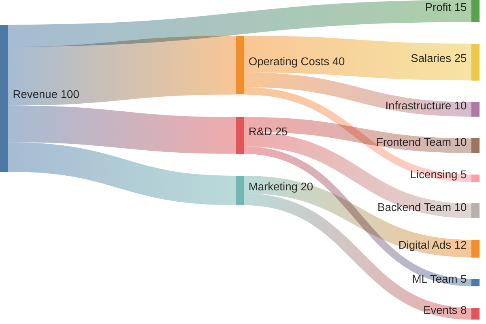
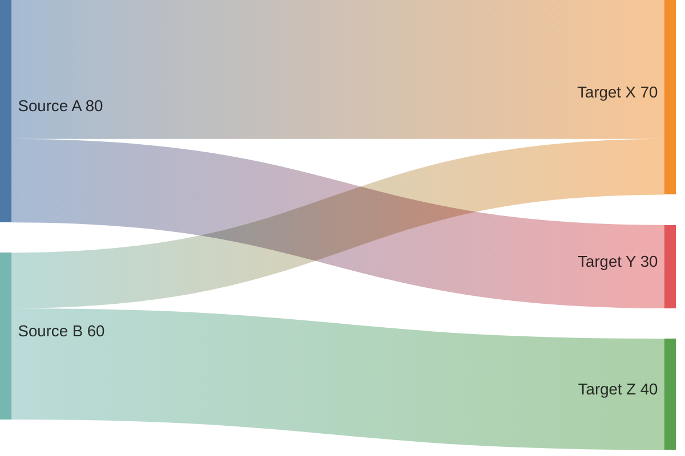
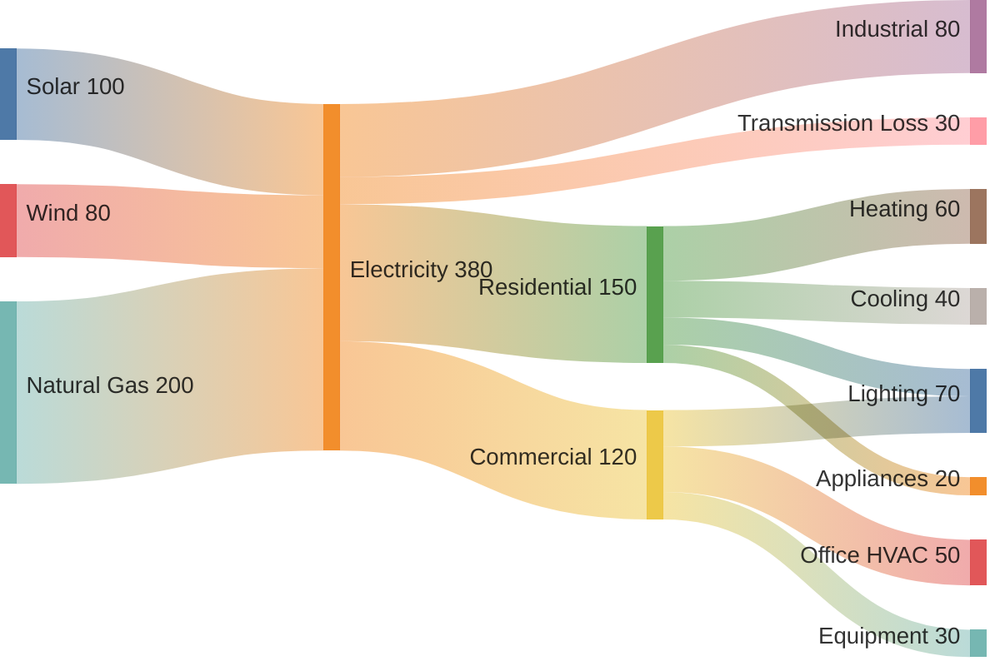
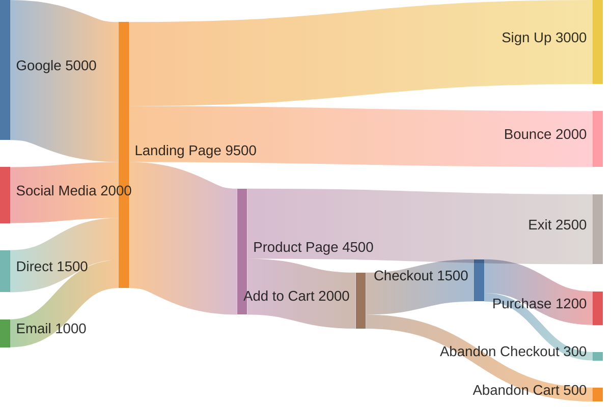
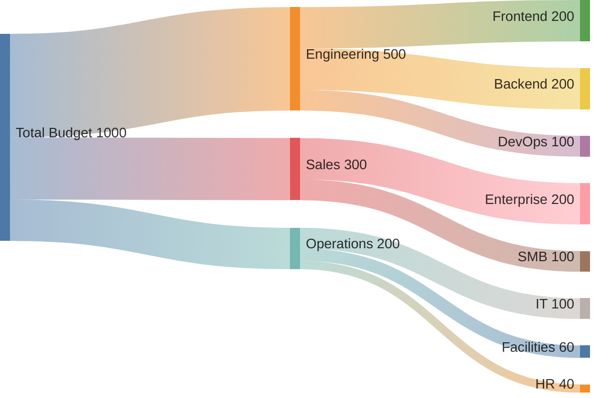

# Mermaid Sankey Diagram Reference

Sankey diagrams visualize flow quantities between nodes. The width of each link is proportional to the flow value, making it easy to see where resources, energy, traffic, or money move through a system.

---

## Directive

```mermaid
sankey-beta
```

The `sankey-beta` directive is required. The "beta" suffix indicates this diagram type is still evolving.

**Important:** A blank line after the `sankey-beta` directive is required before the data begins.

---

## CSV Format

Sankey data uses a simple CSV format with three columns:

```
source,target,value
```

| Column   | Description                           |
| -------- | ------------------------------------- |
| `source` | The originating node name             |
| `target` | The destination node name             |
| `value`  | Numeric flow quantity (width of link) |

Each line defines one flow. Nodes are created automatically from source and target names.

---

## Complete Example



---

## Basic Example



---

## Multi-Step Flow Example

Sankey diagrams support multi-step flows where the target of one link becomes the source of another, creating chains:



In this example, `Electricity` is both a target (from energy sources) and a source (to consumption sectors), creating a two-stage flow.

---

## Website Traffic Flow Example



---

## Data Format Rules

### Node names

- Node names can contain spaces and most characters
- Node names are case-sensitive: `Revenue` and `revenue` are different nodes
- A node referenced as both source and target in different rows creates multi-step flow

### Values

- Must be positive numbers
- Can be integers or decimals
- Values determine the proportional width of each link
- Zero values are valid but produce invisible links

### Blank line requirement

A blank line between `sankey-beta` and the first data row is required:

```
%% CORRECT
sankey-beta

Source,Target,10

%% INCORRECT (will not parse)
sankey-beta
Source,Target,10
```

### Quoting

Node names containing commas must be quoted:

```
"New York, NY",East Coast,500
"San Francisco, CA",West Coast,300
```

---

## Budget Flow Example



---

## Tips and Limitations

- The `sankey-beta` directive must be followed by a blank line before data.
- Node positioning is automatic -- you cannot control the vertical order of nodes.
- Link colors are assigned automatically and cannot be customized through the CSV data.
- All flows are left-to-right. There is no support for right-to-left or vertical Sankey layouts.
- Circular flows (A -> B -> A) are not supported and will produce rendering errors.
- Very small values relative to large ones may produce links too thin to see.
- There is no support for node colors or labels beyond the node name.
- Column headers are not supported -- do not add a `source,target,value` header row.
- The diagram type is still in beta; syntax and rendering behavior may change in future mermaid versions.
