# Mermaid Sequence Diagram Reference

## Directive

```
sequenceDiagram
```

## Complete Example

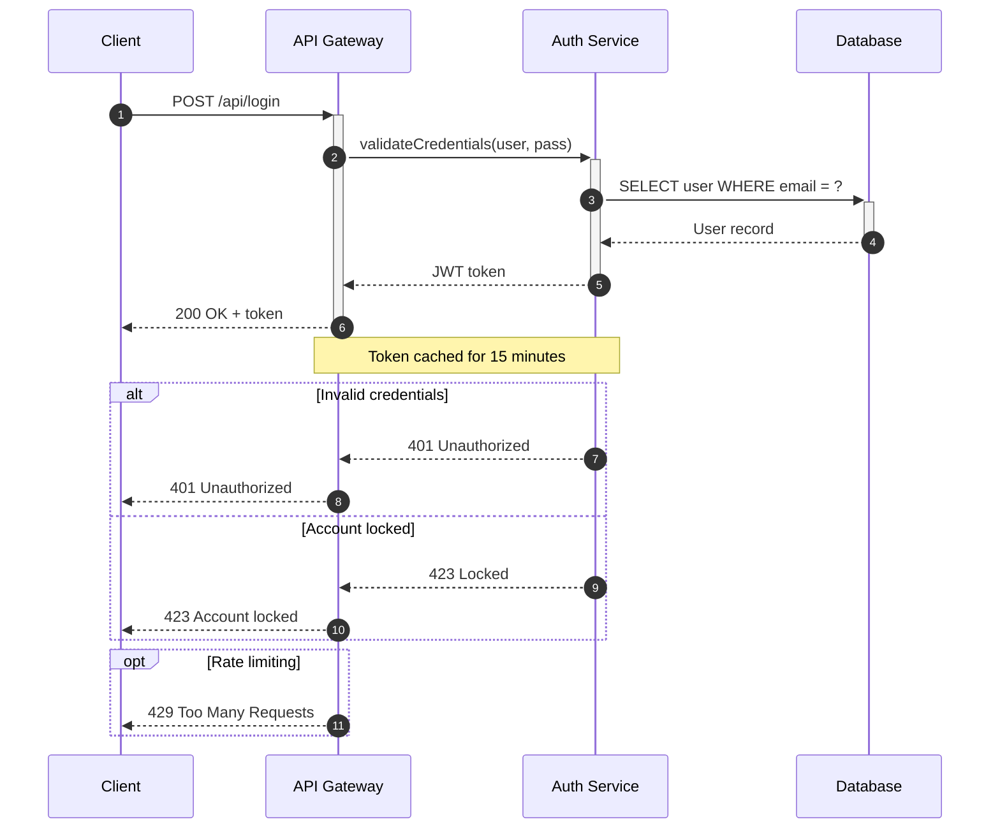

## Arrow Types

| Syntax | Description                     |
| ------ | ------------------------------- |
| `->`   | Solid line, no arrowhead        |
| `-->`  | Dotted line, no arrowhead       |
| `->>`  | Solid line, arrowhead           |
| `-->>` | Dotted line, arrowhead          |
| `-x`   | Solid line, cross (lost msg)    |
| `--x`  | Dotted line, cross (lost msg)   |
| `-)`   | Solid line, open arrow (async)  |
| `--)`  | Dotted line, open arrow (async) |

### Arrow conventions

- **Solid with arrowhead** (`->>`) for synchronous request.
- **Dotted with arrowhead** (`-->>`) for synchronous response/return.
- **Open arrow** (`-)`, `--)`) for asynchronous fire-and-forget messages.
- **Cross** (`-x`, `--x`) for lost or rejected messages.

## Participants and Actors

Declare participants explicitly to control their left-to-right ordering:

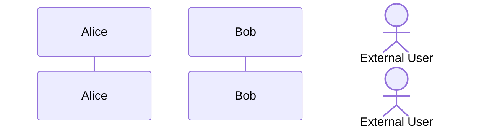

- `participant` renders as a box.
- `actor` renders as a stick figure (use for human users interacting with the system).

If you don't declare participants, Mermaid infers them from usage, but the order may not be what you want.

## Activation (Lifelines)

Show when a participant is actively processing:

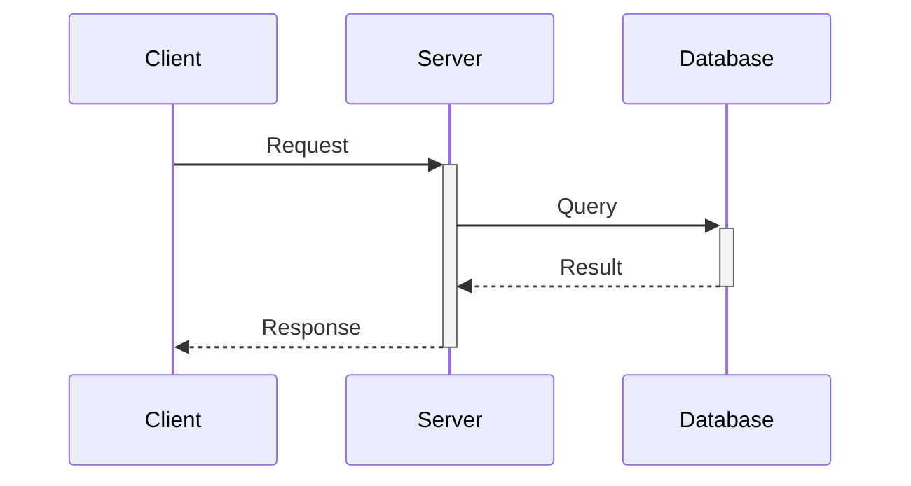

- `+` after the arrow target activates the participant.
- `-` after the arrow source deactivates it.
- This is preferred over separate `activate`/`deactivate` lines -- it's more concise and co-located with the message.

## Grouping Blocks

### alt/else -- Conditional paths

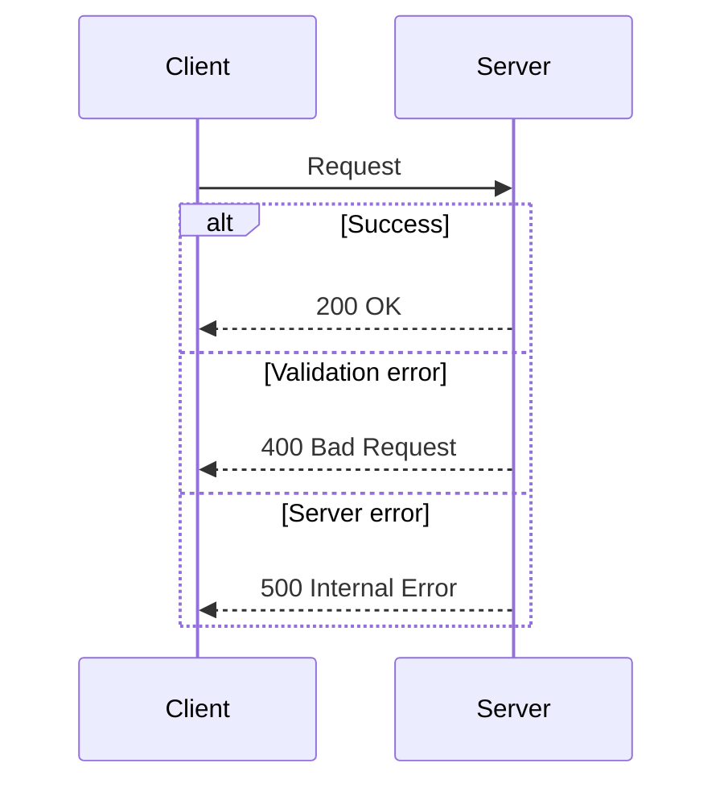

### opt -- Optional path

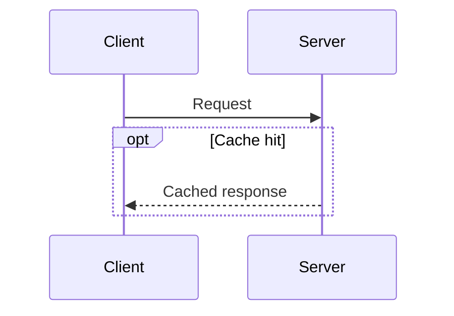

### par -- Parallel execution

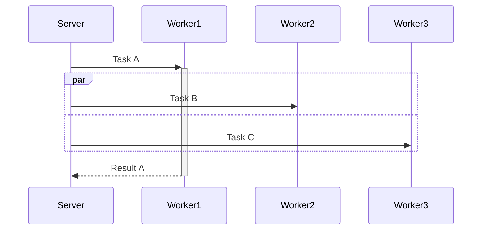

### critical -- Critical region

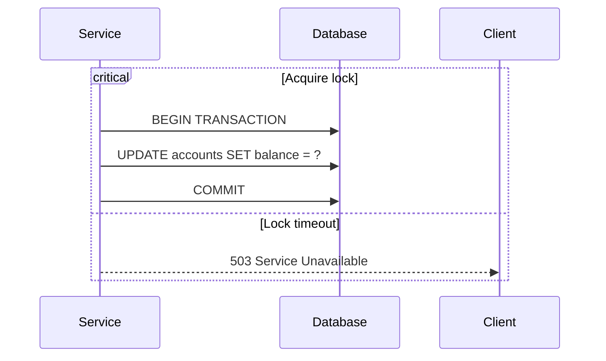

### loop -- Repeated interaction

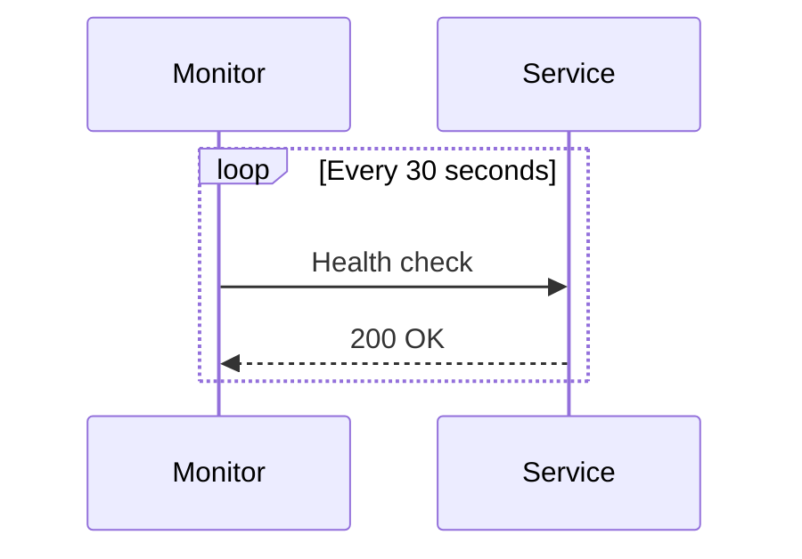

### break -- Early exit

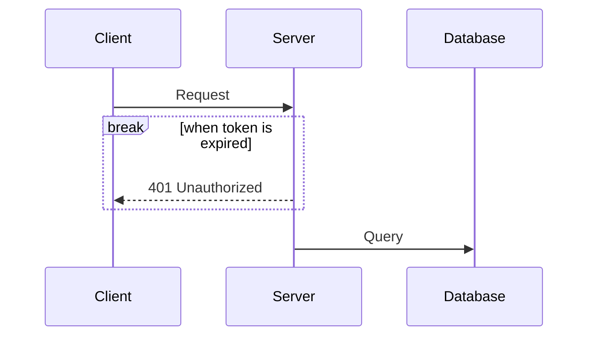

## Notes

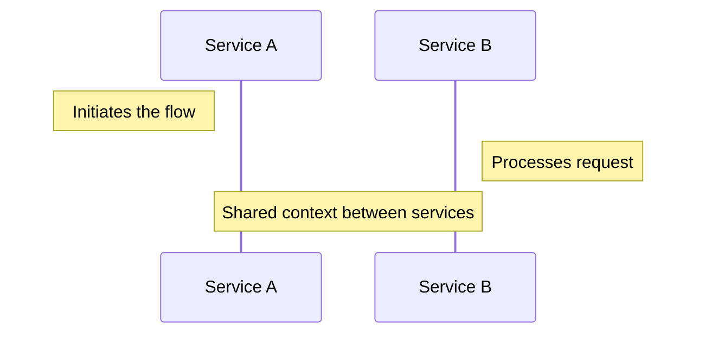

- `Note left of` -- note to the left of a participant.
- `Note right of` -- note to the right.
- `Note over A,B` -- note spanning multiple participants.

## Background Highlighting (rect)

Use `rect` to add colored background sections:

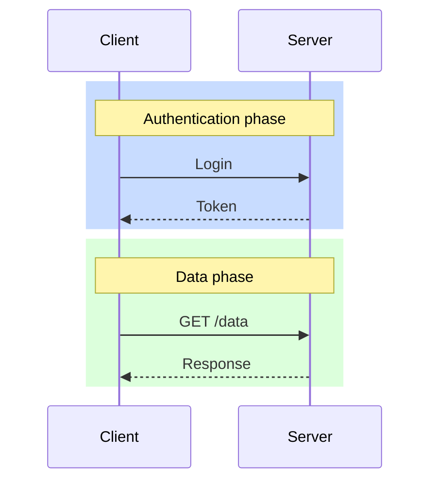

## Autonumber

Add sequential message numbers:

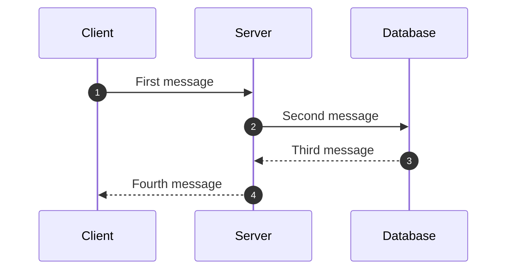

Place `autonumber` immediately after the `sequenceDiagram` directive.

## Best Practices

1. **Declare participants explicitly** -- controls ordering and lets you assign short aliases (`participant G as API Gateway`).
2. **Use `autonumber`** for complex flows so readers can follow the sequence by number.
3. **Use `+`/`-` suffixes for activation** rather than separate `activate`/`deactivate` lines -- it's more concise and keeps activation co-located with the message.
4. **Include error paths** with `alt`/`else` blocks -- real systems have failure modes; show them.
5. **Use `actor` for humans, `participant` for systems** -- this visual distinction helps readers quickly identify external users.
6. **Keep diagrams focused** -- a single sequence diagram should cover one flow (e.g., login, checkout). Split multi-flow interactions into separate diagrams.
7. **Use `Note over`** to annotate important context like caching, timeouts, or side effects.
