# Mermaid State Diagram Reference

## Directive

```
stateDiagram-v2
```

Always use `stateDiagram-v2` (not `stateDiagram`). The v2 syntax supports composite states, forks, joins, choices, notes, and improved styling.

## Complete Example

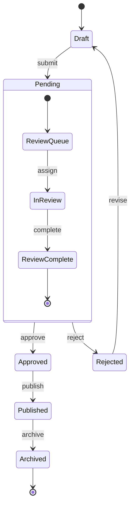

## Start and End States

Use `[*]` to represent both start and end pseudo-states:

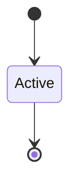

- A transition **from** `[*]` denotes the initial state.
- A transition **to** `[*]` denotes a final/terminal state.
- A diagram can have multiple final states but should have exactly one initial transition.

## Transitions

### Basic transitions

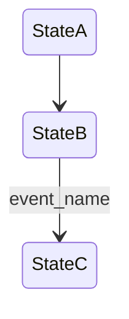

A transition can have an optional label (after `:`) describing the event or trigger.

### Transitions with guards and descriptions

Use the label to include guard conditions and action descriptions:

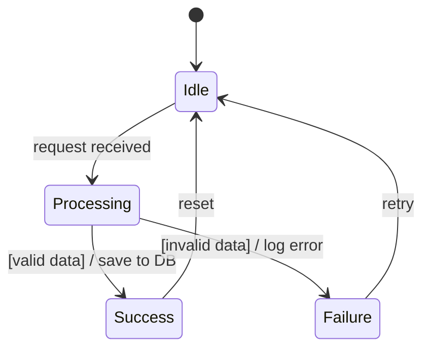

Convention: `[guard condition] / action` in the transition label communicates both the condition and the side effect.

## Composite (Nested) States

Group related states inside a parent state:

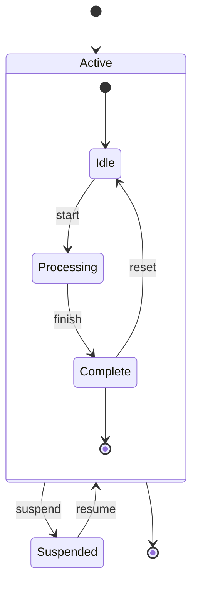

Composite states can be nested to any depth. Each composite state can have its own `[*]` start and end.

## Fork and Join

Model parallel state execution with `<<fork>>` and `<<join>>`:

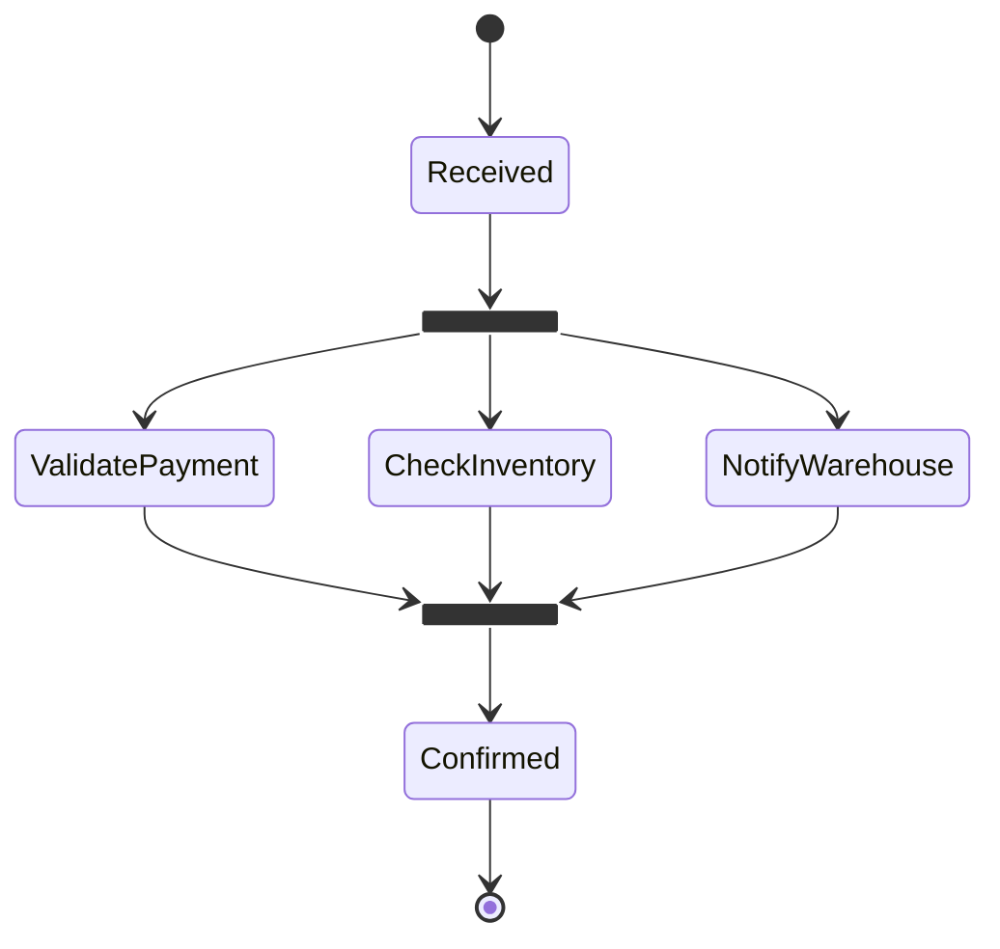

- `<<fork>>` splits into parallel paths.
- `<<join>>` waits for all parallel paths to complete before continuing.

## Choice (Decision)

Model conditional branching with `<<choice>>`:

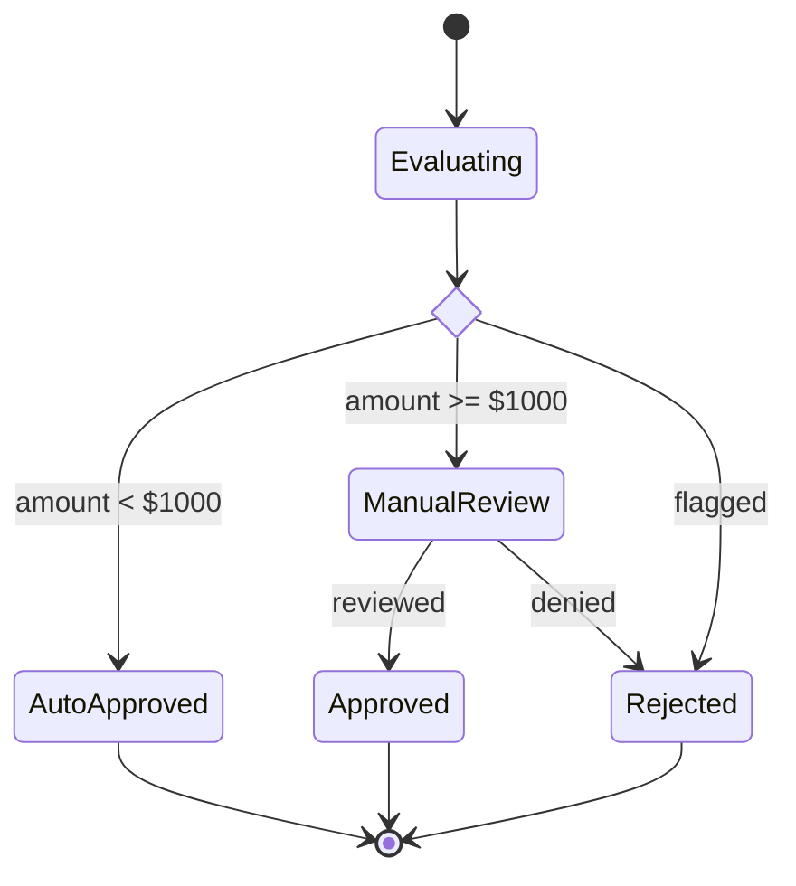

## Notes

Add notes to states for additional context:

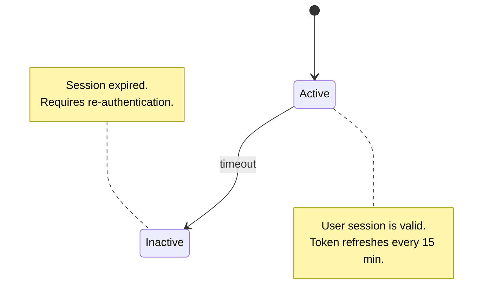

Notes support `right of`, `left of` positioning.

## Concurrency

Use `--` to indicate concurrent (orthogonal) regions within a composite state:

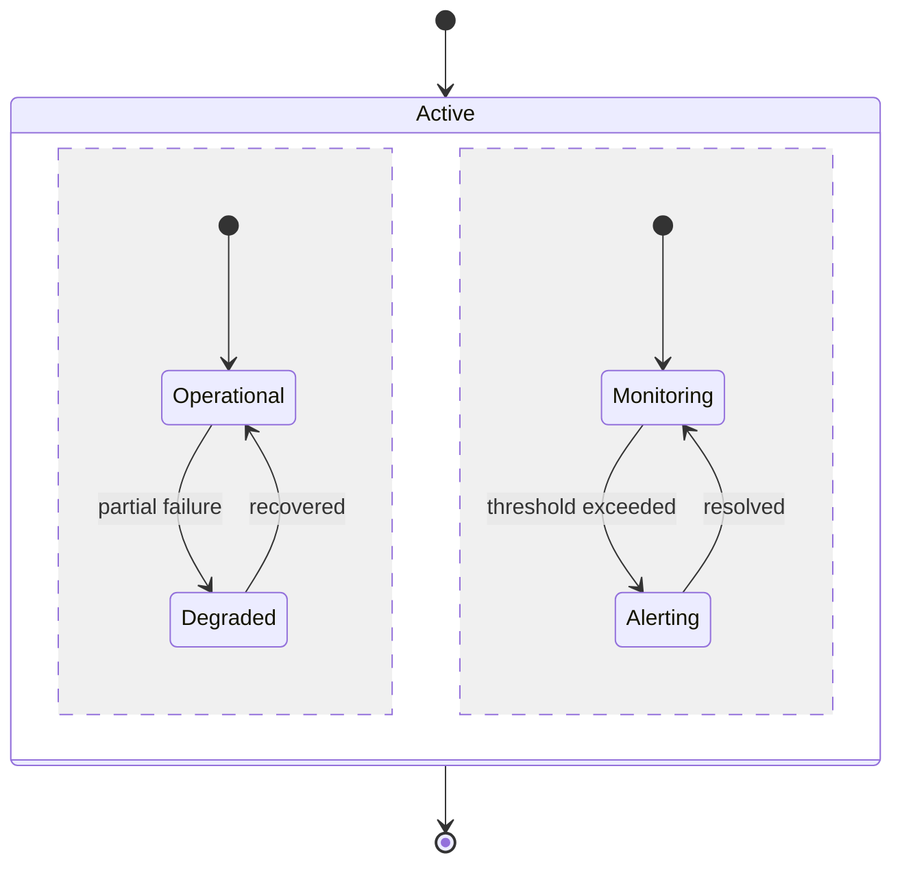

The `--` separator creates parallel regions that execute independently within the same parent state.

## State Descriptions

Add descriptions to states using `:` syntax:

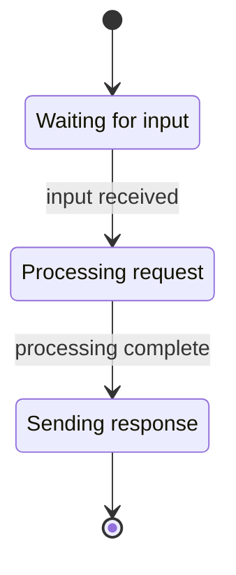

## Styling

Apply styles to specific states:

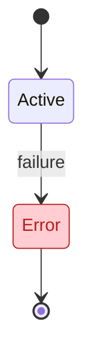

## Best Practices

1. **Use `stateDiagram-v2`** -- never use the original `stateDiagram` syntax. The v2 version supports composite states, forks, joins, choices, and notes.
2. **Use composite states for nesting** -- any time a state has its own internal lifecycle, model it as a composite state rather than flattening everything.
3. **Always include `[*]` transitions** -- every diagram should have a clear start and at least one end state.
4. **Label transitions with events** -- bare arrows without labels are harder to understand. Always describe what triggers the transition.
5. **Use `<<choice>>` for decisions** -- rather than having multiple transitions from the same state, use an explicit choice pseudo-state to make the branching clear.
6. **Use `<<fork>>`/`<<join>>` for parallelism** -- when multiple things happen simultaneously, model them explicitly rather than sequential approximations.
7. **Keep state names descriptive** -- `ProcessingPayment` is better than `S3`. State names appear in the rendered output.
8. **Use notes for business rules** -- if a state has conditions, timeouts, or constraints, document them with `note` blocks.
9. **Use concurrency (`--`) sparingly** -- only when the parent state genuinely has independent parallel concerns (e.g., operational status and monitoring).
