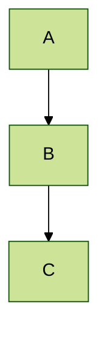
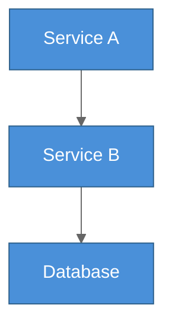

# Mermaid Theming Reference

## Built-in Themes

| Theme     | Description                                    | Best For                        |
| --------- | ---------------------------------------------- | ------------------------------- |
| `default` | Mermaid's standard blue/grey palette           | General purpose, light contexts |
| `forest`  | Green-toned, earthy palette                    | Environmental, natural topics   |
| `dark`    | Dark background with light text                | Dark UIs (but see note below)   |
| `neutral` | Greyscale, minimal color                       | Print, formal documentation     |
| `base`    | Unstyled starting point for full customization | Custom branded diagrams         |

## Applying a Theme via Frontmatter

Use YAML frontmatter at the top of the mermaid file to set the theme:



## Custom Theme Variables

Override specific colors using `themeVariables` in frontmatter:



### Important: Use Hex Colors Only

The Mermaid theme engine only recognizes hex color values. Color names like `red`, `blue`, `steelblue` will not work. Always use hex notation:

- Correct: `primaryColor: "#4a90d9"`
- Wrong: `primaryColor: "steelblue"`

## Common themeVariables

| Variable              | Controls                      |
| --------------------- | ----------------------------- |
| `primaryColor`        | Main node background color    |
| `primaryTextColor`    | Text color on primary nodes   |
| `primaryBorderColor`  | Border color on primary nodes |
| `lineColor`           | Edge and arrow color          |
| `secondaryColor`      | Secondary node background     |
| `tertiaryColor`       | Tertiary node background      |
| `mainBkg`             | Default node background       |
| `nodeBkg`             | Node fill color               |
| `nodeBorder`          | Node border color             |
| `clusterBkg`          | Subgraph/group background     |
| `clusterBorder`       | Subgraph/group border         |
| `titleColor`          | Diagram title text color      |
| `edgeLabelBackground` | Background behind edge labels |
| `textColor`           | General text color            |

## Dark Mode with diagramkit

When rendering with diagramkit, you do **not** need to use Mermaid's built-in `dark` theme. diagramkit handles dark mode automatically through a three-step process:

### How diagramkit dark mode works

1. **Separate dark theme config** -- diagramkit renders dark variants with its own theme variables that set a dark background, light text, and muted fills. This is applied automatically; you do not configure it.

2. **Post-processing with `postProcessDarkSvg()`** -- after rendering, diagramkit scans the SVG for fills with WCAG relative luminance > 0.4 (bright colors that would cause poor contrast on dark backgrounds) and darkens them while preserving hue. This catches colors that Mermaid's theme engine does not control (e.g., inline styles, classDef colors).

3. **Dual output** -- diagramkit outputs both `name-light.svg` and `name-dark.svg`. Consumers pick the variant matching their context.

### What this means for authors

- **Do not set `theme: dark`** in your mermaid files. diagramkit applies its own dark treatment.
- **Stick to default or neutral themes** for the source file. diagramkit transforms them for dark mode.
- **Custom `classDef` colors will be adjusted** -- if you use bright custom fills, the post-processor will darken them in dark output. This is intentional.
- **Use `--no-contrast` flag** if you want to disable the post-processing step (e.g., for diagrams with carefully chosen dark-compatible colors).

### diagramkit's Default Dark Theme Variables

These are the theme variables diagramkit applies when rendering dark variants (from `defaultMermaidDarkTheme` in `renderer.ts`):

```
background:          #111111
primaryColor:        #2d2d2d
primaryTextColor:    #e5e5e5
primaryBorderColor:  #555555
secondaryColor:      #333333
lineColor:           #cccccc
textColor:           #e5e5e5
mainBkg:             #2d2d2d
nodeBkg:             #2d2d2d
nodeBorder:          #555555
clusterBkg:          #1e1e1e
clusterBorder:       #555555
titleColor:          #e5e5e5
edgeLabelBackground: #1e1e1e
```

These values are intentionally low-contrast and muted. The post-processor then ensures any remaining bright fills are adjusted for readability.

## Best Practices

1. **Let diagramkit handle dark mode** -- do not set `theme: dark` in source files. Author for light mode; diagramkit produces both variants.
2. **Use `base` theme for custom branding** -- the `base` theme is a blank slate that respects all `themeVariables` without adding its own colors.
3. **Hex colors only** -- `#4a90d9` works, `steelblue` does not. This applies to both `themeVariables` and `classDef` styles.
4. **Prefer theme variables over `classDef`** -- theme variables apply globally and work with diagramkit's dark mode. `classDef` is per-diagram and may conflict with dark mode post-processing.
5. **Test both variants** -- run `diagramkit render file.mermaid` and inspect both light and dark SVGs to verify colors look correct in both modes.
6. **Avoid very bright custom fills** -- colors with high luminance (near-white yellows, light greens) will be significantly darkened by the post-processor. Choose mid-tone colors that work in both modes.
7. **Use `neutral` for print/PDF** -- the greyscale palette prints well and avoids color reproduction issues.
