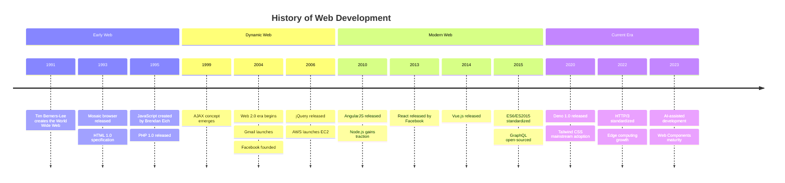
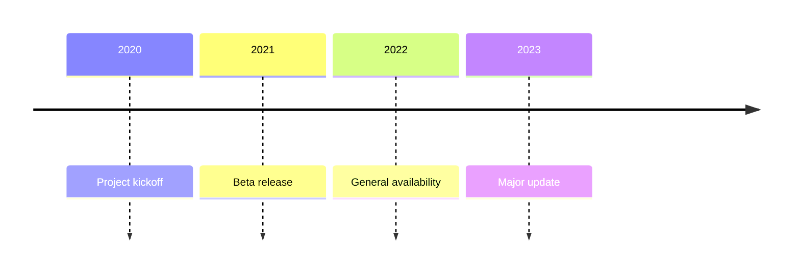
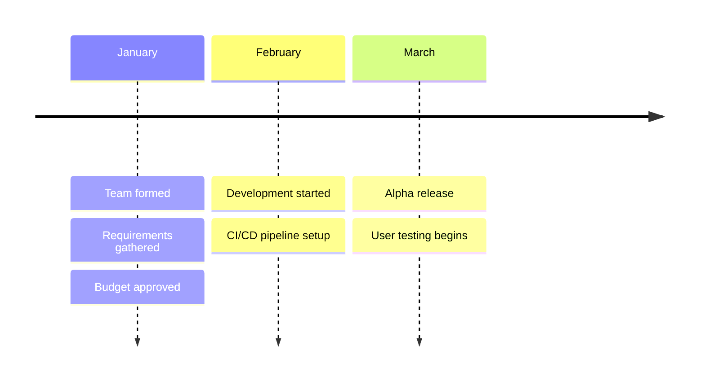
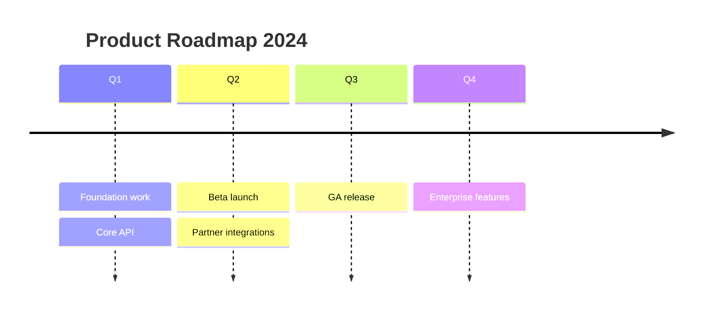
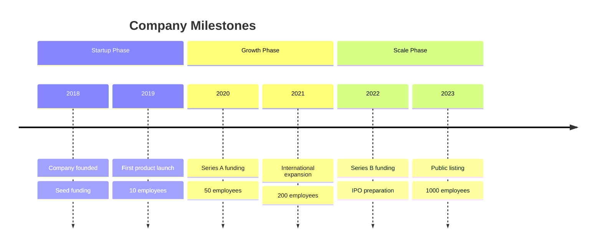
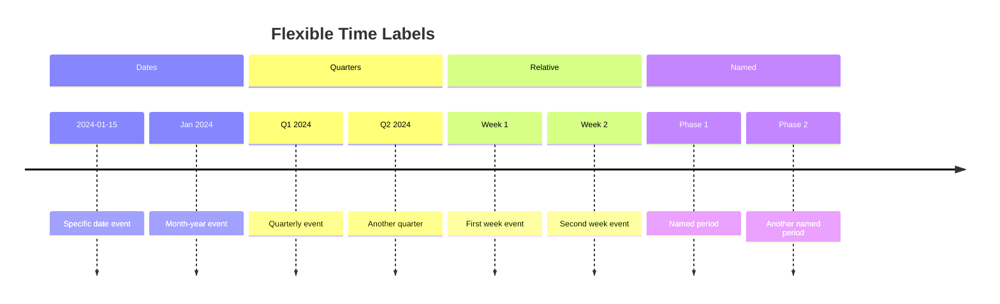
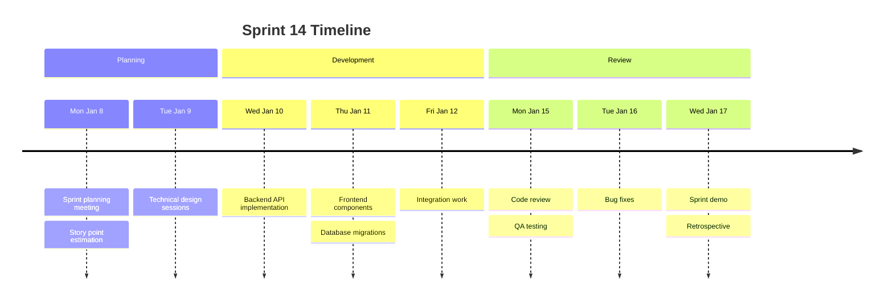
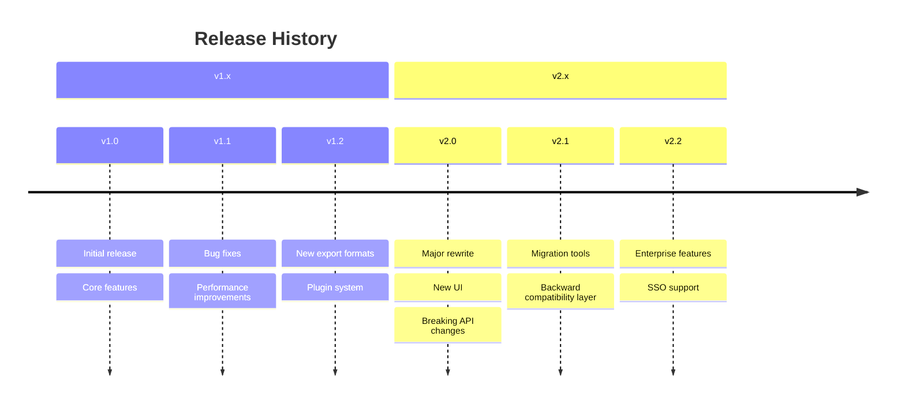
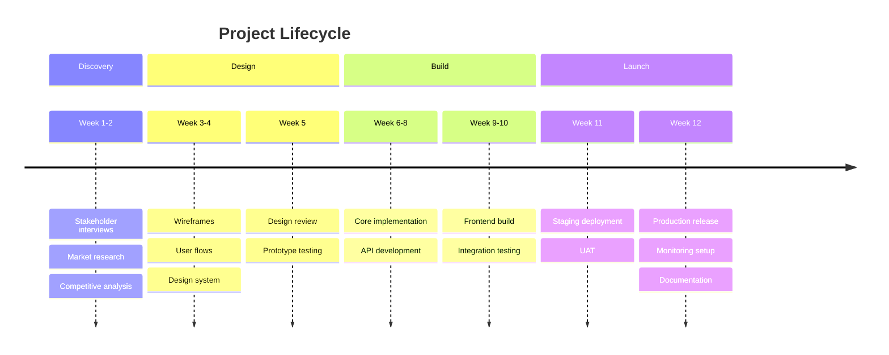

# Mermaid Timeline Reference

Complete reference for timeline diagrams in Mermaid. Timelines display events in chronological order, grouped by time periods and optional sections.

---

## Directive

```
timeline
```

---

## Complete Example



---

## Basic Syntax

Each timeline entry is a time period followed by a colon and an event description:

```
time period : event description
```



---

## Multiple Events Per Time Period

Add multiple events to the same time period by putting additional events on subsequent lines with the same indentation, using `: event` syntax:



The first line defines the time period. Subsequent lines starting with `:` add events to that same time period.

---

## Title

Add a title at the top of the timeline:



---

## Section Grouping

Sections visually group time periods under a common label:



Sections are optional. Without sections, all time periods appear in a single group.

---

## Time Period Formats

The time period label is free-form text. Use whatever format fits:



---

## Practical Examples

### Sprint Timeline



### Release History



### Project Phases



---

## Best Practices

1. **Use a `title`** -- always add a title to provide context for what the timeline represents.

2. **Group with sections for long timelines** -- sections break up visual monotony and add organizational structure. Use them when you have more than 5-6 time periods.

3. **Keep event descriptions concise** -- one line per event, 3-8 words. The timeline should be scannable.

4. **Limit events per time period to 3-4** -- too many events per period creates visual clutter.

5. **Use consistent time period formats** -- do not mix "2024", "January", and "Q1" in the same timeline unless sections clearly separate them.

6. **Order chronologically** -- timelines are read left to right. Ensure time periods are in sequential order.

7. **Use sections to tell a story** -- section labels like "Growth Phase", "Discovery", "v2.x" guide the reader through a narrative arc.

8. **Prefer timelines over Gantt for high-level overviews** -- timelines are better for communicating "what happened when" without duration/dependency complexity.

9. **Limit total timeline to 10-15 time periods** -- longer timelines should be split into separate diagrams or use broader time periods.

10. **Use free-form time labels for flexibility** -- "Phase 1", "Sprint 3", "Q2 2024", and "2024-03-15" are all valid. Choose what communicates best for your audience.
