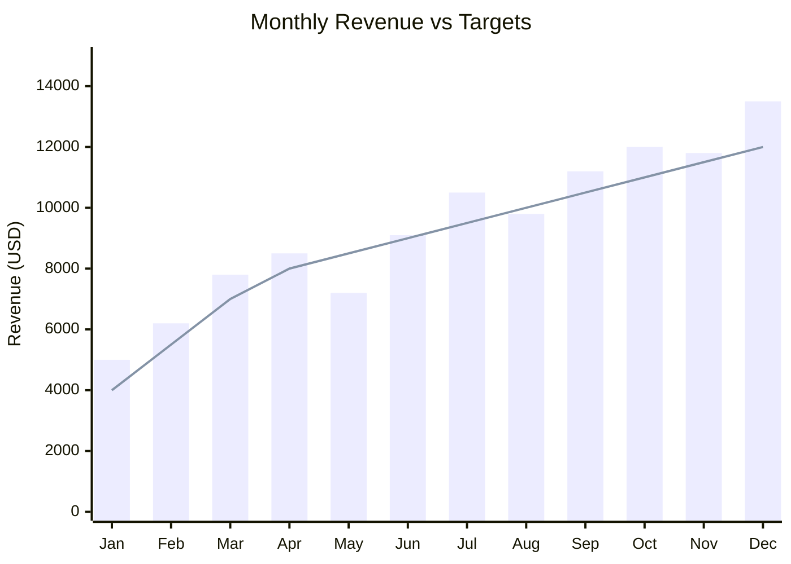
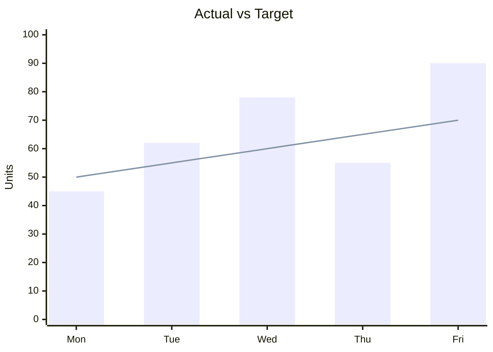

# Mermaid XY Chart Reference

## Directive

```
xychart-beta
```

XY charts render bar charts, line charts, or combined bar+line charts on a two-dimensional axis.

## Complete Example



## Title

Optional title displayed above the chart:

```
title "Sales Performance 2024"
```

The title string must be quoted.

## X-Axis

Define x-axis categories as a bracket-enclosed, comma-separated list:

```
x-axis [Q1, Q2, Q3, Q4]
```

You can also add a label before the array:

```
x-axis "Quarter" [Q1, Q2, Q3, Q4]
```

The number of x-axis values must match the number of data points in each series.

## Y-Axis

Define y-axis with an optional label and numeric range:

```
y-axis "Revenue (USD)" 0 --> 15000
```

Without a range, the axis auto-scales to the data:

```
y-axis "Count"
```

## Bar Series

Plot bars with the `bar` keyword followed by a bracket-enclosed list of numbers:

```
bar [10, 20, 30, 40]
```

Multiple `bar` lines create grouped bars:

```mermaid
xychart-beta
    title "Comparison"
    x-axis [A, B, C, D]
    y-axis 0 --> 50
    bar [10, 20, 30, 40]
    bar [15, 25, 20, 35]
```



## Line Series

Plot lines with the `line` keyword:

```
line [12, 18, 28, 38]
```

## Combined Bar and Line

Mix bar and line series in a single chart to overlay trends on categorical data:



## Best Practices

1. **Match data point counts** -- every `bar` and `line` array must have exactly the same number of elements as the x-axis array.
2. **Set y-axis range explicitly** when you want consistent scaling across related charts.
3. **Use combined bar+line** to show actuals (bars) against targets or trends (line).
4. **Keep x-axis labels short** -- long labels will overlap. Abbreviate months, use codes for categories.
5. **Quote titles and axis labels** -- string values require double quotes.
6. **Limit categories to ~12** -- more than 12 x-axis items becomes hard to read.
