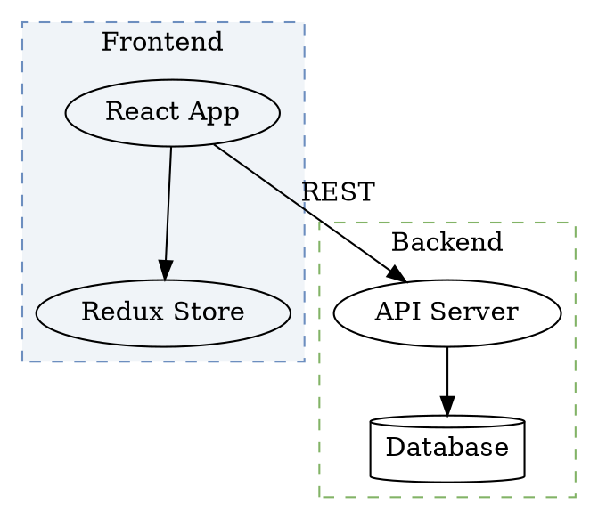
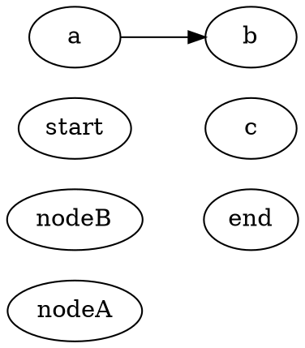

# Diagram Authoring Guide

Exhaustive reference for generating diagram source files across all four engines supported by diagramkit: Mermaid, Excalidraw, Draw.io, and Graphviz.

This guide covers engine selection, source file syntax, color palettes, theming for light/dark mode, embedding in markdown, and quality rules. Use it when creating or updating diagrams in any project that uses diagramkit.

## Engine Selection

Use the smallest engine that fits the job.

| Signal                                                                                                                                                                                        | Engine     | Extension     |
| --------------------------------------------------------------------------------------------------------------------------------------------------------------------------------------------- | ---------- | ------------- |
| Process, workflow, sequence, ER, class, state, timeline, gantt, C4, mindmap, pie, quadrant, sankey, XY, packet, radar, requirement, journey, block, architecture, kanban, or gitgraph diagram | Mermaid    | `.mermaid`    |
| Architecture overview, system context, codebase map, freeform explanation, hand-drawn presentation visual                                                                                     | Excalidraw | `.excalidraw` |
| Network topology, cloud deployment, BPMN, org chart, enterprise system map, multi-page layout, icon-heavy infrastructure                                                                      | Draw.io    | `.drawio`     |
| Dependency graph, call graph, strict automatic layout, existing `.dot`/`.gv` source                                                                                                           | Graphviz   | `.dot`        |

### When To Prefer Each

**Mermaid** — Default choice for most diagrams. Text-first, diffs cleanly in Git, fast to revise, 21+ diagram types. Use when the content maps naturally to a structured diagram type.

**Excalidraw** — Flexible freeform layout with a hand-drawn look. Use when layout and presentation matter more than strict syntax, or when the audience benefits from an approachable whiteboard-style visual. Best for overview diagrams, system context, and concept maps.

**Draw.io** — Rich shape libraries and tight layout control. Use when the diagram is infrastructure-heavy, needs cloud/vendor icons, precise manual positioning, containers/swimlanes, or multi-page support.

**Graphviz** — Strong algorithmic layout and graph semantics. Use when the graph structure is the important part, not hand-tuned positioning. Good for dependency graphs, call graphs, and rank-constrained layouts.

## Universal Rules

These rules apply to all engines:

1. **Source alongside output.** The editable source file is always committed next to rendered assets.
2. **Smallest diagram.** Prefer the minimal diagram that explains the point. Add complexity only when it adds clarity.
3. **Semantic IDs.** Use descriptive IDs like `auth_service` or `orders_api`, not `a` or `n1`.
4. **One story per diagram.** Keep each diagram focused on a single concept. Split large systems into multiple diagrams.
5. **No hardcoded themes.** Let diagramkit control theme selection during render. Do not hardcode light/dark theme directives.
6. **Hex colors only.** Use hex color codes, not named colors like `red` or `blue`.
7. **Mid-tone palette.** Use mid-tone fills that survive both light and dark renders. Avoid near-white or near-black fills.
8. **Re-render after edits.** Always re-render from source after changes. Never hand-edit generated SVGs.

## Color Palette — Universal

These colors work across all four engines and survive both light and dark mode rendering. The diagramkit contrast optimizer (WCAG-based) adjusts high-luminance fills in dark mode, so mid-tone fills are ideal.

### Primary Palette

| Purpose             | Fill      | Stroke    | Text      |
| ------------------- | --------- | --------- | --------- |
| Primary / API       | `#4C78A8` | `#2E5A88` | `#ffffff` |
| Secondary / Service | `#72B7B2` | `#4A9A95` | `#ffffff` |
| Accent / Alert      | `#E45756` | `#C23B3A` | `#ffffff` |
| Storage / Data      | `#E4A847` | `#C08C35` | `#ffffff` |
| Success             | `#54A24B` | `#3D8B3D` | `#ffffff` |
| Neutral             | `#9B9B9B` | `#7B7B7B` | `#ffffff` |

### Pastel Palette (for engines that use lighter fills)

| Purpose | Fill      | Stroke    |
| ------- | --------- | --------- |
| Blue    | `#dae8fc` | `#6c8ebf` |
| Green   | `#d5e8d4` | `#82b366` |
| Orange  | `#ffe6cc` | `#d6b656` |
| Red     | `#f8cecc` | `#b85450` |
| Purple  | `#e1d5e7` | `#9673a6` |
| Yellow  | `#fff2cc` | `#d6b656` |
| Gray    | `#f5f5f5` | `#666666` |

### Pagesmith Docs Theme Colors

When diagrams are embedded in a Pagesmith docs site, align with the site's design tokens:

| Token          | Light     | Dark      |
| -------------- | --------- | --------- |
| Background     | `#f5f4f0` | `#111110` |
| Background Alt | `#eeeee8` | `#1a1a18` |
| Text           | `#111110` | `#f5f4f0` |
| Text Secondary | `#333330` | `#ccccca` |
| Text Muted     | `#7a7a72` | `#888882` |
| Border         | `#d0cfc9` | `#2a2a28` |
| Accent         | `#1a1a18` | `#e8e7e2` |

### Colors To Avoid

- `#ffffff` or near-white fills (disappear on light backgrounds)
- `#000000` or near-black fills (disappear on dark backgrounds)
- Named colors (`red`, `blue`, etc.) — behavior varies across renderers
- Very saturated neon colors — poor contrast in both modes

## Theming And Dark Mode

diagramkit renders both light and dark variants by default. Each engine handles dark mode differently:

### How Each Engine Handles Dark Mode

| Engine     | Dark Mode Strategy                                                                                | Contrast Post-Processing                                |
| ---------- | ------------------------------------------------------------------------------------------------- | ------------------------------------------------------- |
| Mermaid    | Separate dark page with injected theme variables. Background `#111111` (dark), `#ffffff` (light). | Yes — WCAG luminance check darkens high-luminance fills |
| Excalidraw | Native `exportWithDarkMode` flag. Background `#111111` (dark), `#ffffff` (light).                 | Yes — WCAG luminance check darkens high-luminance fills |
| Draw.io    | Browser-side color adjustment using WCAG luminance. White→`#2d2d2d`, black→`#e5e5e5`.             | Yes — WCAG luminance check darkens high-luminance fills |
| Graphviz   | WASM render + dark mode adaptation (black strokes→`#94a3b8`, black text→`#e5e7eb`).               | Yes — WCAG luminance check runs before dark adaptation  |

### Mermaid Dark Theme Variables

When rendering in dark mode, diagramkit injects these theme variables:

```
background: #111111
primaryColor: #2d2d2d
primaryTextColor: #e5e5e5
primaryBorderColor: #555555
secondaryColor: #333333
secondaryTextColor: #cccccc
lineColor: #cccccc
textColor: #e5e5e5
mainBkg: #2d2d2d
nodeBkg: #2d2d2d
nodeBorder: #555555
clusterBkg: #1e1e1e
clusterBorder: #555555
titleColor: #e5e5e5
edgeLabelBackground: #1e1e1e
```

### WCAG Contrast Optimization

All four engines apply `postProcessDarkSvg()` to dark SVG output (when `contrastOptimize` is enabled, which is the default):

1. Scans inline `fill` color attributes in the SVG
2. Computes WCAG 2.0 relative luminance for each fill color
3. Colors with luminance > 0.4 are darkened to lightness 0.25, preserving hue and capping saturation at 0.6
4. This ensures readable contrast on dark backgrounds without losing color identity

### Best Practices For Theme-Safe Diagrams

- Use the mid-tone palette above — these colors survive both modes
- Use `transparent` backgrounds in Graphviz DOT files (`bgcolor="transparent"`)
- Use `classDef` in Mermaid instead of inline styles for reusable color definitions
- Test both light and dark output after rendering
- Use `--no-contrast` flag only when you need raw unprocessed dark output

## Rendering

### CLI Commands

```bash
npx diagramkit warmup                    # First time: install Chromium
npx diagramkit render .                  # Render all diagrams in cwd
npx diagramkit render flow.mermaid       # Single file
npx diagramkit render . --format svg,png # Multi-format
npx diagramkit render . --theme dark     # Dark only
npx diagramkit render . --force          # Ignore cache
npx diagramkit render . --watch          # Watch mode
```

### Output Convention

Rendered images go to `.diagramkit/` next to source files (default) or same folder if `sameFolder: true`:

```
docs/
  architecture.mermaid
  .diagramkit/
    architecture-light.svg
    architecture-dark.svg
```

Or with `sameFolder: true`:

```
docs/diagrams/
  architecture.mermaid
  architecture-light.svg
  architecture-dark.svg
```

## Markdown Embedding

### Theme-Aware Picture Element (GitHub/generic)

Use `<picture>` for theme switching in GitHub README files or generic markdown:

```html
<picture>
  <source media="(prefers-color-scheme: dark)" srcset="./diagrams/overview-dark.svg" />
  <source media="(prefers-color-scheme: light)" srcset="./diagrams/overview-light.svg" />
  
</picture>
```

### Consecutive Image Pairs (Pagesmith content sites)

For Pagesmith-rendered content (like sujeet.pro articles), use consecutive markdown images. The Pagesmith pipeline automatically merges them into a themed figure:

```md


```

Rules:

- Light image always comes first
- Dark image immediately after (no blank line)
- Alt text on both images (identical)
- Optional caption via title attribute on the light image: ``

### Pagesmith Docs (figure with theme classes)

For Pagesmith docs sites, use figure elements with theme utility classes:

```html
<figure>
  
  
  <figcaption>System overview</figcaption>
</figure>
```

For simple black-and-white diagrams:

```html
<figure>
  
  <figcaption>Build flow</figcaption>
</figure>
```

Available Pagesmith theme classes:

- `.only-light` / `.only-dark` — show only in matching color scheme
- `.show-on-light` / `.show-on-dark` — toggle visibility (works on any element)
- `.invert-on-dark` — CSS invert filter for simple black/white diagrams

### Plain Markdown Image (no theme switching)

When the target does not support HTML:

```md

```

### Embedding Rules

- Place the embed below the section heading it illustrates
- Always include meaningful, specific alt text
- Use relative paths from the markdown file to the rendered SVG
- Replace existing embeds when updating; do not duplicate
- Add a short sentence near the diagram telling the reader what to notice

---

## Mermaid Reference

Use Mermaid for text-first diagrams that diff cleanly in Git.

Extensions: `.mermaid`, `.mmd`, `.mmdc`

### Build Rules

1. Start every source file with a comment header:

```
 %% Diagram: <title>
 %% Type: <diagram-type>
```

1. Pick the smallest diagram type that matches the job
2. Use semantic IDs (`auth_service`, not `a`)
3. Keep a single diagram focused — split large systems into multiple files
4. Prefer `classDef` and `linkStyle` over repetitive inline styling
5. Use hex colors, not named colors
6. Let diagramkit control theme — do not hardcode `%%{init: {theme: ...}}%%`
7. For `` embeds, add `%%{init: {'htmlLabels': false}}%%` at the top

### Type Routing

| Type           | Directive            | Best for                                  |
| -------------- | -------------------- | ----------------------------------------- |
| `flowchart`    | `flowchart TD`       | Process flows, pipelines, decision trees  |
| `sequence`     | `sequenceDiagram`    | Message passing, API exchanges, protocols |
| `class`        | `classDiagram`       | OOP structure, inheritance, interfaces    |
| `state`        | `stateDiagram-v2`    | State machines and lifecycle transitions  |
| `er`           | `erDiagram`          | Database entities and relationships       |
| `gantt`        | `gantt`              | Timelines, schedules, rollout plans       |
| `gitgraph`     | `gitGraph`           | Branching and release histories           |
| `mindmap`      | `mindmap`            | Concept maps and decision trees           |
| `timeline`     | `timeline`           | Milestones, roadmaps, history             |
| `c4`           | `C4Context`          | C4 architecture views                     |
| `pie`          | `pie`                | Simple categorical distribution           |
| `quadrant`     | `quadrantChart`      | Priority or evaluation matrices           |
| `sankey`       | `sankey-beta`        | Flow volumes between stages               |
| `xy`           | `xychart-beta`       | Small chart-like comparisons              |
| `block`        | `block-beta`         | Structured block layouts                  |
| `architecture` | `architecture-beta`  | Icon-driven architecture diagrams         |
| `kanban`       | `kanban`             | Board-style work status views             |
| `journey`      | `journey`            | User journey or service experience maps   |
| `packet`       | `packet-beta`        | Bit- or field-level packet layouts        |
| `radar`        | `radar-beta`         | Multi-axis comparison                     |
| `requirement`  | `requirementDiagram` | Requirements tracing                      |

### Flowchart

Directive: `flowchart TD` or `flowchart LR`

Node shapes:

```
id[Rectangle]    id2(Rounded)     id3([Stadium])
id4[[Subroutine]] id5[(Database)]  id6((Circle))
id7{Diamond}     id8{{Hexagon}}   id9[/Parallelogram/]
```

Edge types:

```
A --> B          %% solid arrow
A -.-> C         %% dashed arrow
A ==> D          %% thick arrow
A -- text --> B  %% labeled edge
```

Subgraphs:

```
subgraph title["Display Title"]
    nodes...
end
```

Example:

```
%% Diagram: CI/CD Pipeline
%% Type: flowchart
flowchart LR
    subgraph build["Build Stage"]
        checkout[Checkout Code] --> lint[Run Linter]
        lint --> test[Run Tests]
        test --> compile[Compile]
    end

    subgraph deploy["Deploy Stage"]
        staging[Deploy Staging] --> smoke[Smoke Tests]
        smoke --> prod[Deploy Production]
    end

    compile --> staging
    prod --> monitor[Monitor Health]

    classDef stage fill:#4C78A8,stroke:#2E5A88,color:#fff
    class checkout,lint,test,compile stage
```

### Sequence

Directive: `sequenceDiagram`

```
sequenceDiagram
    participant A as Alice
    actor U as User

    A->>B: Synchronous
    A-->>B: Dashed response
    A-)B: Async message

    activate B
    B->>A: Response
    deactivate B

    Note over A,B: Shared note

    alt Condition
        A->>B: Path 1
    else Other
        A->>B: Path 2
    end

    loop Every minute
        A->>B: Heartbeat
    end

    par Parallel
        A->>B: Task 1
    and
        A->>C: Task 2
    end

    autonumber
```

Example:

```
%% Diagram: OAuth2 Authorization Code Flow
%% Type: sequence
sequenceDiagram
    autonumber
    actor user as User
    participant app as Client App
    participant auth as Auth Server
    participant api as Resource API

    user->>app: Click "Login"
    app->>auth: Authorization request
    auth->>user: Show login form
    user->>auth: Enter credentials
    auth->>app: Authorization code
    app->>auth: Exchange code for token
    auth->>app: Access token + refresh token
    app->>api: API request (Bearer token)
    api->>app: Protected resource
    app->>user: Display data
```

### Class

Directive: `classDiagram`

```
classDiagram
    class ClassName {
        +String publicField
        -int privateField
        +publicMethod() ReturnType
    }

    ClassA <|-- ClassB : inherits
    ClassA *-- ClassC : composition
    ClassA o-- ClassD : aggregation
    ClassA ..> ClassF : dependency
    ClassA ..|> InterfaceG : implements
    ClassA "1" --> "*" ClassH : multiplicity
```

### State

Directive: `stateDiagram-v2`

```
stateDiagram-v2
    [*] --> State1
    State1 --> State2 : event
    State2 --> [*]

    state fork_state <<fork>>
    state join_state <<join>>
    state if_state <<choice>>

    state CompositeState {
        [*] --> SubState1
        SubState1 --> SubState2
    }
```

### ER

Directive: `erDiagram`

Cardinality: `||--o{` (one-to-many), `||--||` (one-to-one), `}o--o{` (many-to-many)

```
erDiagram
    CUSTOMER ||--o{ ORDER : places
    CUSTOMER {
        uuid id PK
        string email UK
        string name
    }
    ORDER ||--|{ ORDER_ITEM : contains
```

### Gantt

```
gantt
    title Project Timeline
    dateFormat YYYY-MM-DD
    axisFormat %b %d
    excludes weekends

    section Backend
    API redesign       :crit, api, 2025-04-07, 5d
    Database migration :db, after api, 3d

    section QA
    Release            :milestone, release, after qa, 0d
```

### GitGraph

```
gitGraph
    commit id: "init"
    branch develop
    commit id: "setup-ci"
    branch feature/auth
    commit id: "auth-models"
    checkout develop
    merge feature/auth id: "merge-auth"
    checkout main
    merge develop id: "release" tag: "v1.0.0"
```

### Mindmap

```
mindmap
    root((Central Topic))
        Branch 1
            Leaf 1a
            Leaf 1b
        Branch 2
            Leaf 2a
```

### Timeline

```
timeline
    title 2025 Product Roadmap
    section Q1
        Auth System : OAuth2 integration
                    : SSO support
    section Q2
        Mobile App : iOS launch
                   : Android launch
```

### C4

```
C4Context
    title System Context

    Person(user, "User", "Description")
    System(system, "System", "Description")
    System_Ext(ext, "External System", "Description")
    System_Boundary(boundary, "Boundary") {
        System(inner, "Inner System", "Description")
    }

    Rel(user, system, "Uses", "HTTPS")
```

### Pie

```
pie title Error Distribution
    "Timeout" : 35
    "Auth Failure" : 25
    "Validation" : 20
```

### Quadrant

```
quadrantChart
    title Priority Matrix
    x-axis Low Effort --> High Effort
    y-axis Low Impact --> High Impact
    quadrant-1 Do First
    quadrant-2 Plan Carefully
    quadrant-3 Deprioritize
    quadrant-4 Quick Wins
    Upgrade Node.js: [0.3, 0.9]
```

### Sankey

```
sankey-beta

CDN,API Gateway,500
CDN,Static Assets,300
API Gateway,Auth Service,200
```

### XY

```
xychart-beta
    title "API Latency by Endpoint (ms)"
    x-axis ["/users", "/orders", "/products"]
    y-axis "P95 Latency (ms)" 0 --> 500
    bar [45, 120, 65]
    line [35, 90, 50]
```

### Block

```
block-beta
    columns 3

    block:cdn["CDN Layer"]
        columns 1
        cf["CloudFront"]
    end

    block:compute["Compute"]
        columns 2
        ecs1["ECS Task 1"] ecs2["ECS Task 2"]
    end

    cf --> ecs1
    cf --> ecs2
```

### Architecture

```
architecture-beta
    group api(cloud)[API Layer]

    service gateway(internet)[API Gateway] in api
    service auth(server)[Auth Service] in api
    service db(database)[PostgreSQL]

    gateway:R --> L:auth
    auth:B --> T:db
```

### Kanban

```
kanban
    todo[To Do]
        t1[Setup CI pipeline]
    progress[In Progress]
        t4[Auth service refactor]
    done[Done]
        t7[Add health check endpoint]
```

### Journey

```
journey
    title New User Onboarding
    section Discovery
        Visit landing page: 5: User
        Read pricing: 3: User
    section Signup
        Create account: 4: User
```

### Packet

```
packet-beta
    0-15: "Source Port"
    16-31: "Destination Port"
    32-63: "Sequence Number"
```

### Radar

```
radar-beta
    title "Framework Evaluation"
    axis1: "Performance"
    axis2: "DX"
    axis3: "Ecosystem"

    "Next.js": [8, 9, 9]
    "Remix": [9, 8, 6]
```

### Requirement

```
requirementDiagram
    requirement auth_system {
        id: AUTH-001
        text: System shall authenticate users via OAuth2
        risk: high
        verifymethod: test
    }

    element auth_module {
        type: module
        docRef: src/auth/index.ts
    }

    auth_module - satisfies -> auth_system
```

### Mermaid Styling

Prefer `classDef` for reusable styling:

```
flowchart TD
    A[API Gateway]:::primary --> B[Auth Service]:::secondary
    B --> D[(Database)]:::storage

    classDef primary fill:#4C78A8,stroke:#2E5A88,color:#fff
    classDef secondary fill:#72B7B2,stroke:#4A9A95,color:#fff
    classDef storage fill:#E4A847,stroke:#C08C35,color:#fff
```

Style edges with `linkStyle`:

```
flowchart TD
    A --> B
    A -.-> C
    linkStyle 0 stroke:#4C78A8,stroke-width:2px
    linkStyle 1 stroke:#E45756,stroke-width:1px,stroke-dasharray:5
```

### Mermaid Quality Rules

- Keep most diagrams under ~15 nodes
- Use subgraphs for groups of related nodes
- Use `TD` for hierarchical flows, `LR` for pipelines
- Quote labels with punctuation or reserved words
- Split large systems into overview and detail diagrams

---

## Excalidraw Reference

Use Excalidraw for hand-drawn-feel architecture overviews and freeform explanation diagrams.

Extension: `.excalidraw`

### Minimal File Structure

```json
{
  "type": "excalidraw",
  "version": 2,
  "source": "diagramkit",
  "elements": [],
  "appState": {
    "gridSize": 20,
    "viewBackgroundColor": "#ffffff"
  },
  "files": {}
}
```

### Build Rules

1. Plan the layout before writing JSON
2. Use rectangles, ellipses, text, arrows, and grouping boxes
3. Give every element a stable semantic ID
4. Treat labels as separate text elements, not inline properties
5. Keep arrows orthogonal and explicit
6. Use grouping rectangles for layers, zones, and bounded contexts
7. Validate JSON structure before rendering

### Layout Planning

**Vertical flow** (layered architectures):

- Columns at roughly `100`, `300`, `500`, `700`, `900`
- Element width: `160`–`200`, height: `80`–`90`
- Spacing: `40`–`50`

**Horizontal flow** (pipelines):

- Stage x positions: `100`, `350`, `600`, `850`, `1100`
- Common y position: `200`

**Hub and spoke** (orchestrators):

- Center hub: `x=500`, `y=350`
- Spokes at ~45-degree increments

### Critical Rules

**1. Do not use diamond shapes** — Arrow attachments render poorly. Use styled rectangles instead.

**2. Labels need two elements** — Every labeled shape needs a shape element with `boundElements` referencing a text element, and a text element with `containerId` pointing back:

Shape:

```json
{
  "id": "api-box",
  "type": "rectangle",
  "boundElements": [{ "type": "text", "id": "api-box-text" }]
}
```

Text:

```json
{
  "id": "api-box-text",
  "type": "text",
  "containerId": "api-box",
  "text": "API Server",
  "originalText": "API Server"
}
```

**3. Position text explicitly:**

- `text.x = shape.x + 5`
- `text.y = shape.y + (shape.height - text.height) / 2`
- `text.width = shape.width - 10`
- `textAlign: "center"`, `verticalAlign: "middle"`

**4. Elbow arrows need three properties:**

```json
{
  "type": "arrow",
  "roughness": 0,
  "roundness": null,
  "elbowed": true
}
```

**5. Arrow anchors at shape edges:**

| Edge   | Formula                     |
| ------ | --------------------------- |
| Top    | `(x + width/2, y)`          |
| Bottom | `(x + width/2, y + height)` |
| Left   | `(x, y + height/2)`         |
| Right  | `(x + width, y + height/2)` |

### Required Element Properties

```json
{
  "id": "unique-id",
  "type": "rectangle",
  "x": 100,
  "y": 100,
  "width": 200,
  "height": 80,
  "angle": 0,
  "strokeColor": "#1971c2",
  "backgroundColor": "#a5d8ff",
  "fillStyle": "solid",
  "strokeWidth": 2,
  "strokeStyle": "solid",
  "roughness": 1,
  "opacity": 100,
  "groupIds": [],
  "frameId": null,
  "roundness": { "type": 3 },
  "seed": 1,
  "version": 1,
  "versionNonce": 1,
  "isDeleted": false,
  "boundElements": null,
  "updated": 1,
  "link": null,
  "locked": false
}
```

### Arrow Routing Patterns

| Pattern      | Points                            |
| ------------ | --------------------------------- |
| Down         | `[[0,0], [0,h]]`                  |
| Right        | `[[0,0], [w,0]]`                  |
| L-left-down  | `[[0,0], [-w,0], [-w,h]]`         |
| L-right-down | `[[0,0], [w,0], [w,h]]`           |
| S-shape      | `[[0,0], [0,h1], [w,h1], [w,h2]]` |

### Arrow Bindings

```json
{
  "startBinding": {
    "elementId": "source-id",
    "focus": 0,
    "gap": 1,
    "fixedPoint": [0.5, 1]
  },
  "endBinding": {
    "elementId": "target-id",
    "focus": 0,
    "gap": 1,
    "fixedPoint": [0.5, 0]
  }
}
```

Fixed points: top `[0.5, 0]`, bottom `[0.5, 1]`, left `[0, 0.5]`, right `[1, 0.5]`

### Excalidraw Color Palette

| Component          | Background | Stroke    |
| ------------------ | ---------- | --------- |
| Frontend / UI      | `#a5d8ff`  | `#1971c2` |
| Backend / API      | `#d0bfff`  | `#7048e8` |
| Database           | `#b2f2bb`  | `#2f9e44` |
| Storage            | `#ffec99`  | `#f08c00` |
| AI / ML            | `#e599f7`  | `#9c36b5` |
| External API       | `#ffc9c9`  | `#e03131` |
| Orchestration      | `#ffa8a8`  | `#c92a2a` |
| Network / Security | `#dee2e6`  | `#495057` |

### Grouping

Use dashed rectangles for logical grouping:

```json
{
  "id": "group-data-layer",
  "type": "rectangle",
  "strokeColor": "#2f9e44",
  "backgroundColor": "transparent",
  "strokeStyle": "dashed",
  "roughness": 0,
  "roundness": null
}
```

### Validation Checklist

- Every labeled shape has both a shape and a text element
- `boundElements` and `containerId` are properly linked
- Arrow points start/end on shape edges
- Elbow arrows set `elbowed: true`, `roundness: null`, `roughness: 0`
- Arrow `width`/`height` match the point bounding box
- No duplicate IDs
- Valid JSON

---

## Draw.io Reference

Use Draw.io for infrastructure-heavy diagrams with icon libraries and precise positioning.

Extensions: `.drawio`, `.drawio.xml`, `.dio`

### Minimal File Structure

```xml
<mxfile host="diagramkit" modified="2024-01-01T00:00:00.000Z" type="device">
  <diagram id="page-1" name="Page-1">
    <mxGraphModel dx="1200" dy="800" grid="1" gridSize="10" guides="1"
                  tooltips="1" connect="1" arrows="1" fold="1" page="1"
                  pageScale="1" pageWidth="1200" pageHeight="900"
                  math="0" shadow="0">
      <root>
        <mxCell id="0"/>
        <mxCell id="1" parent="0"/>
      </root>
    </mxGraphModel>
  </diagram>
</mxfile>
```

### Build Rules

1. Keep required root cells: `id="0"` and `id="1"`
2. Give nodes semantic IDs
3. Use `vertex="1"` for shapes and `edge="1"` for connectors
4. Keep shared style fragments consistent
5. Prefer orthogonal edges
6. Use containers or swimlanes for zones
7. Split large diagrams into multiple pages

### Basic Elements

Vertex:

```xml
<mxCell id="node-1" value="Service A"
        style="rounded=1;whiteSpace=wrap;fillColor=#dae8fc;strokeColor=#6c8ebf;"
        vertex="1" parent="1">
  <mxGeometry x="100" y="100" width="120" height="60" as="geometry"/>
</mxCell>
```

Edge:

```xml
<mxCell id="edge-1" value="REST API"
        style="edgeStyle=orthogonalEdgeStyle;rounded=1;"
        edge="1" source="node-1" target="node-2" parent="1">
  <mxGeometry relative="1" as="geometry"/>
</mxCell>
```

### Common Shapes

| Shape             | Style                                                                       |
| ----------------- | --------------------------------------------------------------------------- |
| Rectangle         | `rounded=0;whiteSpace=wrap;`                                                |
| Rounded rectangle | `rounded=1;whiteSpace=wrap;`                                                |
| Ellipse           | `ellipse;whiteSpace=wrap;`                                                  |
| Diamond           | `rhombus;whiteSpace=wrap;`                                                  |
| Cylinder          | `shape=cylinder3;whiteSpace=wrap;boundedLbl=1;backgroundOutline=1;size=15;` |
| Cloud             | `ellipse;shape=cloud;whiteSpace=wrap;`                                      |
| Swimlane          | `swimlane;startSize=30;`                                                    |

### Cloud Shapes

| Platform | Examples                                                                                   |
| -------- | ------------------------------------------------------------------------------------------ |
| AWS      | `shape=mxgraph.aws4.ec2;`, `shape=mxgraph.aws4.lambda_function;`, `shape=mxgraph.aws4.s3;` |
| Azure    | `shape=mxgraph.azure.virtual_machine;`, `shape=mxgraph.azure.app_service;`                 |
| GCP      | `shape=mxgraph.gcp2.compute_engine;`, `shape=mxgraph.gcp2.cloud_run;`                      |

### Edge Styles

| Style                                | Use                     |
| ------------------------------------ | ----------------------- |
| `edgeStyle=orthogonalEdgeStyle;`     | Clean 90-degree routing |
| `edgeStyle=elbowEdgeStyle;`          | Single bend             |
| `edgeStyle=entityRelationEdgeStyle;` | ER-style routing        |
| `curved=1;`                          | Curved line             |
| no `edgeStyle`                       | Straight line           |

Arrowheads: `classic`, `block`, `open`, `diamond`, `oval`, `none`, `ERmandOne`, `ERmany`

### Layout Patterns

**Grid guidance:**

- Column width: ~160–200px
- Row height: ~120–160px
- Standard node: ~120x60
- Spacing: ~40px between elements

**Containers** — coordinates are relative to the container:

```xml
<mxCell id="vpc" value="VPC" style="swimlane;startSize=30;"
        vertex="1" parent="1">
  <mxGeometry x="40" y="40" width="400" height="300" as="geometry"/>
</mxCell>

<mxCell id="subnet" value="Public Subnet"
        style="rounded=1;whiteSpace=wrap;fillColor=#dae8fc;strokeColor=#6c8ebf;"
        vertex="1" parent="vpc">
  <mxGeometry x="20" y="50" width="160" height="60" as="geometry"/>
</mxCell>
```

**Multi-page** — use multiple `<diagram>` blocks:

```xml
<mxfile>
  <diagram id="overview" name="Overview">...</diagram>
  <diagram id="detail" name="Detail">...</diagram>
</mxfile>
```

### Draw.io Color Guidance

Use colors from the pastel palette above. Keep text `fontColor=#333333`. The draw.io renderer adjusts colors for dark mode:

- White (`#ffffff`) → `#2d2d2d`
- Black (`#000000`) → `#e5e5e5`
- High-luminance fills (>0.4) are darkened by factor 0.3

---

## Graphviz Reference

Use Graphviz for algorithmic graph layout.

Extensions: `.dot`, `.gv`, `.graphviz`

### Minimal Skeleton

```dot
digraph G {
    graph [rankdir=TB, fontname="Helvetica", fontsize=14, bgcolor="transparent"];
    node [shape=box, style="rounded,filled", fillcolor="#dae8fc",
          fontname="Helvetica", fontsize=12, fontcolor="#333333", color="#6c8ebf"];
    edge [fontname="Helvetica", fontsize=10, color="#666666", fontcolor="#666666"];

    a [label="Node A"];
    b [label="Node B"];

    a -> b [label="calls"];
}
```



### Build Rules

1. Use `digraph` for directed, `graph` for undirected
2. Set graph-wide `graph`, `node`, and `edge` defaults
3. Use semantic node IDs
4. Use `subgraph cluster_*` for grouped boxes
5. Use `bgcolor="transparent"` (diagramkit handles background)
6. Keep layout hints minimal — add rank constraints only when needed

### Clusters



### Layout Engines

| Engine  | Best for                                |
| ------- | --------------------------------------- |
| `dot`   | Hierarchical DAGs, call trees (default) |
| `neato` | Undirected, network-style               |
| `fdp`   | Larger undirected graphs                |
| `circo` | Ring/circular layouts                   |
| `twopi` | Radial hub-and-spoke                    |

### Layout Controls



### Node Shapes

| Shape                     | Use                 |
| ------------------------- | ------------------- |
| `box`                     | Services, modules   |
| `box` + `style="rounded"` | Softer presentation |
| `cylinder`                | Databases           |
| `diamond`                 | Decisions           |
| `record`                  | Structured fields   |
| `doublecircle`            | Terminal states     |
| `folder`                  | Packages            |
| `component`               | UML components      |

### Record Nodes and Ports

```dot
node [shape=record];
struct [label="{ClassName|+ field1: int\l|+ method(): void\l}"];

a [label="<left> Left | <center> Center | <right> Right"];
b [label="<in> Input | <out> Output"];
a:center -> b:in;
```

### Edge Styles

| Style     | Attribute      |
| --------- | -------------- |
| Solid     | default        |
| Dashed    | `style=dashed` |
| Dotted    | `style=dotted` |
| Bold      | `style=bold`   |
| Invisible | `style=invis`  |

Arrowheads: `normal`, `none`, `diamond`, `odiamond`, `dot`, `empty`, `crow`, `tee`, `vee`

### Graphviz Dark Mode Handling

diagramkit automatically adapts Graphviz SVGs for dark mode:

- Black strokes → `#94a3b8`
- Black text → `#e5e7eb`
- Black fills → `#94a3b8`
- Then WCAG contrast post-processing runs

Best practices:

- Use `bgcolor="transparent"`
- Use `fontcolor="#333333"` (gets adapted automatically)
- Avoid very light or very dark fills
- Let post-processing handle dark mode adaptation

---

## File Layout Conventions

### Standard Layout

```
project/
  docs/
    architecture/
      README.md
      diagrams/
        overview.mermaid
        .diagramkit/
          overview-light.svg
          overview-dark.svg
```

### Same-Folder Layout (`sameFolder: true`)

```
project/
  content/articles/topic/
    README.md
    diagrams/
      overview.mermaid
      overview-light.svg
      overview-dark.svg
```

### Rules

- Commit source files — they are the editable truth
- Treat rendered SVGs as generated artifacts
- Use descriptive filenames: `cache-invalidation-flow.mermaid`, not `diagram1.mermaid`
- One diagram per concept
- Put diagrams in a `diagrams/` folder next to the markdown that references them

## Quality Checklist

Before finishing a diagram:

- Does the page become easier to understand with this diagram?
- Is the chosen engine the simplest one that fits?
- Are semantic IDs and descriptive labels used throughout?
- Do colors use the mid-tone palette (not near-white or near-black)?
- Is the source file committed alongside rendered outputs?
- Is the markdown embed correct for the target surface?
- Is alt text descriptive and specific?
- Did you re-render after edits?
- Did you check both light and dark variants?

## Anti-Patterns

- Using Mermaid for everything regardless of diagram type
- Creating diagrams without committing editable source
- Over-complicated diagrams that obscure rather than clarify
- Rendering without source review
- Leaving broken markdown embeds
- Ignoring existing project diagram conventions
- Hardcoding theme directives instead of letting diagramkit handle themes
- Using named colors instead of hex values
- Hand-editing generated SVGs
