# AI Agents

<picture>
  <source srcset=".diagramkit/ai-agent-workflow-dark.svg" media="(prefers-color-scheme: dark)">
  
</picture>

This page is the fastest path for agent-driven setup and usage.

## Do it with an agent

The rest of this page is the agent flow — copy any of the prompts below into your AI coding agent (Claude Code, Cursor, Codex, Continue, OpenCode, Windsurf, Gemini, GitHub Copilot, …). Start with the install/configure prompt, then use the situational prompts as you need them. If you do not have an agent available, jump to [Do it manually](#do-it-manually) for a paste-into-rules-files fallback.

### Copy-Paste Prompt: Install Latest + Configure Skills

Paste this prompt into your coding agent (Claude Code, Cursor, Codex, Continue, OpenCode, Windsurf, GitHub Copilot, ...). It installs the latest diagramkit, reads the version-pinned reference, then wires up local-pointer agent skills that always defer to the skills bundled inside the installed package.

```text
Install the latest diagramkit in this repository and configure its agent
skills as local pointers into node_modules:

1. Install the latest release:
     npm add diagramkit@latest
   Confirm with: npx diagramkit --version

2. Read node_modules/diagramkit/REFERENCE.md end to end. It is the
   version-pinned contract for the CLI/API surface you just installed — do
   NOT use a globally installed `diagramkit` or rely on older training data.

3. Follow node_modules/diagramkit/skills/diagramkit-setup/SKILL.md end to
   end. It will:
     - run `npx diagramkit warmup` (skip if the repo is Graphviz-only),
     - wire `"render:diagrams": "diagramkit render ."` into package.json
       (use the repo's existing script naming convention if it has one),
     - create diagramkit.config.json5 ONLY if the repo needs non-default
       behavior (`npx diagramkit init --yes`),
     - render any existing diagrams once with `npx diagramkit render .`,
     - and write thin pointer SKILL.md files for every skill shipped at
       node_modules/diagramkit/skills/diagramkit-<name>/, at:
         .agents/skills/diagramkit-<name>/SKILL.md    (always)
         .claude/skills/diagramkit-<name>/SKILL.md    (if .claude/ exists)
         .cursor/skills/diagramkit-<name>/SKILL.md    (if .cursor/ exists)
         .codex/skills/diagramkit-<name>/SKILL.md     (if .codex/ exists)
         .continue/skills/diagramkit-<name>/SKILL.md  (if .continue/ exists)
       Each pointer contains frontmatter (name + description copied from
       the bundled SKILL.md) plus a single "follow
       node_modules/diagramkit/skills/diagramkit-<name>/SKILL.md"
       instruction, so every agent reads the skill version pinned to the
       installed diagramkit.
       Skills installed: setup, auto, mermaid, excalidraw, draw-io,
       graphviz, review (validation + WCAG 2.2 AA contrast).
     - never overwrite an existing pointer or existing config file
       without explicit confirmation.

4. Commit the pointer SKILL.md files along with any package.json / config
   changes. List the created/skipped pointers in your summary.
```

> [!TIP]
> The pointer pattern means every `npm install diagramkit` upgrade automatically refreshes every skill's content — the pointers themselves don't need rewriting. Only re-run the setup skill when a diagramkit upgrade adds a new skill that needs a new pointer.

## 60-Second Agent Flow

Shorter variant of the prompt above, when you want the agent to act with less scaffolding:

> Set up diagramkit in this repo:
>
> 1. `npm add diagramkit@latest`
> 2. Read `node_modules/diagramkit/REFERENCE.md` (anchor on the LOCAL install).
> 3. Follow `node_modules/diagramkit/skills/diagramkit-setup/SKILL.md`. It runs `npx diagramkit warmup` (unless Graphviz-only), wires a `render:diagrams` script, optionally creates `diagramkit.config.json5`, renders existing diagrams, and writes thin pointer SKILL.md files at `.agents/skills/diagramkit-*` (with mirrors under `.claude/skills/`, `.cursor/skills/`, `.codex/skills/`) that defer to `node_modules/diagramkit/skills/<name>/SKILL.md`.

Expected commands:

```bash
npm add diagramkit
npx diagramkit warmup    # skip if Graphviz-only; the setup skill handles this
# (the setup skill also writes the local skill pointers — no extra command needed)
npm run render:diagrams
```

> [!NOTE]
> `npx diagramkit warmup` is only required for Mermaid, Excalidraw, and Draw.io. Graphviz-only repos can skip it.

> [!IMPORTANT]
> Every diagramkit agent skill ships **inside the npm package** at `node_modules/diagramkit/skills/<name>/SKILL.md`. The recommended install is the local pointer pattern (written by `diagramkit-setup`) so each skill is version-pinned to the installed CLI. The standalone [`skills`](https://github.com/vercel-labs/skills) CLI (`npx skills add sujeet-pro/diagramkit`) is supported as an alternative when you specifically want skills that update independently of `diagramkit` itself.

## Which Agent Doc to Use

diagramkit ships agent-readable files in two locations at the package root:

### Structured agent guidance (`ai-guidelines/`)

Prose guides that change less often:

| File                                 | Purpose                                                                        |
| ------------------------------------ | ------------------------------------------------------------------------------ |
| `ai-guidelines/usage.md`             | Primary agent instructions — setup, prompts, quick reference                   |
| `ai-guidelines/diagram-authoring.md` | Exhaustive diagram authoring guide — all engines, colors, theming, embedding   |

### LLM reference files (package root)

Two plain-text files with tiered detail:

| File            | Best for                 | Includes                                      |
| --------------- | ------------------------ | --------------------------------------------- |
| `llms.txt`      | Day-to-day usage         | CLI patterns, config layering summary         |
| `llms-full.txt` | Deep implementation work | Full CLI + API + types + architecture         |

You can also run:

```bash
diagramkit --agent-help
```

This prints `llms-full.txt` so agents can ingest a single stream.

For repo bootstrap, start with `node_modules/diagramkit/ai-guidelines/usage.md`. It is the best single file for install, config, and package-script guidance.

## Install Project Skills (any agent)

Every skill lives in `node_modules/diagramkit/skills/<name>/SKILL.md` after `npm add diagramkit`. The `diagramkit-setup` skill writes thin pointer SKILL.md files in your repo that defer to those bundled originals, so every agent reads guidance pinned to the installed CLI version.

Canonical layout that `diagramkit-setup` produces:

```text
.agents/skills/diagramkit-<name>/SKILL.md   # source-of-truth pointer (always)
.claude/skills/diagramkit-<name>/SKILL.md   # harness mirror → .agents/skills/...
.cursor/skills/diagramkit-<name>/SKILL.md   # harness mirror → .agents/skills/...
.codex/skills/diagramkit-<name>/SKILL.md    # harness mirror → .agents/skills/...
```

Shipped skills (all packed in the npm package):

| Capability                                                                  | Skill                   |
| --------------------------------------------------------------------------- | ----------------------- |
| Bootstrap (install, warmup, config, scripts, **skill pointers**). Run first.| `diagramkit-setup`      |
| Engine routing for new diagram requests                                     | `diagramkit-auto`       |
| Authoring + image generation (vector + raster) — Mermaid                    | `diagramkit-mermaid`    |
| Authoring + image generation (vector + raster) — Excalidraw                 | `diagramkit-excalidraw` |
| Authoring + image generation (vector + raster) — Draw.io                    | `diagramkit-draw-io`    |
| Authoring + image generation (vector + raster) — Graphviz                   | `diagramkit-graphviz`   |
| Validation (SVG structure, ``-embed safety) **+ WCAG 2.2 AA contrast** | `diagramkit-review`     |

> [!NOTE]
> Every `diagramkit-*` skill always prefers the **locally installed** CLI. They read `node_modules/diagramkit/REFERENCE.md` first and run `npx diagramkit ...` (which auto-resolves to `./node_modules/.bin/diagramkit`) so the agent uses the exact CLI/API surface for the version installed in this repo — never a divergent global install.

### Alternative: GitHub-published skills via `npx skills`

When you want the skills to update independently of the installed `diagramkit` package, use the standalone [`skills`](https://github.com/vercel-labs/skills) CLI instead of writing local pointers:

```bash
npx skills add sujeet-pro/diagramkit                              # all skills
npx skills add sujeet-pro/diagramkit -a claude-code -a cursor     # specific agents
npx skills add sujeet-pro/diagramkit -s diagramkit-setup          # specific skills
npx skills update sujeet-pro/diagramkit                           # refresh later
```

Pick **one** mechanism per repo (local pointers OR `npx skills`) so they don't drift against each other.

## Agent Prompts

These copy-paste prompts can be given to any AI coding agent. They reference the locally installed package (`node_modules/diagramkit/`) so they always match the version installed in your repo.

### Bootstrap diagramkit + install all skills

> Set up diagramkit in this repo:
>
> 1. `npm add diagramkit`.
> 2. Read `node_modules/diagramkit/REFERENCE.md` (anchor on the LOCAL install; do NOT use a globally installed `diagramkit`).
> 3. Follow `node_modules/diagramkit/skills/diagramkit-setup/SKILL.md` end to end. It runs `npx diagramkit warmup` (unless Graphviz-only), wires a `render:diagrams` script, optionally creates `diagramkit.config.json5`, renders existing diagrams, and writes thin pointer SKILL.md files at `.agents/skills/diagramkit-*` (with mirrors under `.claude/skills/`, `.cursor/skills/`, `.codex/skills/` for the harnesses you use) that defer to `node_modules/diagramkit/skills/<name>/SKILL.md`. Skills installed: setup, auto, mermaid, excalidraw, draw-io, graphviz, **review** (validation + WCAG 2.2 AA contrast).

### Add diagrams to documentation

> Add visual diagrams to the documentation in this project. If diagramkit is not installed, run `npm add diagramkit` and follow `node_modules/diagramkit/skills/diagramkit-setup/SKILL.md` to install the skills as local pointers. Read `node_modules/diagramkit/REFERENCE.md` first, then `node_modules/diagramkit/ai-guidelines/diagram-authoring.md` for engine selection, syntax, color palettes, and embedding patterns. Create source files in `diagrams/` folders next to the markdown they support. Render with `npx diagramkit render .` (uses the local install) and embed using the appropriate pattern for the target surface.

### Generate a diagram + multi-format raster export

> Create a diagram for [TOPIC] using the diagramkit-* skills installed in this repo. Read `node_modules/diagramkit/REFERENCE.md` first so you anchor on the LOCAL install. Follow `.agents/skills/diagramkit-auto/SKILL.md` (or its harness mirror) to pick the engine, then follow the matching engine skill (mermaid / excalidraw / draw-io / graphviz). Save the source under `diagrams/`. Render to multiple formats with the local CLI: `npx diagramkit render diagrams/<file> --format svg,png,webp --scale 2`. Embed with the `<picture>` pattern.

### Validate every diagram (structure, embed-safety, WCAG 2.2 AA contrast)

> Audit every diagram in this repo. Read `node_modules/diagramkit/REFERENCE.md` first, then follow `.agents/skills/diagramkit-review/SKILL.md` (or `node_modules/diagramkit/skills/diagramkit-review/SKILL.md` directly). It will force-render every diagram, run `diagramkit validate . --recursive --json`, classify issues into errors vs warnings, and delegate per-engine fixes (palette swaps for `LOW_CONTRAST_TEXT`, `htmlLabels: false` for foreignObject, etc.) back to the matching engine skill's "Review Mode". Cap fix loops at 8 iterations per source.

### Refresh skills after upgrading diagramkit

> After `npm update diagramkit`, re-read `node_modules/diagramkit/REFERENCE.md` for any CLI/API changes. The `.agents/skills/diagramkit-*` thin pointers don't need rewriting — they always defer to `node_modules/diagramkit/skills/<name>/SKILL.md`, which the npm install just refreshed. If the upgrade added new skills, re-run `node_modules/diagramkit/skills/diagramkit-setup/SKILL.md` to write the missing pointers. If the repo uses `npx skills` instead of local pointers, run `npx skills update sujeet-pro/diagramkit`. Confirm with `npx diagramkit --version`.

### Review and update existing diagrams

> Review and update the diagrams in this project. Read `node_modules/diagramkit/REFERENCE.md` and `node_modules/diagramkit/ai-guidelines/diagram-authoring.md` for guidelines. Check each diagram against the quality checklist and color palette. Re-render with `npx diagramkit render . --force` after changes (uses the local install). Verify both light and dark variants.

## Recommended Prompt Sequence

1. **Execute:** "Render all diagram files to SVG."
2. **Optimize:** "Now render PNG for docs/email where needed."
3. **Harden:** "Use --dry-run and show what will re-render before changing files."
4. **Automate:** "Add a CI step that runs diagramkit render . and fails on errors."

## Do it manually

If your assistant does not support project skills yet, paste the equivalent guidance into the repo's memory or rules files.

### `CLAUDE.md`

~~~markdown
## Diagram Rendering

When changing .mermaid, .mmd, .excalidraw, .drawio, .dot, or .gv files, run:

```bash
npx diagramkit render <file-or-dir>
```

Use defaults unless asked otherwise:
- format: svg
- theme: both
- outputs in .diagramkit/ next to source files
~~~

### `.cursor/rules`

```text
When editing diagram files (.mermaid, .mmd, .excalidraw, .drawio, .dot, .gv), run:
npx diagramkit render <file-or-dir>
Prefer --dry-run before large batch renders.
```

## JSON Output for Automation

Use JSON for scripts/CI:

```bash
npx diagramkit render . --json
npx diagramkit render . --plan --json
npx diagramkit doctor --json
```

`--json` returns a versioned envelope (`schemaVersion: 1`) with nested `result`.
`failedDetails` provides machine-readable diagnostics (`file`, `code`, `message`) for each failed render.
`--plan --json` includes stale reasons before execution.

JSON schema: `diagramkit/schemas/diagramkit-cli-render.v1.json` (exported from the npm package).

Use `--quiet --json` together for clean JSON on stdout (suppresses log noise to stderr).

## Exit Codes

| Code | Meaning |
| --- | --- |
| `0` | Success |
| `1` | Error (render failure, unknown command, etc.) |

## Error Codes

`failedDetails` entries include a `code` field:

| Code | Description |
| --- | --- |
| `UNKNOWN_TYPE` | File extension not recognized |
| `RENDER_FAILED` | Diagram rendering failed (syntax error, etc.) |
| `MISSING_DEPENDENCY` | Required dependency not installed (e.g. sharp for raster) |
| `CONFIG_INVALID` | Invalid configuration value |
| `BROWSER_LAUNCH_FAILED` | Playwright Chromium could not start |
| `BUNDLE_FAILED` | IIFE bundle generation failed |

## Deep Dives

- [Getting Started](../getting-started/README.md)
- [CLI](../cli/README.md)
- [JavaScript API](../js-api/README.md)
- [Configuration](../configuration/README.md)
- [Bundled Assets](../bundled-assets/README.md) — schemas, llms.txt, ai-guidelines, skills the npm package ships
