# API Patterns

<picture>
  <source srcset=".diagramkit/api-decision-dark.svg" media="(prefers-color-scheme: dark)">
  
</picture>

## 1) Batch Render in CI

Use this when you want rendered outputs committed or published from a docs repo.

```ts
import { renderAll, dispose } from 'diagramkit'

const result = await renderAll({
  dir: '.',
  formats: ['svg', 'png'],
  theme: 'both',
})

console.log(result)
await dispose()
```

## 2) Watch During Authoring

Use this in local dev flows so diagram edits re-render on save.

```ts
import { watchDiagrams, dispose } from 'diagramkit'

const stop = watchDiagrams({
  dir: '.',
  renderOptions: { formats: ['svg'] },
})

// later
await stop()
await dispose()
```

## 3) Custom Incremental Pipeline

Use this pattern when integrating into custom build tools.

```ts
import { findDiagramFiles, filterStaleFiles, updateManifest } from 'diagramkit/utils'
import { renderDiagramFileToDisk, dispose } from 'diagramkit'

const files = findDiagramFiles('.')
const stale = filterStaleFiles(files, false, ['svg'])
for (const file of stale) await renderDiagramFileToDisk(file, { formats: ['svg'] })
updateManifest(stale, ['svg'])
await dispose()
```

## 4) Choosing the Right API

| Need | Use |
| --- | --- |
| Render from a source string | `render()` |
| Render one file to memory | `renderFile()` |
| Render one discovered file to disk | `renderDiagramFileToDisk()` |
| Render a whole directory | `renderAll()` |
| React to file changes | `watchDiagrams()` |
