# Architecture

This page explains how diagramkit works under the hood. Understanding the architecture helps when debugging issues, extending the tool, or integrating it into custom pipelines.

For the stable implementation philosophy behind these mechanics, see [Design Principles](/guide/design-principles).

## Render Pipeline

Every diagram goes through the same pipeline: detect type from file extension, render to SVG, optionally convert to raster, and write atomically to disk.

<picture>
  <source srcset=".diagramkit/render-pipeline-dark.svg" media="(prefers-color-scheme: dark)">
  
</picture>

- **Type detection** uses longest-match-first extension resolution. `.drawio.xml` matches before `.xml`.
- **Browser-based engines** (Mermaid, Excalidraw, Draw.io) share a single Chromium instance.
- **Graphviz** uses Viz.js/WASM directly in Node.js -- no browser needed.
- **SVG is always the first output.** Raster formats are a post-processing step via sharp.
- **Atomic writes** use a `.tmp` + rename pattern to prevent partial files.

## Browser Pool

Mermaid, Excalidraw, and Draw.io rendering run inside headless Chromium managed by a `BrowserPool` singleton.

<picture>
  <source srcset=".diagramkit/browser-pool-dark.svg" media="(prefers-color-scheme: dark)">
  
</picture>

Key design decisions:

- **Single Chromium instance** shared by all browser-based engines. New engines must add a page to the pool, not launch a separate browser.
- **Reference counting** -- `acquire()` increments, `release()` decrements. When the count reaches zero, a 5-second idle timer starts.
- **Launch coalescing** -- concurrent `acquire()` calls share the same launch promise, preventing multiple browser instances.
- **Page init coalescing** -- concurrent `getExcalidrawPage()` / `getDrawioPage()` calls share one initialization promise, preventing duplicate page creation under parallel workloads.
- **4 dedicated pages:**
  - Mermaid light (`mermaid.initialize({ theme: 'default' })`)
  - Mermaid dark (`mermaid.initialize({ theme: 'base', themeVariables })`)
  - Excalidraw (handles dark mode per-call)
  - Draw.io (handles dark mode per-call)
- **Mermaid needs two pages** because `mermaid.initialize()` sets the theme globally and cannot be changed per-render.
- **IIFE bundles** -- Excalidraw and Draw.io renderers are bundled from TypeScript entry files into IIFEs via rolldown.
- **Singleflight bundle builds** -- concurrent cache misses for the same entry reuse one in-flight build, preventing duplicate rolldown work.
- **Signal handlers** clean up on SIGINT/SIGTERM to prevent zombie Chromium processes.

## Manifest System

The manifest provides incremental builds by tracking content hashes and output state.

<picture>
  <source srcset=".diagramkit/manifest-system-dark.svg" media="(prefers-color-scheme: dark)">
  
</picture>

How the manifest works:

1. **Per-directory `.diagramkit/manifest.json`** stores SHA-256 content hashes, output file lists, and format tracking.
2. **Staleness checks** compare: content hash, requested theme, requested formats, and whether output files exist on disk.
3. **Format accumulation** -- if you first render SVG, then later request PNG, both SVG and PNG are rendered and tracked. The manifest remembers all formats ever generated.
4. **Missing outputs trigger re-render** even if the source hash has not changed. This handles cases where outputs are deleted.
5. **Orphan cleanup** removes outputs for source files that no longer exist.
6. **Atomic writes** -- the manifest itself is written via `.tmp` + rename to prevent corruption.

Use `--force` to bypass the manifest and re-render everything. Use `--no-manifest` to disable tracking entirely.

## Dark Mode Processing

Each engine handles dark mode differently. The common goal is readable output on both light and dark backgrounds.

<picture>
  <source srcset=".diagramkit/dark-mode-dark.svg" media="(prefers-color-scheme: dark)">
  
</picture>

| Engine | Dark Mode Strategy | `--no-contrast` Effect |
|:-------|:-------------------|:-----------------------|
| **Mermaid** | Separate dark page with `theme: 'base'` + custom variables. Then `postProcessDarkSvg()` WCAG contrast fix. | Disables contrast fix |
| **Excalidraw** | Native `exportWithDarkMode: true` in the same page. | No effect |
| **Draw.io** | Browser-side `adjustColorForDark()` during SVG generation. | No effect |
| **Graphviz** | `postProcessDarkSvg()` WCAG contrast fix + `adaptGraphvizSvgForDarkMode()` to replace default black strokes/text. | Disables contrast fix |

### WCAG Contrast Optimization (`postProcessDarkSvg`)

Applied to Mermaid and Graphviz dark SVGs:

1. Scans inline `fill` color attributes (both `style="fill:#hex"` and `fill="#hex"`)
2. Computes WCAG 2.0 relative luminance for each color
3. Colors with luminance above 0.4 are darkened to lightness 0.25
4. Hue and saturation are preserved (capped at 0.6) -- a yellow node stays yellow, just darker
5. Colors below the threshold pass through unchanged

## Configuration Layering

Configuration merges from five sources, each overriding the previous.

See [Configuration](/guide/configuration) for all options and examples.
