# CI/CD Integration

<picture>
  <source srcset=".diagramkit/ci-pipeline-dark.svg" media="(prefers-color-scheme: dark)">
  
</picture>

diagramkit works in any CI environment with Node.js 24+. The key requirements are:

1. Install dependencies including Playwright Chromium
2. Render diagrams
3. (Optional) Fail the build if any diagrams fail to render

## GitHub Actions

```yaml
name: Render Diagrams
on: [push, pull_request]

jobs:
  diagrams:
    runs-on: ubuntu-latest
    steps:
      - uses: actions/checkout@v4
      - uses: actions/setup-node@v4
        with:
          node-version: '24'
          cache: 'npm'

      - run: npm ci
      - run: npx diagramkit warmup

      # Render all diagrams, fail if any error
      - run: npx diagramkit render . --format svg --json
```

### With Caching

Cache the Playwright browser binary to speed up CI:

```yaml
      - name: Cache Playwright
        uses: actions/cache@v4
        with:
          path: ~/.cache/ms-playwright
          key: playwright-${{ hashFiles('package-lock.json') }}

      - run: npx diagramkit warmup
```

### With Artifact Upload

Save rendered images as build artifacts:

```yaml
      - run: npx diagramkit render . --output ./rendered-diagrams --format svg,png

      - uses: actions/upload-artifact@v4
        with:
          name: diagrams
          path: rendered-diagrams/
```

### Validate Diagrams on PR

Check that all diagrams render successfully without committing outputs:

```yaml
      - name: Render diagrams and capture JSON
        run: npx diagramkit render . --json --no-manifest > diagramkit-render.json

      - name: Check for failures from JSON output
        run: |
          node -e "const r=require('node:fs').readFileSync('diagramkit-render.json','utf8'); const j=JSON.parse(r); const failed=j.result?.failed ?? []; if (failed.length) { console.error('Some diagrams failed to render:', failed); process.exit(1) } console.log('All diagrams rendered successfully')"
```

## GitLab CI

```yaml
render-diagrams:
  image: node:24
  script:
    - npm ci
    - npx playwright install --with-deps chromium
    - npx diagramkit render . --format svg --json
  artifacts:
    paths:
      - '**/.diagramkit/'
```

## Docker

Install Playwright dependencies in your Dockerfile:

```dockerfile
FROM node:24-slim

# Install Playwright system dependencies
RUN npx playwright install-deps chromium

WORKDIR /app
COPY package*.json ./
RUN npm ci
RUN npx diagramkit warmup

COPY . .
RUN npx diagramkit render .
```

## Environment Variables

Configure diagramkit in CI without a config file:

```bash
DIAGRAMKIT_FORMAT=svg,png \
DIAGRAMKIT_THEME=both \
DIAGRAMKIT_NO_MANIFEST=1 \
npx diagramkit render .
```

| Variable | Effect |
|:---------|:-------|
| `DIAGRAMKIT_FORMAT` | Default output formats (comma-separated) |
| `DIAGRAMKIT_THEME` | Default theme (`light`, `dark`, `both`) |
| `DIAGRAMKIT_OUTPUT_DIR` | Output folder name |
| `DIAGRAMKIT_NO_MANIFEST` | Set to `1` to disable manifest caching |

## Programmatic CI Script

For more control, use the JavaScript API:

```ts
// scripts/render-diagrams.ts
import { renderAll, dispose } from 'diagramkit'

const { rendered, skipped, failed } = await renderAll({
  dir: '.',
  formats: ['svg', 'png'],
  force: process.env.CI === 'true',
})

console.log(`Rendered: ${rendered.length}, Skipped: ${skipped.length}, Failed: ${failed.length}`)

await dispose()

if (failed.length > 0) {
  console.error('Failed files:', failed)
  process.exit(1)
}
```

Run with:

```bash
npx tsx scripts/render-diagrams.ts
```

## Pre-commit: Require Rendered Outputs

Block commits when tracked diagram outputs are stale:

```bash
# .husky/pre-commit
npx diagramkit render . --dry-run --json | node -e "
  const input = require('fs').readFileSync('/dev/stdin', 'utf-8');
  const j = JSON.parse(input);
  const stale = j.result?.stale ?? [];
  if (stale.length > 0) {
    console.error('Stale diagrams detected. Run: npx diagramkit render .');
    process.exit(1);
  }
"
```

This checks for stale diagram outputs, not diagram syntax correctness. If you want full validation, run `diagramkit render .` in CI and fail on non-empty `failed`.

## Monorepo Setup

Use `--config` to point at the right config per package:

```bash
# Render docs package diagrams
npx diagramkit render ./packages/docs --config ./packages/docs/diagramkit.config.json5

# Or use inputDirs in a root config
# diagramkit.config.json5:
# { inputDirs: ['packages/docs/diagrams', 'packages/api/diagrams'] }
npx diagramkit render .
```
