# CLI

<picture>
  <source srcset=".diagramkit/cli-commands-dark.svg" media="(prefers-color-scheme: dark)">
  
</picture>

The CLI is the recommended way to use diagramkit. It handles file discovery, incremental builds, watch mode, and output naming automatically.

## Do it with an agent

Paste into your AI coding agent:

> Render every diagram in this repo. If diagramkit is not installed yet, install it with `npm add diagramkit` and run `npx diagramkit warmup` unless the repo is Graphviz-only. Read `node_modules/diagramkit/llms.txt` for defaults. Run `npx diagramkit render .` and report any failures with their file path.

For a repeatable script, ask the agent to add `"render:diagrams": "diagramkit render ."` to `package.json`.

## Do it manually

The rest of this page is the manual reference: how to invoke the CLI, every command, every flag, examples, and exit codes. Skim the section that matches what you're trying to do.

## Invocation Paths

After installation, these entrypoints all invoke the same CLI:

```bash
npx diagramkit --version
./node_modules/.bin/diagramkit --version
node ./node_modules/diagramkit/dist/cli/bin.mjs --version
```

Use whichever form fits your environment. Local npm bin shims and direct `dist/cli/bin.mjs` execution behave the same as `npx diagramkit`.

## Commands

### `render`

Render one or more diagram files to images.

```bash
diagramkit render <file-or-dir> [options]
```

A **file** renders that single diagram. A **directory** recursively discovers and renders all diagram files.

```bash
# Render all diagrams in the current directory
diagramkit render .

# Render a single file
diagramkit render docs/architecture.mermaid

# Render a specific directory
diagramkit render ./content/posts
```

### `warmup`

Pre-install the Playwright Chromium browser binary. Run once per environment.

```bash
diagramkit warmup
```

### `doctor`

Validate environment readiness (Node, Playwright, Chromium, sharp):

```bash
diagramkit doctor
diagramkit doctor --json
```

### `init`

Create a config file in the current directory.

```bash
diagramkit init          # diagramkit.config.json5
diagramkit init --ts     # diagramkit.config.ts with defineConfig()
diagramkit init --yes    # accept defaults, non-interactive
```

The generated `diagramkit.config.json5` includes a `$schema` reference so editors (VSCode, JetBrains, etc.) offer autocomplete out of the box. The schema ships in the npm package at `diagramkit/schemas/diagramkit-config.v1.json`.

### `validate`

Validate generated SVG file(s) for structural correctness and ``-tag renderability. Use after `render` (especially in CI) to catch SVGs with missing `xmlns`, missing dimensions, embedded `<script>`, broken `<foreignObject>`, or external resource references that silently fail in `` embeds.

```bash
diagramkit validate <file-or-dir> [--recursive] [--json]
```

Examples:

```bash
diagramkit validate .diagramkit/                # all SVGs in a folder (top level)
diagramkit validate .diagramkit/ --recursive    # recurse into subfolders
diagramkit validate output.svg                  # single file
diagramkit validate . --recursive --json        # CI-friendly machine-readable output
```

Exits non-zero when any SVG fails. The directory render and single-file render commands also run this check automatically and surface results inline.

### Interactive wizards

When run on a TTY without enough arguments, the CLI launches a top-level interactive picker (render / validate / init / doctor / warmup). Inside `render` and `validate` it then walks you through targets, formats, and theme — seeded from the effective `diagramkit.config.*` it auto-discovers from the cwd.

```bash
diagramkit                              # top-level picker (TTY)
diagramkit render --interactive         # force the render wizard, even with args
diagramkit render . --no-interactive    # disable the wizard for CI/agents
diagramkit render . --yes               # alias for --no-interactive (accept defaults)
```

`--interactive` falls back with a one-line warning when stdout is not a TTY (so CI logs stay clean).

### Project skills (the diagramkit CLI does not install them)

> [!IMPORTANT]
> The previous `diagramkit --install-skill` flag was removed in v0.3. Skills now ship inside the npm package at `node_modules/diagramkit/skills/<name>/SKILL.md`. The `diagramkit-setup` skill writes thin pointer SKILL.md files into your repo (`.agents/skills/diagramkit-*` plus harness mirrors under `.claude/skills/`, `.cursor/skills/`, `.codex/skills/`) that defer to those bundled originals — so every agent reads guidance pinned to the installed CLI version.

Recommended (local pointers):

```bash
npm add diagramkit
# Then have your agent follow:
#   node_modules/diagramkit/skills/diagramkit-setup/SKILL.md
# It writes pointer SKILL.md files for: setup, auto, mermaid, excalidraw,
# draw-io, graphviz, review (validation + WCAG 2.2 AA contrast).
```

Alternative (GitHub-published skills via the standalone [`skills`](https://github.com/vercel-labs/skills) CLI), when you want skills that update independently of the installed `diagramkit`:

```bash
npx skills add sujeet-pro/diagramkit                               # all skills
npx skills add sujeet-pro/diagramkit -a claude-code -a cursor -a codex
npx skills add sujeet-pro/diagramkit -s diagramkit-setup -s diagramkit-review
npx skills update sujeet-pro/diagramkit                            # refresh later
```

Pick **one** mechanism per repo (local pointers OR `npx skills`) so they don't drift against each other.

## Render Options

### Output Format

```bash
diagramkit render . --format svg      # default
diagramkit render . --format png
diagramkit render . --format jpeg
diagramkit render . --format webp
diagramkit render . --format avif
diagramkit render . --format svg,png  # multiple formats in one pass
```

> [!TIP]
> PNG, JPEG, WebP, and AVIF require `sharp`. Install with `npm add sharp`.

### Theme

```bash
diagramkit render . --theme both      # default -- produces -light and -dark variants
diagramkit render . --theme light     # light only
diagramkit render . --theme dark      # dark only
```

### Scale and Quality (Raster Only)

```bash
diagramkit render . --format png --scale 3       # 3x resolution for HiDPI
diagramkit render . --format jpeg --quality 80    # compression quality 1-100
diagramkit render . --format webp --quality 85 --scale 2
```

### Force Re-render

```bash
diagramkit render . --force      # ignore manifest cache, re-render everything
diagramkit render . -f           # short form
```

### Watch Mode

```bash
diagramkit render . --watch      # watch for changes, re-render on save
diagramkit render . -w           # short form
```

See [Watch Mode](../watch-mode/README.md) for details.

### Dark Mode Contrast

```bash
diagramkit render . --no-contrast    # skip WCAG contrast optimization on dark SVGs
```

By default, dark-mode Mermaid and Graphviz SVGs are post-processed to fix fill colors with poor contrast.

### Filter by Type

```bash
diagramkit render . --type mermaid
diagramkit render . --type excalidraw
diagramkit render . --type drawio
diagramkit render . --type graphviz
```

### Custom Output

```bash
# Single file to a custom directory
diagramkit render diagram.mermaid --output ./build/images

# Change the output folder name (default: .diagramkit)
diagramkit render . --output-dir images

# Place outputs next to source files (no subfolder)
diagramkit render . --same-folder

# Add prefix/suffix to output filenames
diagramkit render . --output-prefix "dk-"
diagramkit render . --output-suffix "-v2"
```

When you use `--output`, diagramkit writes to that folder directly. Directory renders skip manifest tracking for that run, and single-file renders do not update the source directory manifest. Use `--output-dir` if you want custom folder naming while keeping incremental manifests.

### Explicit Config File

```bash
diagramkit render . --config ./custom.config.json5
```

Use `--config` to point at a specific config file instead of auto-discovery. Useful for CI or monorepo setups.

### Manifest Control

```bash
diagramkit render . --no-manifest                        # disable incremental caching
diagramkit render . --manifest-file custom-manifest.json # custom manifest filename
```

### Scripting and CI

```bash
diagramkit render . --dry-run    # preview what would render, without rendering
diagramkit render . --plan       # include stale reasons in plan output
diagramkit render . --quiet      # suppress info output, errors only
diagramkit render . --log-level warn
diagramkit render . --log-level verbose
diagramkit render . --json       # machine-readable JSON output
diagramkit render . --strict     # exit non-zero if any single render fails
diagramkit render . --strict-config
diagramkit render . --max-type-lanes 2
```

`--strict` (render-failure strictness) is independent of `--strict-config` (config-validation strictness). Use `--strict` when you want CI to fail loudly on a single broken diagram rather than just printing it to the failure list.

## Global Flags

```bash
diagramkit --help              # show help
diagramkit -h
diagramkit --version           # show version
diagramkit -v
diagramkit --agent-help        # output full reference for LLM agents
diagramkit --interactive       # force interactive wizard even when args are present (TTY required)
diagramkit -i                  # short form
diagramkit --no-interactive    # disable interactive wizard (useful for CI / agents)
diagramkit --yes               # alias for --no-interactive (accept defaults)
diagramkit -y                  # short form
```

> Project skills are installed by the `diagramkit-setup` skill as **local pointers** into `node_modules/diagramkit/skills/` (default), or by the standalone `skills` CLI (`npx skills add sujeet-pro/diagramkit`) when the repo prefers GitHub-published skills. See [Project skills](#project-skills-the-diagramkit-cli-does-not-install-them).

## Examples

```bash
# Render everything with defaults
diagramkit render .
diagramkit .    # alias for "render ."

# High-res PNGs for documentation
diagramkit render ./docs --format png --scale 3

# Watch mode during development
diagramkit render . --watch

# Only mermaid, force re-render
diagramkit render . --type mermaid --force

# Graphviz DOT to dark-only SVG
diagramkit render dependency.dot --theme dark

# Single file to a custom folder
diagramkit render flow.mermaid --output ./static/images

# Explicit config file for CI
diagramkit render . --config ./ci.config.json5

# CI: JSON output, no caching
diagramkit render . --json --no-manifest

# CI: explain stale reasons before rendering
diagramkit render . --plan --json
```

## JSON Contract Upgrade

`--json` now emits a versioned envelope with `schemaVersion: 1` and nested `result`.  
If you parsed legacy root-level JSON fields directly, migrate to `result.*`.

JSON schema: `diagramkit/schemas/diagramkit-cli-render.v1.json` (exported from the npm package).

## Exit Codes

| Code | Meaning |
|:-----|:--------|
| `0`  | Success |
| `1`  | Error (unknown command, render failure, etc.) |

In watch mode, the process stays running until `Ctrl+C` (SIGINT).
