# Configuration

## Do it with an agent

> Configure diagramkit for this repo. Read `node_modules/diagramkit/llms.txt` first. If the defaults (SVG, both themes, `.diagramkit/` output dir, incremental rebuild) work, do nothing. Otherwise run `npx diagramkit init --yes` to scaffold `diagramkit.config.json5`, then edit only the fields this repo actually needs to override (formats, theme, outputDir, sameFolder, outputPrefix/Suffix).

For a TypeScript config with autocompletion: `npx diagramkit init --ts`.

## Do it manually

diagramkit works with zero configuration. All settings have sensible defaults. When you need to customize, settings merge in this order (later sources override earlier):

<picture>
  <source srcset=".diagramkit/config-layers-dark.svg" media="(prefers-color-scheme: dark)">
  
</picture>

1. **Defaults** -- built-in values
2. **Global config** -- `~/.config/diagramkit/config.json5` (also supports `config.json`)
3. **Environment variables** -- `DIAGRAMKIT_*`
4. **Local config** -- `diagramkit.config.json5` or `.ts` (walks up from cwd)
5. **CLI flags / API overrides** -- highest priority

Use `--config <path>` to point at a specific config file instead of auto-discovery.
For a quick chooser, see [Config Decision Matrix](./config-decision-matrix.md).

## Config Files

### Local (JSON5)

Place a `diagramkit.config.json5` in your project root:

```json5
{
  // Output folder name (default: .diagramkit)
  outputDir: '.diagramkit',
  defaultFormats: ['svg'],
  defaultTheme: 'both',
}
```

Create one with:

```bash
diagramkit init
```

Legacy `.diagramkitrc.json` files are still supported but deprecated. Migrate to `diagramkit.config.json5` for comment support and richer options.

### Local (TypeScript)

For type-safe configuration:

```ts title="diagramkit.config.ts"
import { defineConfig } from 'diagramkit'

export default defineConfig({
  defaultFormats: ['svg'],
  defaultTheme: 'both',
})
```

Create one with:

```bash
diagramkit init --ts
```

TypeScript configs are loaded via `jiti` at runtime -- no build step needed.

### Global

Machine-wide defaults at `~/.config/diagramkit/config.json5` (or `$XDG_CONFIG_HOME/diagramkit/config.json5`). `config.json` is also accepted in the same location:

```json5
{
  defaultFormats: ['png'],
  defaultTheme: 'both',
}
```

### Environment Variables

| Variable | Config Equivalent | Example |
|:---------|:------------------|:--------|
| `DIAGRAMKIT_FORMAT` | `defaultFormats` | `DIAGRAMKIT_FORMAT=png,svg` |
| `DIAGRAMKIT_THEME` | `defaultTheme` | `DIAGRAMKIT_THEME=light` |
| `DIAGRAMKIT_OUTPUT_DIR` | `outputDir` | `DIAGRAMKIT_OUTPUT_DIR=images` |
| `DIAGRAMKIT_NO_MANIFEST` | `useManifest: false` | `DIAGRAMKIT_NO_MANIFEST=1` |

## All Options

### `outputDir`

- **Type:** `string` -- **Default:** `'.diagramkit'`

Name of the output folder created next to source files.

### `manifestFile`

- **Type:** `string` -- **Default:** `'manifest.json'`

Manifest filename inside the output folder. Tracks content hashes for incremental builds.

### `useManifest`

- **Type:** `boolean` -- **Default:** `true`

When `false`, all diagrams re-render every run and no manifest is written.

### `sameFolder`

- **Type:** `boolean` -- **Default:** `false`

Place outputs alongside source files instead of in a subdirectory. When `true`, `outputDir` is ignored.

### `defaultFormats`

- **Type:** `OutputFormat[]` -- **Default:** `['svg']`

Array of output formats. Supports multiple formats in a single render pass.

```json5
{ defaultFormats: ['svg', 'png'] }
```

### `defaultTheme`

- **Type:** `'light' | 'dark' | 'both'` -- **Default:** `'both'`

### `outputPrefix` / `outputSuffix`

- **Type:** `string` -- **Default:** `''`

Prefix and suffix for output filenames:

```
${outputPrefix}${name}${outputSuffix}-${theme}.${format}
```

| Config | Source | Output |
|:-------|:-------|:-------|
| defaults | `flow.mermaid` | `flow-light.svg` |
| `outputPrefix: "dk-"` | `flow.mermaid` | `dk-flow-light.svg` |
| `outputSuffix: "-v2"` | `flow.mermaid` | `flow-v2-light.svg` |

### `inputDirs`

- **Type:** `string[]` -- **Default:** `undefined` (scan entire tree)

Restrict diagram file scanning to specific directories (relative to the project root). When set, only these directories are scanned instead of the full tree:

```json5
{
  inputDirs: ['docs/diagrams', 'src/architecture'],
}
```

Useful in monorepos or projects where diagrams are concentrated in specific folders.

### `extensionMap`

- **Type:** `Record<string, DiagramType>` -- **Default:** built-in map

Custom extension-to-type mapping, merged with the built-in map:

```json5
{
  extensionMap: {
    ".custom-diagram": "mermaid",
    ".service-map": "graphviz",
  },
}
```

Built-in extensions:

| Extension | Type |
|:----------|:-----|
| `.mermaid`, `.mmd`, `.mmdc` | `mermaid` |
| `.excalidraw` | `excalidraw` |
| `.drawio`, `.drawio.xml`, `.dio` | `drawio` |
| `.dot`, `.gv`, `.graphviz` | `graphviz` |

### `overrides`

- **Type:** `Record<string, FileOverride>` -- **Default:** `undefined`

Per-file render overrides. Keys can be exact filenames, relative paths, or glob patterns:

```json5
{
  overrides: {
    // Exact filename — render hero as SVG + PNG at 3x
    "hero.mermaid": { formats: ["svg", "png"], scale: 3 },

    // Glob — all excalidraw files in docs/ get light theme only
    "docs/*.excalidraw": { theme: "light" },

    // Relative path — specific file gets high quality
    "src/diagrams/arch.drawio": { quality: 95 },
  },
}
```

Each `FileOverride` can set:

| Field | Type | Description |
|:------|:-----|:------------|
| `formats` | `OutputFormat[]` | Output formats for this file |
| `theme` | `Theme` | Theme for this file |
| `quality` | `number` | JPEG/WebP/AVIF quality |
| `scale` | `number` | Scale factor for raster output |
| `contrastOptimize` | `boolean` | Disable/enable dark SVG contrast |

## Example Configs

### Minimal (defaults work for most projects)

```json5
{}
```

### Multi-format output

```json5
{
  defaultFormats: ['svg', 'png'],
}
```

### PNG, same folder

```json5
{
  defaultFormats: ['png'],
  sameFolder: true,
}
```

### CI pipeline (no caching)

```json5
{
  useManifest: false,
  defaultFormats: ['png'],
}
```

Or via environment:

```bash
DIAGRAMKIT_NO_MANIFEST=1 DIAGRAMKIT_FORMAT=png diagramkit render .
```

### Per-file overrides

```json5
{
  defaultFormats: ['svg'],
  overrides: {
    "hero.mermaid": { formats: ["svg", "png"], scale: 3 },
    "**/*.excalidraw": { theme: "light" },
  },
}
```

### TypeScript with defineConfig

```ts title="diagramkit.config.ts"
import { defineConfig } from 'diagramkit'

export default defineConfig({
  defaultFormats: ['svg', 'png'],
  overrides: {
    'hero.mermaid': { formats: ['svg', 'png'], scale: 3 },
  },
})
```

## Precedence Example

Given:

- **Global:** `{ defaultFormats: ['png'] }`
- **Env:** `DIAGRAMKIT_THEME=light`
- **Local:** `{ defaultFormats: ['svg'], outputDir: '_diagrams' }`
- **CLI:** `diagramkit render . --format jpeg`

Resolved:

| Option | Value | Source |
|:-------|:------|:-------|
| `defaultFormats` | `['jpeg']` | CLI flag |
| `outputDir` | `_diagrams` | Local config |
| `defaultTheme` | `light` | Env variable |
| `manifestFile` | `manifest.json` | Default |
| `useManifest` | `true` | Default |
| `sameFolder` | `false` | Default |
