# Design Principles

<picture>
  <source srcset=".diagramkit/design-principles-dark.svg" media="(prefers-color-scheme: dark)">
  
</picture>

These principles define how diagramkit is built and what should remain stable through 1.0+ evolution.

## One Chromium, Shared Pool

Mermaid, Excalidraw, and Draw.io use one Playwright Chromium instance managed by `BrowserPool`.
Reuse the existing pool/pages instead of launching ad-hoc browsers.

Graphviz stays browser-free (`@viz-js/viz` / WASM in Node).

## Engine Registry over Ad-hoc Branching

Diagram behavior is registered by type:

- Extension mapping in `extensions.ts`
- Engine profile in `engine-profiles.ts`
- Renderer implementation in `render-engines.ts`

This keeps type-specific behavior explicit and avoids scattered conditionals.

## SVG-First Rendering

Core rendering always produces SVG.
Raster formats (PNG/JPEG/WebP/AVIF) are post-processing via optional `sharp`.

This keeps core installs lightweight and preserves vector quality as the canonical output.

## Light + Dark by Default

Unless explicitly restricted, rendering produces both `-light` and `-dark` outputs.
Output naming always includes theme suffixes.

## Incremental by Default

`manifest.json` tracks source hash + output metadata.
Unchanged files are skipped, but missing outputs force regeneration.

## Layered Configuration

Configuration merge order is strict and stable:

1. Defaults
2. Global config
3. Environment variables
4. Local/discovered (or explicit file)
5. Per-call overrides

Do not reorder these layers.

## Atomic Writes

Generated outputs and manifests write via temp file + rename.
This prevents partial/corrupt files from appearing during watch mode or CI.

## Extension-Driven Type Detection

Diagram type detection is based only on extension mapping (longest match first, e.g. `.drawio.xml` before `.xml`).
Adding a type should not require changing unrelated discovery logic.
