# Draw.io

<picture>
  <source srcset=".diagramkit/drawio-pipeline-dark.svg" media="(prefers-color-scheme: dark)">
  
</picture>

[Draw.io](https://www.drawio.com/) (diagrams.net) produces XML-based diagram files. diagramkit includes a built-in renderer that parses mxGraphModel XML and converts shapes and edges to SVG.

## File Extensions

`.drawio`, `.drawio.xml`, `.dio` -- all treated identically.

## Capability Matrix

| Capability | Draw.io |
| --- | --- |
| Browser required | Yes |
| Native dark mode support | Yes (renderer-side transforms) |
| WCAG post-process | Yes |
| Supports `--no-contrast` | Yes |
| Multi-format output | SVG/PNG/JPEG/WebP/AVIF |

## Quick Start

Create a diagram with the [Draw.io editor](https://www.drawio.com/) (web, desktop, or VS Code extension), then render:

```bash
diagramkit render flow.drawio
```

Output:

```
.diagramkit/
  flow-light.svg
  flow-dark.svg
```

## Using with AI Agents

Tell your AI coding agent:

> Render all drawio files in this project to SVG

Or for more control:

> Render docs/flow.drawio to PNG and WebP with dark mode only

## XML Format

Draw.io files use mxGraph XML:

```xml
<mxGraphModel>
  <root>
    <mxCell id="0"/>
    <mxCell id="1" parent="0"/>
    <mxCell id="2" value="Client"
            style="rounded=1;fillColor=#dae8fc;strokeColor=#6c8ebf"
            vertex="1" parent="1">
      <mxGeometry x="100" y="100" width="120" height="60" as="geometry"/>
    </mxCell>
    <mxCell id="3" value="Server"
            style="rounded=1;fillColor=#d5e8d4;strokeColor=#82b366"
            vertex="1" parent="1">
      <mxGeometry x="300" y="100" width="120" height="60" as="geometry"/>
    </mxCell>
    <mxCell id="4" value="HTTP" style="edgeStyle=orthogonalEdgeStyle"
            edge="1" source="2" target="3" parent="1"/>
  </root>
</mxGraphModel>
```

## Supported Shapes

| Shape | Style Key | Description |
|:------|:----------|:------------|
| Rectangle | (default) | Standard box, `rounded=1` for rounded corners |
| Ellipse | `shape=ellipse` | Circle or oval |
| Rhombus | `shape=rhombus` | Diamond for decisions |
| Cylinder | `shape=cylinder` | Database/storage icon |

### Edges

- Solid and dashed lines (`dashed=1`)
- Arrow markers at endpoints
- Labels at the midpoint
- Custom stroke width and colors

### Style Properties

| Property | Description |
|:---------|:------------|
| `fillColor` | Background color |
| `strokeColor` | Border/line color |
| `fontColor` | Text label color |
| `fontSize` | Text size in pixels |
| `strokeWidth` | Border thickness |
| `rounded` | `1` for rounded corners |
| `dashed` | `1` for dashed edges |
| `shape` | `ellipse`, `rhombus`, `cylinder` |

## Dark Mode

The renderer adjusts colors during SVG generation:

- White backgrounds (`#ffffff`) become dark (`#2d2d2d`)
- Black elements (`#000000`) become light (`#e5e5e5`)
- High-luminance colors (luminance > 0.6) are darkened by a factor of 0.3
- Hue is preserved -- a blue node stays blue, just darker

> [!NOTE]
> Draw.io handles dark mode color adjustments in its browser-side renderer. The WCAG contrast post-processor also runs on the dark SVG output to catch any remaining high-luminance fills. Use `--no-contrast` to disable this additional processing.

## Programmatic Usage

```ts
import { render } from 'diagramkit'
import { readFileSync } from 'fs'

const xml = readFileSync('diagram.drawio', 'utf-8')
const result = await render(xml, 'drawio', { format: 'svg', theme: 'both' })
```

## How It Works

1. Draw.io XML is parsed using the browser's `DOMParser`
2. `mxCell` elements are extracted with geometry and style
3. Cells are classified as vertices (shapes) or edges (connections)
4. SVG is generated: edges first (behind), then vertices
5. Arrow markers are generated as `<defs>` with unique IDs
6. ViewBox is computed from bounding box + 20px padding

This does not use the mxGraph engine. It covers common shapes and produces clean SVGs.

> [!NOTE]
> The renderer targets readable output of common diagram patterns. Complex shapes or custom Draw.io plugins may not render with full fidelity.

## Gotchas

- **Not a full mxGraph renderer** -- diagramkit's Draw.io renderer covers common shapes (rectangles, ellipses, rhombuses, cylinders) and edges. Complex shapes, custom plugins, swimlanes, and advanced mxGraph features may not render with full fidelity.
- **Edge routing is simplified** -- orthogonal and curved edge styles are simplified to straight lines between source and target midpoints.
- **`--no-contrast` disables post-processing** -- Draw.io handles dark mode in its browser-side renderer, but the WCAG contrast post-processor also runs by default. Use `--no-contrast` to skip the Node-side processing.
- **Multi-page diagrams** -- only the first page of multi-page `.drawio` files is rendered.

## Tips

1. **Use standard shapes** -- rectangles, ellipses, rhombuses, and cylinders render best
2. **Set explicit colors** -- rely on `fillColor` and `strokeColor` rather than theme defaults
3. **Keep layouts simple** -- complex routing is simplified to straight lines
4. **Label edges** -- labels are placed at midpoints with a background
5. **Test both themes** -- verify custom colors work in both light and dark output
