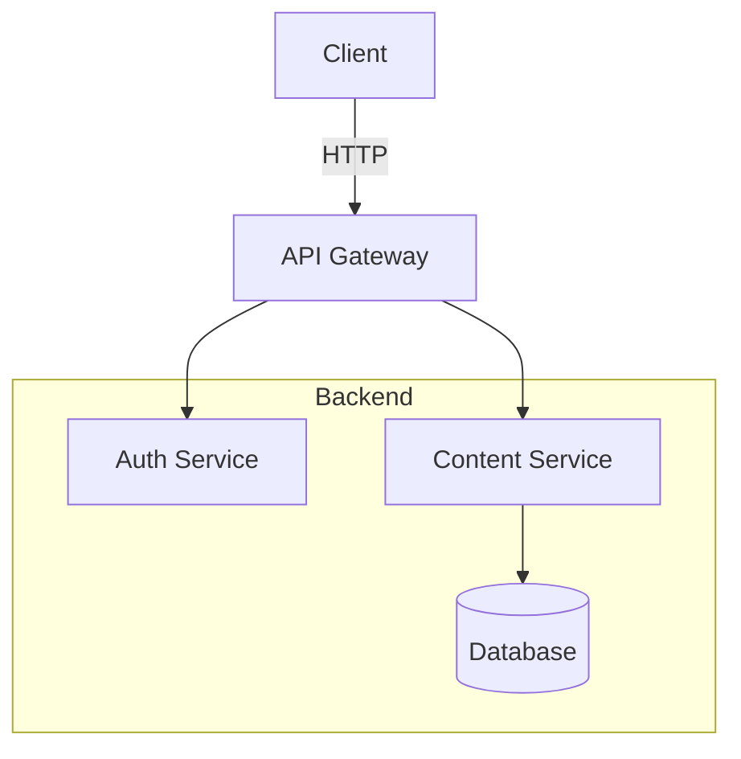

# Mermaid

[Mermaid](https://mermaid.js.org/) is a text-based diagramming language. diagramkit renders Mermaid files using headless Chromium with the official mermaid library.

## File Extensions

`.mermaid`, `.mmd`, `.mmdc` -- all treated identically.

## Capability Matrix

| Capability | Mermaid |
| --- | --- |
| Browser required | Yes |
| Native dark mode support | Yes (separate dark page) |
| WCAG post-process | Yes |
| Supports `--no-contrast` | Yes |
| Multi-format output | SVG/PNG/JPEG/WebP/AVIF |

## Supported Diagram Types

All mermaid diagram types are supported, including flowcharts, sequence diagrams, class diagrams, state diagrams, ER diagrams, gantt charts, pie charts, git graphs, mindmaps, and timelines.

## Quick Start

Create `architecture.mermaid`:



Render:

```bash
diagramkit render architecture.mermaid
```

Output:

```
.diagramkit/
  architecture-light.svg
  architecture-dark.svg
  manifest.json
```

## Using with AI Agents

Tell your AI coding agent:

> Render all mermaid files in this project to SVG

Or for more control:

> Render docs/architecture.mermaid to PNG and SVG with dark mode only

## Dark Mode

Mermaid gets two separate renders:

1. **Light** -- mermaid `default` theme
2. **Dark** -- mermaid `base` theme with custom dark variables

The dark render is then post-processed with WCAG contrast optimization to fix fill colors that are too bright against dark backgrounds.

### Default Dark Theme

The built-in dark palette uses neutral grays with good contrast:

```ts
{
  background: '#111111',
  primaryColor: '#2d2d2d',
  primaryTextColor: '#e5e5e5',
  primaryBorderColor: '#555555',
  lineColor: '#cccccc',
  textColor: '#e5e5e5',
  mainBkg: '#2d2d2d',
  nodeBkg: '#2d2d2d',
  nodeBorder: '#555555',
  clusterBkg: '#1e1e1e',
  // ... additional variables
}
```

### Custom Dark Theme (API)

Override dark theme variables programmatically:

```ts
import { render } from 'diagramkit'

const result = await render(source, 'mermaid', {
  mermaidDarkTheme: {
    background: '#1a1a2e',
    primaryColor: '#16213e',
    primaryTextColor: '#e5e5e5',
    lineColor: '#e5e5e5',
  },
})
```

### Disable Contrast Optimization

```bash
diagramkit render . --no-contrast
```

```ts
const result = await render(source, 'mermaid', { contrastOptimize: false })
```

## How It Works

Mermaid rendering uses two persistent browser pages in the pool:

- **Light page** -- `mermaid.initialize({ theme: 'default' })`
- **Dark page** -- `mermaid.initialize({ theme: 'base', themeVariables: {...} })`

Two pages are needed because `mermaid.initialize()` is global and cannot be reconfigured per-call. Both pages are reused across renders.

## Gotchas

- **Large diagrams** -- Mermaid rendering happens in a headless browser page. Diagrams with hundreds of nodes may be slow or exceed Chromium's rendering budget. Split large diagrams into multiple files.
- **Custom CSS in mermaid** -- diagramkit uses `securityLevel: 'strict'`, so custom CSS or JavaScript in mermaid directives is blocked.
- **`mermaid.initialize()` is global** -- diagramkit uses separate browser pages for light and dark themes because the initialization is not per-call. Custom theme variables only apply to the dark page via the API's `mermaidDarkTheme` option.
- **The contrast optimizer may shift colors** -- fills with high luminance (above 0.4 relative luminance) are darkened to lightness 0.25 while preserving hue. Bright yellows, cyans, and whites are most affected.

## Tips

1. **Use semantic node IDs** -- `A[Web Server]` not `A[Node 1]`
2. **Keep diagrams focused** -- aim for 15 or fewer nodes; split complex systems into multiple files
3. **Use subgraphs** for logical grouping
4. **Prefer neutral fill colors** -- the dark mode post-processor adjusts high-luminance fills automatically
5. **Avoid bright neon colors** -- they may not pass dark mode contrast checks
