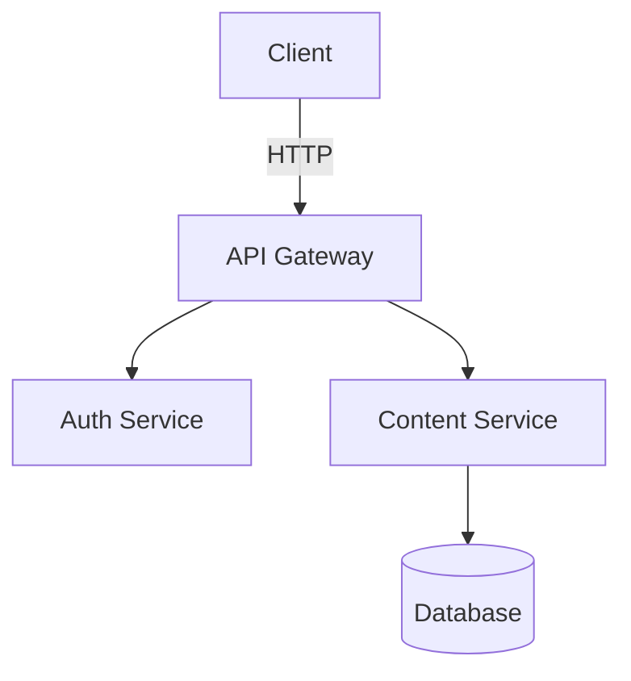

# Getting Started

## Using an AI Agent (Recommended)

If you use an AI coding agent (Claude Code, Cursor, Windsurf, GitHub Copilot, etc.), the fastest path is to give it one bootstrap prompt and let it set up the repo:

### Copy-Paste Project Setup Prompt

```text
Set up diagramkit in this repository. Install the package, then read `node_modules/diagramkit/llms.txt` before making changes. Add a `package.json` script named `render:diagrams` that runs `diagramkit render .`. If this repo needs non-default behavior, create `diagramkit.config.json5`. Run `npx diagramkit --install-skill` to install project skills for Claude and Cursor under `.claude/skills/diagramkit/` and `.cursor/skills/diagramkit/`. Run `npx diagramkit warmup` unless the repo is Graphviz-only, then render the current repo and summarize what changed.
```

After installation, `node_modules/diagramkit/llms.txt` is the best single file for day-to-day setup guidance. Use `node_modules/diagramkit/llms-full.txt` or `diagramkit --agent-help` when the agent needs the full CLI and API reference.

For programmatic agent pipelines, use the JavaScript API:

```ts
import { renderAll, dispose } from 'diagramkit'

const { rendered, skipped, failed } = await renderAll({ dir: '.' })
await dispose() // Always dispose to close the browser
```

> [!IMPORTANT]
> Always call `dispose()` after rendering in scripts and CI. The browser pool has a 5-second idle timeout, but explicit disposal prevents resource leaks and zombie processes.

## Manual Setup

### Install

```bash
npm add diagramkit
```

All four diagram engines (Mermaid, Excalidraw, Draw.io, Graphviz) are bundled -- no extra packages needed.

### Set Up the Browser

diagramkit uses headless Chromium for Mermaid, Excalidraw, and Draw.io rendering. Install the browser binary once:

```bash
npx diagramkit warmup
```

> [!NOTE]
> Graphviz uses bundled Viz.js/WASM and does not need the browser. If you only render `.dot`/`.gv` files, you can skip `warmup`.

### Render Your First Diagram

Create a file called `architecture.mermaid`:



Render it:

```bash
npx diagramkit render architecture.mermaid
```

Output:

```
.diagramkit/
  architecture-light.svg
  architecture-dark.svg
  manifest.json
```

Both light and dark theme variants are generated by default.

## Render a Whole Directory

```bash
npx diagramkit render .
```

This finds all supported files (`.mermaid`, `.mmd`, `.mmdc`, `.excalidraw`, `.drawio`, `.drawio.xml`, `.dio`, `.dot`, `.gv`, `.graphviz`) recursively, skipping `node_modules`, hidden directories, and symlinks.

## Output Convention

Images go into a `.diagramkit/` hidden folder next to each source file:

```
docs/
  getting-started/
    flow.mermaid
    .diagramkit/
      flow-light.svg
      flow-dark.svg
  architecture/
    system.excalidraw
    .diagramkit/
      system-light.svg
      system-dark.svg
```

## Use Rendered Images

### HTML with Automatic Dark Mode

```html
<picture>
  <source srcset=".diagramkit/flow-dark.svg" media="(prefers-color-scheme: dark)">
  
</picture>
```

### Raster Output

For PNG, JPEG, WebP, or AVIF output, install `sharp`:

```bash
npm add sharp
npx diagramkit render . --format png
```

## Create a Config File

diagramkit works with zero configuration. To customize behavior:

```bash
npx diagramkit init            # JSON5 config (comments, trailing commas)
npx diagramkit init --ts       # TypeScript config with defineConfig()
```

See [Configuration](/guide/configuration) for all options.

## Install Project Skills

Use the CLI to install project-level skills for both Claude and Cursor:

```bash
npx diagramkit --install-skill
```

This creates:

- `.claude/skills/diagramkit/SKILL.md`
- `.cursor/skills/diagramkit/SKILL.md`

The generated skill tells agents to read `node_modules/diagramkit/llms.txt`, prefer `diagramkit render <file-or-dir>`, add a `render:diagrams` script in `package.json`, and only create `diagramkit.config.json5` when the repo needs non-default behavior.

Existing skill files are left untouched, so it is safe to rerun after upgrading `diagramkit`.

For a deeper setup flow and more prompt recipes, see [AI Agents](/guide/ai-agents).

## Next Steps

- [CLI](/guide/cli) -- all commands and flags
- [Configuration](/guide/configuration) -- customize output, formats, per-file overrides
- [Image Formats](/guide/image-formats) -- SVG vs PNG vs JPEG vs WebP
- [Watch Mode](/guide/watch-mode) -- live re-rendering during development
- [JavaScript API](/guide/js-api) -- programmatic usage in build scripts
- [Architecture](/guide/architecture) -- how diagramkit works under the hood
- [CI/CD Integration](/guide/ci-cd) -- use diagramkit in GitHub Actions, GitLab CI, Docker
- [Troubleshooting](/guide/troubleshooting) -- common issues and solutions
