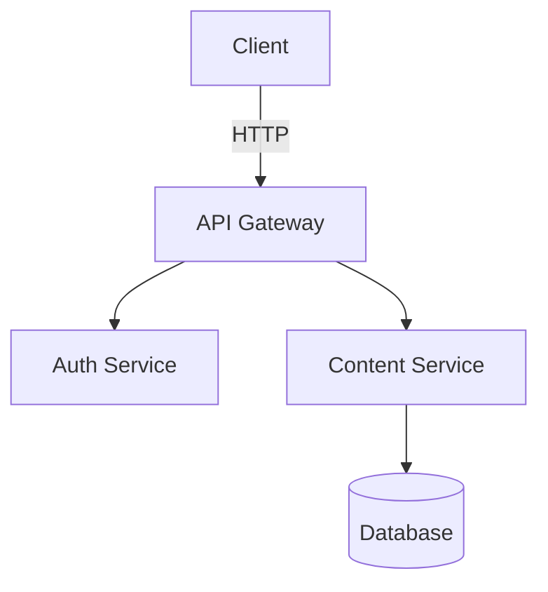

# Getting Started

## Install

```bash
npm add diagramkit
```

All four diagram engines (Mermaid, Excalidraw, Draw.io, Graphviz) are bundled -- no extra packages needed.

## Set Up the Browser

diagramkit uses headless Chromium for Mermaid, Excalidraw, and Draw.io rendering. Install the browser binary once:

```bash
npx diagramkit warmup
```

> [!NOTE]
> Graphviz uses bundled Viz.js/WASM and does not need the browser. If you only render `.dot`/`.gv` files, you can skip `warmup`.

## Render Your First Diagram

Create a file called `architecture.mermaid`:



Render it:

```bash
npx diagramkit render architecture.mermaid
```

Output:

```
.diagramkit/
  architecture-light.svg
  architecture-dark.svg
  manifest.json
```

Both light and dark theme variants are generated by default.

## Render a Whole Directory

```bash
npx diagramkit render .
```

This finds all supported files (`.mermaid`, `.mmd`, `.excalidraw`, `.drawio`, `.dio`, `.dot`, `.gv`, `.graphviz`) recursively, skipping `node_modules` and hidden directories.

## Output Convention

Images go into a `.diagramkit/` hidden folder next to each source file:

```
docs/
  getting-started/
    flow.mermaid
    .diagramkit/
      flow-light.svg
      flow-dark.svg
  architecture/
    system.excalidraw
    .diagramkit/
      system-light.svg
      system-dark.svg
```

## Use Rendered Images

### HTML with Automatic Dark Mode

```html
<picture>
  <source srcset=".diagramkit/flow-dark.svg" media="(prefers-color-scheme: dark)">
  
</picture>
```

### Raster Output

For PNG, JPEG, or WebP output, install `sharp`:

```bash
npm add sharp
npx diagramkit render . --format png
```

## Create a Config File

diagramkit works with zero configuration. To customize behavior:

```bash
npx diagramkit init            # JSON5 config (comments, trailing commas)
npx diagramkit init --ts       # TypeScript config with defineConfig()
```

See [Configuration](/guide/configuration) for all options.

## Next Steps

- [CLI](/guide/cli) -- all commands and flags
- [Configuration](/guide/configuration) -- customize output, formats, per-file overrides
- [Image Formats](/guide/image-formats) -- SVG vs PNG vs JPEG vs WebP
- [Watch Mode](/guide/watch-mode) -- live re-rendering during development
- [JavaScript API](/guide/js-api) -- programmatic usage in build scripts
