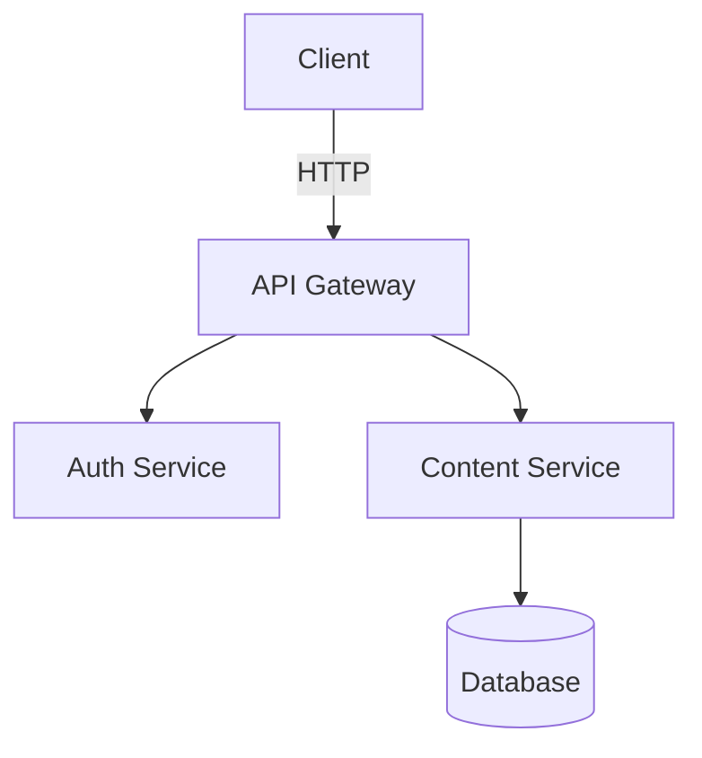

# Getting Started

<picture>
  <source srcset=".diagramkit/getting-started-flow-dark.svg" media="(prefers-color-scheme: dark)">
  
</picture>

## Using an AI Agent (Recommended)

If you use an AI coding agent (Claude Code, Cursor, Codex, Continue, OpenCode, Windsurf, GitHub Copilot, etc.), the fastest path is to give it one bootstrap prompt and let it set up the repo. diagramkit ships every agent skill inside the npm package at `node_modules/diagramkit/skills/`; the `diagramkit-setup` skill writes thin local pointers that defer to those bundled SKILL.md files, so every agent reads guidance pinned to the installed CLI version.

### Copy-Paste Bootstrap Prompt (install latest diagramkit + configure skills)

```text
Install the latest diagramkit in this repo and configure its agent skills:

1. npm add diagramkit@latest
   Confirm with: npx diagramkit --version

2. Read node_modules/diagramkit/REFERENCE.md end to end. It is the
   version-pinned CLI/API contract for the release you just installed.
   Do NOT rely on a globally installed diagramkit or on training data.

3. Follow node_modules/diagramkit/skills/diagramkit-setup/SKILL.md end to
   end. It will run `npx diagramkit warmup` (skip if Graphviz-only), wire
   `"render:diagrams": "diagramkit render ."` into package.json, optionally
   create diagramkit.config.json5 (`npx diagramkit init --yes`), render any
   existing diagrams, and write thin pointer SKILL.md files at:
     .agents/skills/diagramkit-<name>/SKILL.md    (always)
     .claude/skills/diagramkit-<name>/SKILL.md    (if .claude/ exists)
     .cursor/skills/diagramkit-<name>/SKILL.md    (if .cursor/ exists)
     .codex/skills/diagramkit-<name>/SKILL.md     (if .codex/ exists)
     .continue/skills/diagramkit-<name>/SKILL.md  (if .continue/ exists)
   Each pointer defers to
   node_modules/diagramkit/skills/diagramkit-<name>/SKILL.md — so every
   `npm install diagramkit` upgrade automatically refreshes every skill.
   Skills installed: setup, auto, mermaid, excalidraw, draw-io, graphviz,
   review (validation + WCAG 2.2 AA contrast).

4. Commit the pointer SKILL.md files with any package.json / config
   changes. Summarize what was created or skipped.
```

### Copy-Paste Prompt (generate a diagram + multiple image formats)

```text
Use the diagramkit-* skills installed in this repo to create a [TOPIC]
diagram. Read node_modules/diagramkit/REFERENCE.md first so you use the
LOCAL diagramkit install. Follow .agents/skills/diagramkit-auto/SKILL.md
(or its harness mirror under .claude/skills/, .cursor/skills/,
.codex/skills/) to pick the engine, then follow the matching engine skill
(mermaid / excalidraw / draw-io / graphviz). Save the source under
`diagrams/`, render both light + dark variants, and also export PNG + WebP
for docs:
  npx diagramkit render diagrams/<file> --format svg,png,webp --scale 2
Embed using the <picture> pattern.
```

### Copy-Paste Prompt (validate + WCAG 2.2 AA contrast review)

```text
Audit every diagram in this repo for structural validity, ``-embed
safety, and WCAG 2.2 AA text/background contrast. Read
node_modules/diagramkit/REFERENCE.md first, then follow
.agents/skills/diagramkit-review/SKILL.md (or
node_modules/diagramkit/skills/diagramkit-review/SKILL.md directly). It
will force-render every diagram, run `diagramkit validate . --recursive
--json`, classify issues into errors vs warnings, and delegate per-engine
fixes (palette swaps for LOW_CONTRAST_TEXT, htmlLabels:false for
foreignObject, etc.) back to the matching engine skill's "Review Mode".
```

### Copy-Paste Prompt (refresh skills after upgrading diagramkit)

```text
After `npm update diagramkit`, re-read node_modules/diagramkit/REFERENCE.md
for any CLI/API changes. The .agents/skills/diagramkit-* thin pointers
don't need rewriting — they always defer to
node_modules/diagramkit/skills/<name>/SKILL.md, which was just updated by
the npm install. If the upgrade added new skills, re-run
node_modules/diagramkit/skills/diagramkit-setup/SKILL.md to write the
missing pointers. If the repo uses `npx skills` instead of local pointers,
run `npx skills update sujeet-pro/diagramkit`. Confirm with
`npx diagramkit --version`.
```

After installation, `node_modules/diagramkit/REFERENCE.md` is the best single landing page for both humans and agents. `node_modules/diagramkit/llms.txt` is the compact CLI reference; `node_modules/diagramkit/llms-full.txt` (or `diagramkit --agent-help`) has the full CLI + API reference.

For programmatic agent pipelines, use the JavaScript API:

```ts
import { renderAll, dispose } from 'diagramkit'

const { rendered, skipped, failed } = await renderAll({ dir: '.' })
await dispose() // Always dispose to close the browser
```

> [!IMPORTANT]
> Always call `dispose()` after rendering in scripts and CI. The browser pool has a 5-second idle timeout, but explicit disposal prevents resource leaks and zombie processes.

## Manual Setup

### Install

```bash
npm add diagramkit
```

All four diagram engines (Mermaid, Excalidraw, Draw.io, Graphviz) are bundled -- no extra packages needed.

### Set Up the Browser

diagramkit uses headless Chromium for Mermaid, Excalidraw, and Draw.io rendering. Install the browser binary once:

```bash
npx diagramkit warmup
```

> [!NOTE]
> Graphviz uses bundled Viz.js/WASM and does not need the browser. If you only render `.dot`/`.gv` files, you can skip `warmup`.

### Render Your First Diagram

Create a file called `architecture.mermaid`:



Render it:

```bash
npx diagramkit render architecture.mermaid
```

Output:

```
.diagramkit/
  architecture-light.svg
  architecture-dark.svg
  manifest.json
```

Both light and dark theme variants are generated by default.

## Render a Whole Directory

```bash
npx diagramkit render .
```

This finds all supported files (`.mermaid`, `.mmd`, `.mmdc`, `.excalidraw`, `.drawio`, `.drawio.xml`, `.dio`, `.dot`, `.gv`, `.graphviz`) recursively, skipping `node_modules`, hidden directories, and symlinks.

You can also omit the `render` subcommand when the first argument is an existing file or directory, for example `npx diagramkit .`.

## Output Convention

Images go into a `.diagramkit/` hidden folder next to each source file:

```
docs/
  getting-started/
    flow.mermaid
    .diagramkit/
      flow-light.svg
      flow-dark.svg
  architecture/
    system.excalidraw
    .diagramkit/
      system-light.svg
      system-dark.svg
```

## Use Rendered Images

### HTML with Automatic Dark Mode

```html
<picture>
  <source srcset=".diagramkit/flow-dark.svg" media="(prefers-color-scheme: dark)">
  
</picture>
```

### Raster Output

For PNG, JPEG, WebP, or AVIF output, install `sharp`:

```bash
npm add sharp
npx diagramkit render . --format png
```

## Create a Config File

diagramkit works with zero configuration. To customize behavior:

```bash
npx diagramkit init            # JSON5 config (comments, trailing commas)
npx diagramkit init --ts       # TypeScript config with defineConfig()
```

See [Configuration](../configuration/README.md) for all options.

## Install Project Skills (any agent — Claude, Cursor, Codex, Continue, ...)

Every diagramkit agent skill ships **inside the npm package** at `node_modules/diagramkit/skills/<name>/SKILL.md`. The recommended install is to write tiny **local pointer SKILL.md files** in your repo that defer to those bundled originals. The `diagramkit-setup` skill does this for you:

```bash
# 1. Install the package (skills come with it)
npm add diagramkit

# 2. Run the setup skill in your agent. It writes pointer SKILL.md files at:
#      .agents/skills/diagramkit-<name>/SKILL.md   (always)
#      .claude/skills/diagramkit-<name>/SKILL.md   (if Claude Code in use)
#      .cursor/skills/diagramkit-<name>/SKILL.md   (if Cursor in use)
#      .codex/skills/diagramkit-<name>/SKILL.md    (if Codex in use)
#    Each pointer is a few lines of frontmatter plus a single
#    "follow node_modules/diagramkit/skills/<name>/SKILL.md" instruction.
```

The shipped skills:

| Capability                                                                  | Skill                   |
| --------------------------------------------------------------------------- | ----------------------- |
| Bootstrap (install, warmup, config, scripts, skill pointers). **Run first.**| `diagramkit-setup`      |
| Engine routing for new diagram requests                                     | `diagramkit-auto`       |
| Authoring + image generation (vector + raster) — Mermaid                    | `diagramkit-mermaid`    |
| Authoring + image generation (vector + raster) — Excalidraw                 | `diagramkit-excalidraw` |
| Authoring + image generation (vector + raster) — Draw.io                    | `diagramkit-draw-io`    |
| Authoring + image generation (vector + raster) — Graphviz                   | `diagramkit-graphviz`   |
| Validation (SVG structure, ``-embed safety) **+ WCAG 2.2 AA contrast** | `diagramkit-review`     |

> [!IMPORTANT]
> All `diagramkit-*` skills always prefer the **locally installed** CLI. They read `node_modules/diagramkit/REFERENCE.md` first and run `npx diagramkit ...` (which auto-resolves to `./node_modules/.bin/diagramkit`) so the agent uses the exact CLI/API surface for the version installed in this repo.

### Alternative: GitHub-published skills via `npx skills`

If you want the skills to advance independently of the installed `diagramkit` package, use the standalone [`skills`](https://github.com/vercel-labs/skills) CLI instead of the local pointers:

```bash
npx skills add sujeet-pro/diagramkit                              # all skills
npx skills add sujeet-pro/diagramkit -a claude-code -a cursor     # specific agents
npx skills add sujeet-pro/diagramkit -s diagramkit-setup          # specific skills
npx skills update sujeet-pro/diagramkit                           # refresh later
```

Pick **one** mechanism per repo (local pointers OR `npx skills`) so skills don't drift against each other.

For a deeper setup flow and more prompt recipes, see [AI Agents](../ai-agents/README.md).

## Next Steps

- [CLI](../cli/README.md) -- all commands and flags
- [Configuration](../configuration/README.md) -- customize output, formats, per-file overrides
- [Image Formats](../image-formats/README.md) -- SVG vs PNG vs JPEG vs WebP
- [Watch Mode](../watch-mode/README.md) -- live re-rendering during development
- [JavaScript API](../js-api/README.md) -- programmatic usage in build scripts
- [Architecture](../architecture/README.md) -- how diagramkit works under the hood
- [CI/CD Integration](../ci-cd/README.md) -- use diagramkit in GitHub Actions, GitLab CI, Docker
- [Troubleshooting](../troubleshooting/README.md) -- common issues and solutions
- [Bundled Assets](../bundled-assets/README.md) -- schemas, llms.txt, ai-guidelines, skills the npm package ships
