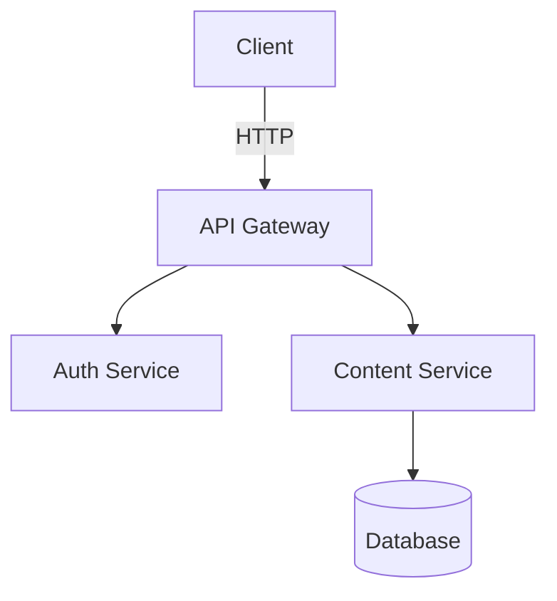

# Getting Started

<picture>
  <source srcset=".diagramkit/getting-started-flow-dark.svg" media="(prefers-color-scheme: dark)">
  
</picture>

## Using an AI Agent (Recommended)

If you use an AI coding agent (Claude Code, Cursor, Codex, Continue, OpenCode, Windsurf, GitHub Copilot, etc.), the fastest path is to give it one bootstrap prompt and let it set up the repo. diagramkit's agent skills are installed via the standalone [`skills`](https://github.com/vercel-labs/skills) CLI from Vercel Labs — diagramkit itself only handles rendering.

### Copy-Paste Bootstrap Prompt (install diagramkit + all skills)

```text
Set up diagramkit in this repository:

1. npm add diagramkit
2. Read node_modules/diagramkit/REFERENCE.md so you anchor on the LOCALLY
   installed version (do NOT use a globally installed `diagramkit`).
3. npx diagramkit warmup        # skip if Graphviz-only
4. If non-default behavior is needed, run: npx diagramkit init --yes
   (this writes diagramkit.config.json5 with the JSON Schema wired up).
5. Add to package.json:
     "render:diagrams": "diagramkit render ."
6. Install diagramkit's agent skills with the standalone `skills` CLI so any
   agent (Claude/Cursor/Codex/Continue/OpenCode/...) gets the engine, setup,
   and auto-router skills:
     npx skills add sujeet-pro/diagramkit
7. Render every diagram once: npx diagramkit render .
8. Summarize what changed.
```

### Copy-Paste Prompt (generate a diagram + multiple image formats)

```text
Use the diagramkit-* skills installed in this repo to create a [TOPIC]
diagram. Read node_modules/diagramkit/REFERENCE.md first so you use the
LOCAL diagramkit install. Use diagramkit-auto to pick the engine, then
follow the matching engine skill (mermaid / excalidraw / draw-io / graphviz).
Save the source under `diagrams/`, render both light + dark variants, and
also export PNG + WebP for docs:
  npx diagramkit render diagrams/<file> --format svg,png,webp --scale 2
Embed using the <picture> pattern.
```

### Copy-Paste Prompt (refresh skills only)

```text
Refresh the diagramkit-* skills installed in this repo so they match the
latest upstream versions: `npx skills update sujeet-pro/diagramkit`.
Then re-read .claude/skills/diagramkit-setup/SKILL.md (or the equivalent
under .cursor/skills/, .codex/skills/, .agents/skills/) and confirm the
local diagramkit install is current with `npx diagramkit --version`.
```

After installation, `node_modules/diagramkit/REFERENCE.md` is the best single landing page for both humans and agents. `node_modules/diagramkit/llms.txt` is the compact CLI reference; `node_modules/diagramkit/llms-full.txt` (or `diagramkit --agent-help`) has the full CLI + API reference.

For programmatic agent pipelines, use the JavaScript API:

```ts
import { renderAll, dispose } from 'diagramkit'

const { rendered, skipped, failed } = await renderAll({ dir: '.' })
await dispose() // Always dispose to close the browser
```

> [!IMPORTANT]
> Always call `dispose()` after rendering in scripts and CI. The browser pool has a 5-second idle timeout, but explicit disposal prevents resource leaks and zombie processes.

## Manual Setup

### Install

```bash
npm add diagramkit
```

All four diagram engines (Mermaid, Excalidraw, Draw.io, Graphviz) are bundled -- no extra packages needed.

### Set Up the Browser

diagramkit uses headless Chromium for Mermaid, Excalidraw, and Draw.io rendering. Install the browser binary once:

```bash
npx diagramkit warmup
```

> [!NOTE]
> Graphviz uses bundled Viz.js/WASM and does not need the browser. If you only render `.dot`/`.gv` files, you can skip `warmup`.

### Render Your First Diagram

Create a file called `architecture.mermaid`:



Render it:

```bash
npx diagramkit render architecture.mermaid
```

Output:

```
.diagramkit/
  architecture-light.svg
  architecture-dark.svg
  manifest.json
```

Both light and dark theme variants are generated by default.

## Render a Whole Directory

```bash
npx diagramkit render .
```

This finds all supported files (`.mermaid`, `.mmd`, `.mmdc`, `.excalidraw`, `.drawio`, `.drawio.xml`, `.dio`, `.dot`, `.gv`, `.graphviz`) recursively, skipping `node_modules`, hidden directories, and symlinks.

You can also omit the `render` subcommand when the first argument is an existing file or directory, for example `npx diagramkit .`.

## Output Convention

Images go into a `.diagramkit/` hidden folder next to each source file:

```
docs/
  getting-started/
    flow.mermaid
    .diagramkit/
      flow-light.svg
      flow-dark.svg
  architecture/
    system.excalidraw
    .diagramkit/
      system-light.svg
      system-dark.svg
```

## Use Rendered Images

### HTML with Automatic Dark Mode

```html
<picture>
  <source srcset=".diagramkit/flow-dark.svg" media="(prefers-color-scheme: dark)">
  
</picture>
```

### Raster Output

For PNG, JPEG, WebP, or AVIF output, install `sharp`:

```bash
npm add sharp
npx diagramkit render . --format png
```

## Create a Config File

diagramkit works with zero configuration. To customize behavior:

```bash
npx diagramkit init            # JSON5 config (comments, trailing commas)
npx diagramkit init --ts       # TypeScript config with defineConfig()
```

See [Configuration](../configuration/README.md) for all options.

## Install Project Skills (any agent — Claude, Cursor, Codex, Continue, ...)

diagramkit's agent skills are installed via the standalone [`skills`](https://github.com/vercel-labs/skills) CLI, not via the diagramkit CLI itself. This keeps diagramkit focused on rendering and lets the same skills work across 41+ agents.

```bash
# Install every diagramkit-* skill (setup, auto-router, mermaid, excalidraw, draw-io, graphviz, review)
npx skills add sujeet-pro/diagramkit

# Target specific agents only (any combination)
npx skills add sujeet-pro/diagramkit -a claude-code -a cursor -a codex

# Install only specific skills
npx skills add sujeet-pro/diagramkit -s diagramkit-setup -s diagramkit-mermaid

# Refresh skills later (no diagramkit npm release required)
npx skills update sujeet-pro/diagramkit
```

The shipped skills:

| Skill                   | Purpose                                                                                          |
| ----------------------- | ------------------------------------------------------------------------------------------------ |
| `diagramkit-setup`      | First-time install + config in a repo. **Run first.**                                            |
| `diagramkit-auto`       | Routes a diagram request to the best engine.                                                     |
| `diagramkit-mermaid`    | Authors Mermaid diagrams + renders to SVG/PNG/JPEG/WebP/AVIF via the local diagramkit CLI.       |
| `diagramkit-excalidraw` | Authors Excalidraw diagrams + renders to SVG/PNG/JPEG/WebP/AVIF.                                 |
| `diagramkit-draw-io`    | Authors Draw.io diagrams (cloud icons, BPMN, swimlanes) + renders to SVG/PNG/JPEG/WebP/AVIF.     |
| `diagramkit-graphviz`   | Authors Graphviz DOT diagrams + renders to SVG/PNG/JPEG/WebP/AVIF.                               |
| `diagramkit-review`     | Audits and repairs every diagram in a repo (pre-merge / pre-release health check).               |

> [!IMPORTANT]
> All `diagramkit-*` skills always prefer the **locally installed** CLI. They read `node_modules/diagramkit/REFERENCE.md` first and run `npx diagramkit ...` (which auto-resolves to `./node_modules/.bin/diagramkit`) so the agent uses the exact CLI/API surface for the version installed in this repo.

If `npx skills` is unavailable (older toolchains), copy the folders manually from `node_modules/diagramkit/skills/diagramkit-*/` into `.claude/skills/`, `.cursor/skills/`, `.codex/skills/`, `.continue/skills/`, or `.agents/skills/`.

For a deeper setup flow and more prompt recipes, see [AI Agents](../ai-agents/README.md).

## Next Steps

- [CLI](../cli/README.md) -- all commands and flags
- [Configuration](../configuration/README.md) -- customize output, formats, per-file overrides
- [Image Formats](../image-formats/README.md) -- SVG vs PNG vs JPEG vs WebP
- [Watch Mode](../watch-mode/README.md) -- live re-rendering during development
- [JavaScript API](../js-api/README.md) -- programmatic usage in build scripts
- [Architecture](../architecture/README.md) -- how diagramkit works under the hood
- [CI/CD Integration](../ci-cd/README.md) -- use diagramkit in GitHub Actions, GitLab CI, Docker
- [Troubleshooting](../troubleshooting/README.md) -- common issues and solutions
- [Bundled Assets](../bundled-assets/README.md) -- schemas, llms.txt, ai-guidelines, skills the npm package ships
