# Image Formats

<picture>
  <source srcset=".diagramkit/format-pipeline-dark.svg" media="(prefers-color-scheme: dark)">
  
</picture>

diagramkit supports five output formats. SVG is the default and recommended format.

## Format Comparison

| Format | Type | Transparency | File Size | Best For |
|:-------|:-----|:-------------|:----------|:---------|
| SVG | Vector | Yes | Smallest | Web, docs, version control |
| PNG | Raster | Yes | Medium | Documentation, presentations, README |
| JPEG | Raster | No | Small | Slides, email, social media |
| WebP | Raster | Yes | Small raster | Modern web, performance-optimized sites |
| AVIF | Raster | Yes | Often smallest raster | Next-gen web, best compression |

## SVG (Default and Recommended)

Diagrams stay crisp at any zoom level, produce the smallest files, and diff cleanly in version control.

```bash
diagramkit render . --format svg
```

> [!TIP]
> Use SVG whenever possible, especially for web-based documentation. It is the only format that preserves vector quality.

## PNG

Raster with transparency. Good where SVG is not supported (some Markdown renderers, social media previews).

```bash
diagramkit render . --format png
diagramkit render . --format png --scale 3   # high-DPI
```

## JPEG

Compressed raster with a white background (no transparency). Smaller than PNG but lossy.

```bash
diagramkit render . --format jpeg --quality 80
```

## WebP

Modern raster with transparency and better compression than PNG or JPEG.

```bash
diagramkit render . --format webp --quality 85
```

## AVIF

Next-generation format with the best compression ratios. Modern browsers support it, but older browsers may not.

```bash
diagramkit render . --format avif --quality 80
```

> [!WARNING]
> PNG, JPEG, WebP, and AVIF require the `sharp` library. Install with `npm add sharp`.

## Scale and Quality

### Scale (`--scale`)

Controls pixel density for raster output. No effect on SVG.

| Scale | Use Case |
|:------|:---------|
| `1` | Standard displays, small file size |
| `2` | Retina/HiDPI displays (default) |
| `3` | High-DPI, print |
| `4` | Large-format print |

### Quality (`--quality`)

Lossy compression for JPEG, WebP, and AVIF. Ignored for SVG and PNG.

| Quality | Result |
|:--------|:-------|
| `100` | Highest quality, largest file |
| `90` | Default -- good balance |
| `75` | Smaller file, slight artifacts |
| `50` | Small file, visible artifacts |

## Conversion Pipeline

For raster formats, diagramkit always renders to SVG first, then converts via [sharp](https://sharp.pixelplumbing.com/):

1. Render diagram to SVG (headless Chromium or Viz.js)
2. Pass SVG through sharp with requested scale and quality
3. Write raster output for each theme variant

The same pipeline is available standalone via `convertSvg()`:

```ts
import { convertSvg } from 'diagramkit/convert'

const png = await convertSvg(svgBuffer, { format: 'png', scale: 2 })
```

## When to Use Each Format

| Scenario | Recommended |
|:---------|:------------|
| Documentation site | SVG |
| GitHub README | SVG or PNG |
| Presentations | PNG at `--scale 3` |
| Email / chat | PNG or JPEG |
| Performance-critical web | WebP or AVIF at `--quality 85` |
