# JavaScript API

<picture>
  <source srcset=".diagramkit/api-overview-dark.svg" media="(prefers-color-scheme: dark)">
  
</picture>

For programmatic control, diagramkit exports an async API. All rendering functions return promises. Mermaid, Excalidraw, and Draw.io use Playwright internally; Graphviz uses bundled Viz.js/WASM.

```bash
npm add diagramkit
```

> [!NOTE]
> The [CLI](/guide/cli) is the recommended way to use diagramkit. Use the API when you need programmatic control in build scripts, custom tooling, or Node.js applications.

## `render(source, type, options?)`

Render a diagram from a source string.

```ts
import { render } from 'diagramkit'

const result = await render(
  `graph TD
    A[Client] --> B[Server]
    B --> C[(Database)]`,
  'mermaid',
  { format: 'svg', theme: 'both' },
)

// result.light  -- Buffer containing light theme SVG
// result.dark   -- Buffer containing dark theme SVG
// result.format -- 'svg'
// result.width  -- SVG width in pixels (SVG only)
// result.height -- SVG height in pixels (SVG only)
```

| Parameter | Type | Description |
|:----------|:-----|:------------|
| `source` | `string` | Diagram source content |
| `type` | `DiagramType` | `'mermaid'`, `'excalidraw'`, `'drawio'`, or `'graphviz'` |
| `options` | `RenderOptions` | Optional rendering config |

## `renderFile(filePath, options?)`

Render a file from disk. Type is inferred from the extension.

```ts
import { renderFile } from 'diagramkit'
import { writeFileSync } from 'fs'

const result = await renderFile('/path/to/architecture.mermaid', {
  format: 'png',
  scale: 3,
})

if (result.light) writeFileSync('architecture-light.png', result.light)
if (result.dark) writeFileSync('architecture-dark.png', result.dark)
```

## `renderAll(options?)`

Batch render all diagrams in a directory tree. Writes to `.diagramkit/` folders. Uses the manifest for incremental builds.

```ts
import { renderAll, dispose } from 'diagramkit'

const { rendered, skipped, failed } = await renderAll({
  dir: '/path/to/project',
  formats: ['svg'],
  theme: 'both',
  force: false,
})

// Always dispose when done
await dispose()
```

The function discovers files, checks the manifest, renders stale files, updates the manifest, and cleans orphaned outputs.

## `renderDiagramFileToDisk(file, options?)`

Render a single discovered file and write output to disk. Used internally by `renderAll()` and watch mode.

```ts
import { renderDiagramFileToDisk, dispose } from 'diagramkit'
import { findDiagramFiles } from 'diagramkit/utils'

const files = findDiagramFiles('/path/to/project')
for (const file of files) {
  const written = await renderDiagramFileToDisk(file, { formats: ['svg'] })
  // written -- ['flow-light.svg', 'flow-dark.svg']
}
await dispose()
```

## `watchDiagrams(options)`

Watch for changes and re-render automatically. Returns a cleanup function.

```ts
import { watchDiagrams, dispose } from 'diagramkit'

const stop = watchDiagrams({
  dir: '/path/to/project',
  renderOptions: { format: 'svg', theme: 'both' },
  onChange: (file) => console.log(`Re-rendered: ${file}`),
})

await stop()
await dispose()
```

## `createRendererRuntime()`

Create an isolated runtime with its own browser pool.
Use this for workers, long-running services, and tests where shared singleton state is undesirable.

```ts
import { createRendererRuntime } from 'diagramkit'

const runtime = createRendererRuntime()

const result = await runtime.renderAll({
  dir: '/path/to/project',
  formats: ['svg'],
  includeMetrics: true,
})

await runtime.dispose()
```

> [!TIP]
> When issuing overlapping renders (`Promise.all`) for browser-backed engines, prefer `createRendererRuntime()` per worker/service boundary so each runtime has an isolated pool.

> [!NOTE]
> The top-level APIs (`render`, `renderAll`, `watchDiagrams`, `warmup`, `dispose`) share a singleton browser pool. Runtime methods use their own isolated pool, so clean them up with `runtime.dispose()` instead of the global `dispose()`.

`createRendererRuntime()` returns runtime-scoped versions of:
- `render`
- `renderFile`
- `renderDiagramFileToDisk`
- `renderAll`
- `watchDiagrams`
- `warmup`
- `dispose`

## Browser Lifecycle

### `warmup()`

Pre-warm the browser pool. Optional -- the browser launches automatically on first render.

```ts
import { warmup } from 'diagramkit'
await warmup()
```

### `dispose()`

Close the browser pool and release resources.

```ts
import { dispose } from 'diagramkit'
await dispose()
```

> [!IMPORTANT]
> Always call `dispose()` when done rendering, especially in scripts and CI. The pool has an idle timeout, but explicit disposal prevents resource leaks.

## `convertSvg(svg, options)`

Convert SVG to raster format using [sharp](https://sharp.pixelplumbing.com/).

```ts
import { convertSvg } from 'diagramkit/convert'

const png = await convertSvg(svgBuffer, { format: 'png', scale: 2 })
const jpeg = await convertSvg(svgString, { format: 'jpeg', quality: 85, scale: 3 })
```

## `loadConfig(overrides?, dir?, configFile?, options?)`

Load merged config from all sources. Pass `configFile` to load a specific file instead of auto-discovery.

```ts
import { loadConfig } from 'diagramkit'

const config = loadConfig(
  { outputDir: 'images' },
  '/path/to/project',
)

// Or with explicit config file
const ciConfig = loadConfig({}, '.', './ci.config.json5')

// Strict mode throws on invalid config instead of warning and falling back
const strictConfig = loadConfig({}, '.', undefined, { strict: true })
```

## File Discovery

```ts
import { findDiagramFiles, filterByType } from 'diagramkit/utils'

const all = findDiagramFiles('/path/to/project')
const mermaidOnly = filterByType(all, 'mermaid')
```

## Color Utilities

```ts
import { postProcessDarkSvg } from 'diagramkit/color'

const optimized = postProcessDarkSvg(rawDarkSvg)
```

Finds inline fill colors with high luminance and darkens them while preserving hue, ensuring readability against dark backgrounds.

## Subpath Exports

| Import | Content |
|:-------|:--------|
| `diagramkit` | Core rendering functions, config, lifecycle, and `convertSvg` |
| `diagramkit/utils` | Utility barrel (discovery, manifest, extensions, output, color) |
| `diagramkit/color` | Color utilities only |
| `diagramkit/convert` | SVG-to-raster conversion |

> [!NOTE]
> `convertSvg` is available from both `diagramkit` (main) and `diagramkit/convert` (subpath). Discovery, manifest, and color utilities are in the subpath exports (`diagramkit/utils`, `diagramkit/color`), not the main entry.
