# diagramkit

<picture>
  <source srcset=".diagramkit/module-map-dark.svg" media="(prefers-color-scheme: dark)">
  
</picture>

The `diagramkit` npm package exposes four entry points:

| Entry point          | What it covers                                             | Reference                              |
| -------------------- | ---------------------------------------------------------- | -------------------------------------- |
| `diagramkit`         | Core rendering APIs (`render`, `renderFile`, `renderAll`)  | [API](./api/README.md)                 |
| `diagramkit/utils`   | Discovery, manifest, output helpers for custom pipelines   | [Utils](./utils/README.md)             |
| `diagramkit/color`   | Dark SVG contrast utilities                                | [Color](./color/README.md)             |
| `diagramkit/convert` | SVG-to-raster conversion via sharp                         | [Convert](./convert/README.md)         |

And the CLI surface:

| Area      | Reference                                              |
| --------- | ------------------------------------------------------ |
| CLI       | [CLI reference](./cli/README.md)                       |
| Config    | [Configuration reference](./config/README.md)          |
| Types     | [TypeScript types](./types/README.md)                  |
