# Mermaid Diagram Generation

Generate diagrams using Mermaid syntax. Supports all 20+ Mermaid v11 diagram types with proper syntax, theming, and rendering via `diagramkit`.

## Rendering

Use `diagramkit` for rendering -- NOT `mmdc` or `@mermaid-js/mermaid-cli`:

```bash
# Render a single mermaid file
diagramkit render diagram.mermaid

# Render raster output for email or Confluence
diagramkit render diagram.mermaid --format png --theme light --scale 2

# Render all mermaid files in a directory
diagramkit render . --type mermaid
```

diagramkit uses a headless Chromium instance with the mermaid library loaded directly, producing light and dark variants with automatic contrast optimization.

Accepted file extensions: `.mermaid`, `.mmd`, `.mmdc`

## Workflow

### Phase 1: Determine Diagram Type

If `type` is not specified, auto-detect from the description (see `/diagrams` orchestrator skill for detection rules). If `type` is specified, use it directly.

### Phase 2: Generate Mermaid Source

Write a `.mermaid` file following the syntax reference below. Apply these quality standards:

1. **Clear labels**: Use descriptive text, not single letters (e.g., `API Gateway` not `A`).
2. **Meaningful IDs**: Use readable IDs like `api_gateway` not `A`.
3. **Proper spacing**: Use subgraphs to group related components.
4. **Visual hierarchy**: Important nodes should be visually prominent.
5. **Readable flow**: Prefer `TD` for hierarchies, `LR` for sequences/timelines.
6. **Theme compatibility**: Avoid hardcoded colors unless necessary. Use `classDef` for styling.
7. **Comments**: Add a header comment with the diagram title.

File header:

```
%% Diagram: <title>
%% Type: <diagram-type>
```

### Phase 3: Render with diagramkit

```bash
diagramkit render <name>.mermaid --format <format>
```

diagramkit automatically produces both light and dark variants. Default to SVG unless the destination explicitly needs raster output, such as email or Confluence. Dark SVGs are post-processed with `postProcessDarkSvg()` to fix contrast issues.

### Phase 4: Output

Save and report:

````
Mermaid diagram generated:
  Source: ./diagrams/auth-flow.mermaid
  Output: .diagrams/auth-flow-light.svg
          .diagrams/auth-flow-dark.svg

Embed in markdown:
  <picture>
    <source srcset=".diagrams/auth-flow-dark.svg" media="(prefers-color-scheme: dark)">
    
  </picture>

Or inline (light mode only, no dark variant):
  ```mermaid
  <source>
````

````

---

## Diagram Type Reference

### Flowchart

**Directive:** `flowchart TD` (or `LR`, `BT`, `RL`)

**Directions:** `TB`/`TD` (top-down), `BT` (bottom-top), `LR` (left-right), `RL` (right-left)

```mermaid
flowchart TD
    subgraph Client Layer
        web[Web Client]
        mobile[Mobile Client]
    end
    subgraph API Layer
        gateway[API Gateway]
        auth[Auth Service]
    end
    subgraph Data Layer
        db[(PostgreSQL)]
        cache[(Redis)]
    end

    web --> gateway
    mobile --> gateway
    gateway --> auth
    gateway --> db
    gateway --> cache
````

**Node shapes:**

- `[text]` -- Rectangle (process)
- `(text)` -- Rounded rectangle
- `{text}` -- Rhombus (decision)
- `[(text)]` -- Cylinder (database)
- `((text))` -- Circle
- `>text]` -- Asymmetric
- `[[text]]` -- Subroutine
- `{{text}}` -- Hexagon

**Edge types:**

- `-->` -- Arrow
- `---` -- Line
- `-.->` -- Dotted arrow
- `==>` -- Thick arrow
- `--text-->` -- Arrow with label
- `-->|text|` -- Arrow with label (alternative)

**Best practices:**

- Use `flowchart` (not `graph`) for modern features.
- Avoid `end` as a node ID (use `End` or wrap in quotes).
- Use subgraphs for logical grouping.
- Use `classDef` for consistent styling across nodes.

---

### Sequence Diagram

**Directive:** `sequenceDiagram`

```mermaid
sequenceDiagram
    participant C as Client
    participant G as API Gateway
    participant A as Auth Service
    participant D as Database

    C->>+G: POST /api/login
    G->>+A: validateCredentials(user, pass)
    A->>+D: SELECT user WHERE email = ?
    D-->>-A: User record
    A-->>-G: JWT token
    G-->>-C: 200 OK + token

    Note over G,A: Token cached for 15 minutes

    alt Invalid credentials
        A-->>G: 401 Unauthorized
        G-->>C: 401 Unauthorized
    end
```

**Arrow types:**
| Syntax | Description |
|--------|-------------|
| `->` | Solid line, no arrow |
| `-->` | Dotted line, no arrow |
| `->>` | Solid line, arrowhead |
| `-->>` | Dotted line, arrowhead |
| `-x` | Solid line, cross |
| `--x` | Dotted line, cross |
| `-)` | Solid line, open arrow (async) |
| `--)` | Dotted line, open arrow (async) |

**Features:** `activate`/`deactivate` (or `+`/`-` suffixes), `alt`/`else`, `opt`, `par`, `critical`, `break`, `loop`, `rect` (background highlight), `autonumber`, `Note over`/`Note left of`/`Note right of`.

**Best practices:**

- Declare participants explicitly to control ordering.
- Use `autonumber` for complex flows.
- Use `+`/`-` suffixes for activation rather than separate `activate`/`deactivate` lines.
- Include error paths with `alt`/`else` blocks.

---

### Class Diagram

**Directive:** `classDiagram`

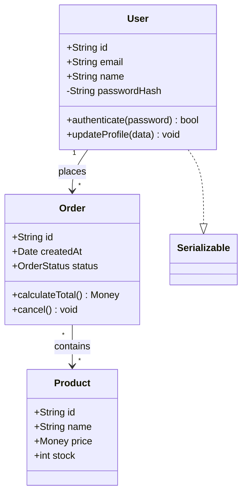

**Relationships:**
| Syntax | Meaning |
|--------|---------|
| `<\|--` | Inheritance |
| `*--` | Composition |
| `o--` | Aggregation |
| `-->` | Association |
| `--` | Link (solid) |
| `..>` | Dependency |
| `..\|>` | Realization |
| `..` | Link (dashed) |

**Features:** Annotations (`<<interface>>`, `<<abstract>>`, `<<enumeration>>`), visibility (`+` public, `-` private, `#` protected, `~` package), generic types, namespaces.

---

### State Diagram

**Directive:** `stateDiagram-v2`

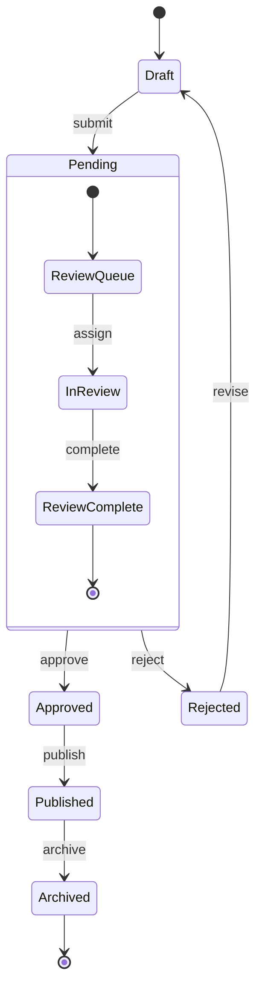

**Features:** `[*]` for start/end states, composite states, `<<fork>>`, `<<join>>`, `<<choice>>`, notes, concurrency with `--`.

**Best practices:** Use `stateDiagram-v2` (not v1). Use composite states for nested state machines.

---

### Entity Relationship Diagram

**Directive:** `erDiagram`

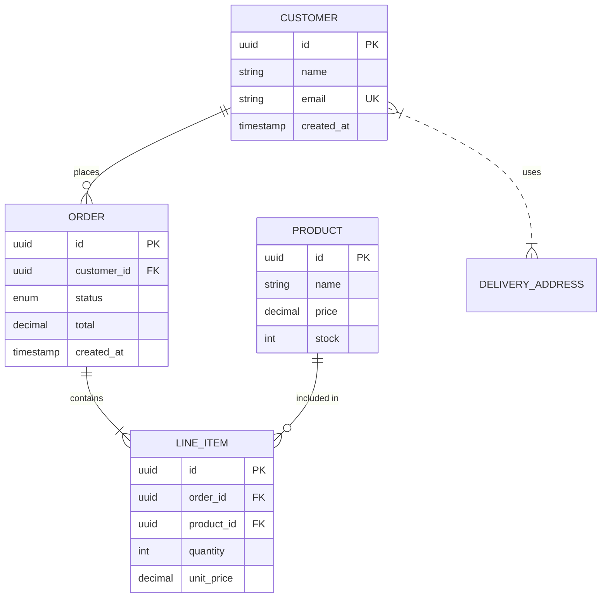

**Cardinality:**
| Symbol | Meaning |
|--------|---------|
| `\|\|` | Exactly one |
| `o\|` | Zero or one |
| `}\|` | One or more |
| `o{` | Zero or more |

Solid lines (`--`) = identifying relationships. Dashed lines (`..`) = non-identifying.

---

### Gantt Chart

**Directive:** `gantt`

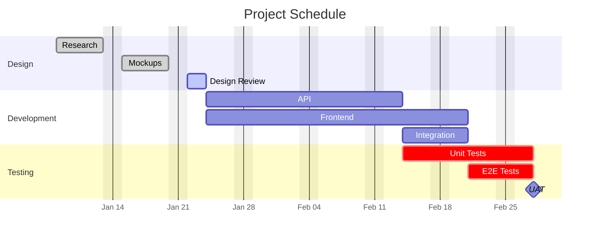

**Tags:** `done`, `active`, `crit`, `milestone`. Use `after taskId` for dependencies.

---

### GitGraph

**Directive:** `gitGraph`

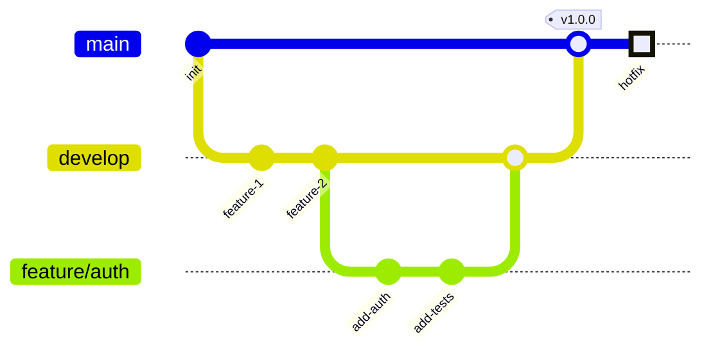

**Commands:** `commit`, `branch`, `checkout`/`switch`, `merge`, `cherry-pick`. Commit options: `id:`, `msg:`, `tag:`, `type:` (NORMAL/REVERSE/HIGHLIGHT).

---

### Mindmap

**Directive:** `mindmap`

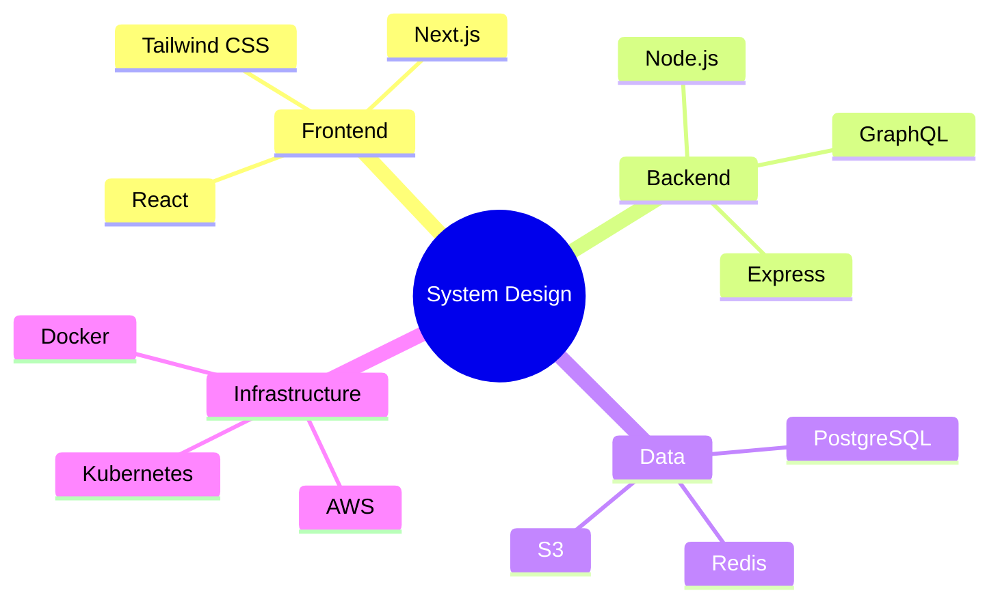

**Node shapes:** `()` rounded, `(())` circle, `[()]` cylinder, `[]` square, `))` bang, `{{}}` hexagon. Hierarchy via relative indentation.

---

### Timeline

**Directive:** `timeline`

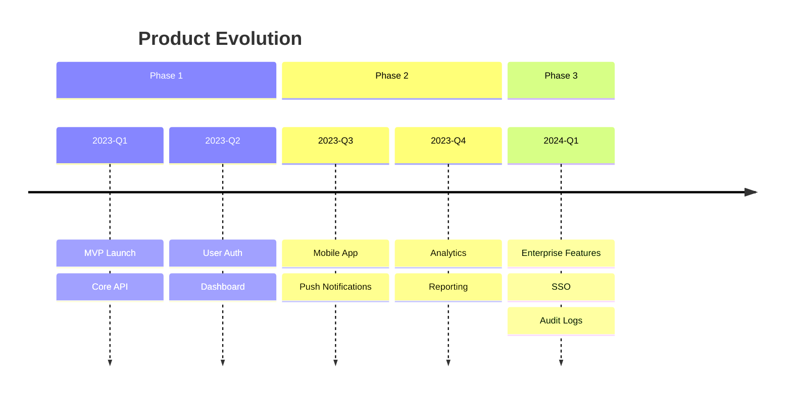

---

### C4 Diagrams

**Directives:** `C4Context`, `C4Container`, `C4Component`, `C4Dynamic`, `C4Deployment`

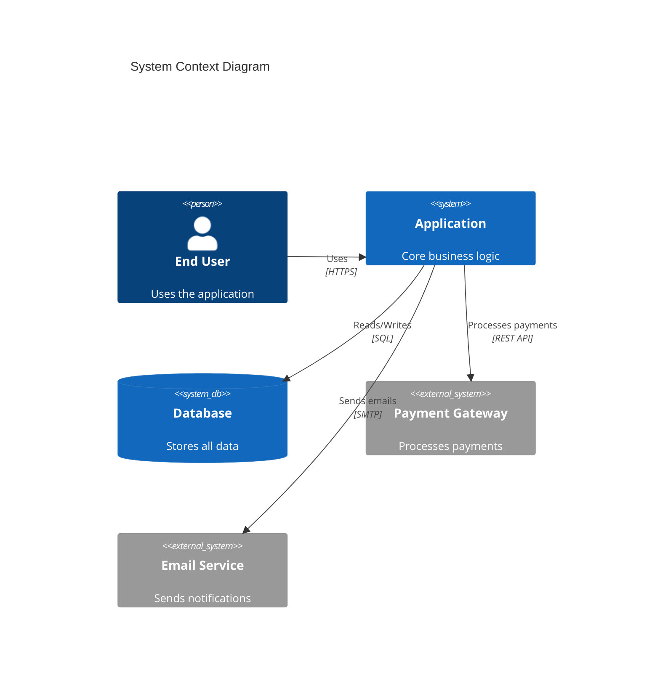

**Elements:** `Person`, `Person_Ext`, `System`, `System_Ext`, `SystemDb`, `SystemDb_Ext`, `SystemQueue`, `Boundary`, `Container`, `Component`.

**Note:** C4 diagrams are experimental. Syntax may change.

---

### Architecture Diagram (v11.1+)

**Directive:** `architecture-beta`

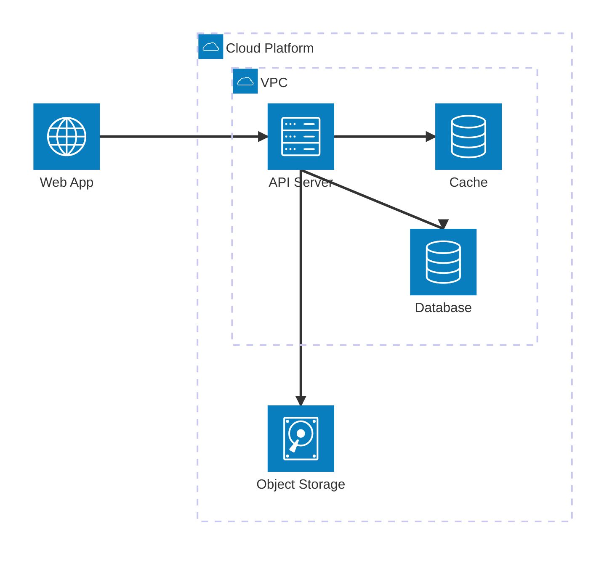

**Built-in icons:** `cloud`, `database`, `disk`, `internet`, `server`. Use `--iconPacks` for additional icons from iconify.design.

**Port directions:** `L` (left), `R` (right), `T` (top), `B` (bottom).

---

### Kanban (v11.4+)

**Directive:** `kanban`

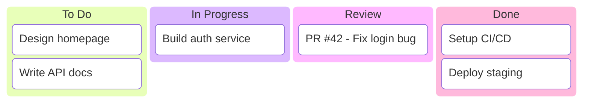

**Features:** Metadata via `@{ assigned: "Alice", priority: "High" }`.

---

### Quadrant Chart

**Directive:** `quadrantChart`

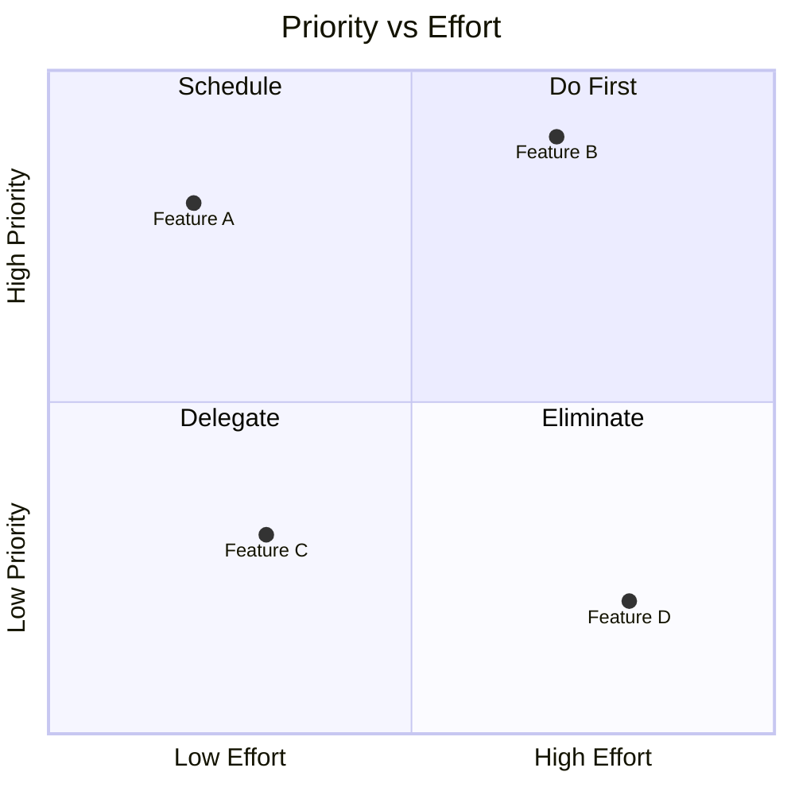

Quadrant numbering: 1=top-right, 2=top-left, 3=bottom-left, 4=bottom-right. Point coordinates: `[x, y]` in 0-1 range.

---

### Sankey Diagram

**Directive:** `sankey-beta`

```
sankey-beta

Source A,Process 1,40
Source A,Process 2,30
Source B,Process 1,20
Process 1,Output,50
Process 2,Output,35
```

CSV format: source, target, value. Blank line after directive is required.

---

### XY Chart

**Directive:** `xychart-beta`

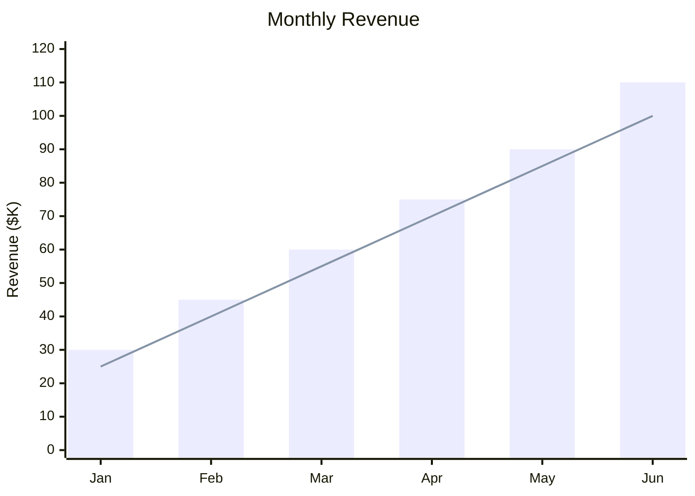

---

### Packet Diagram (v11+)

**Directive:** `packet-beta`

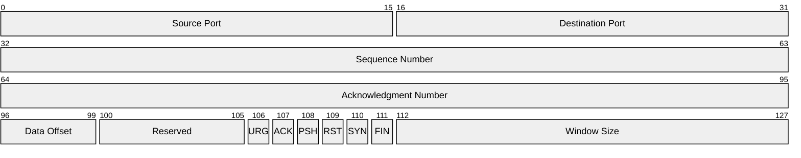

Bit-range notation: `start-end: "Label"`.

---

### User Journey

**Directive:** `journey`

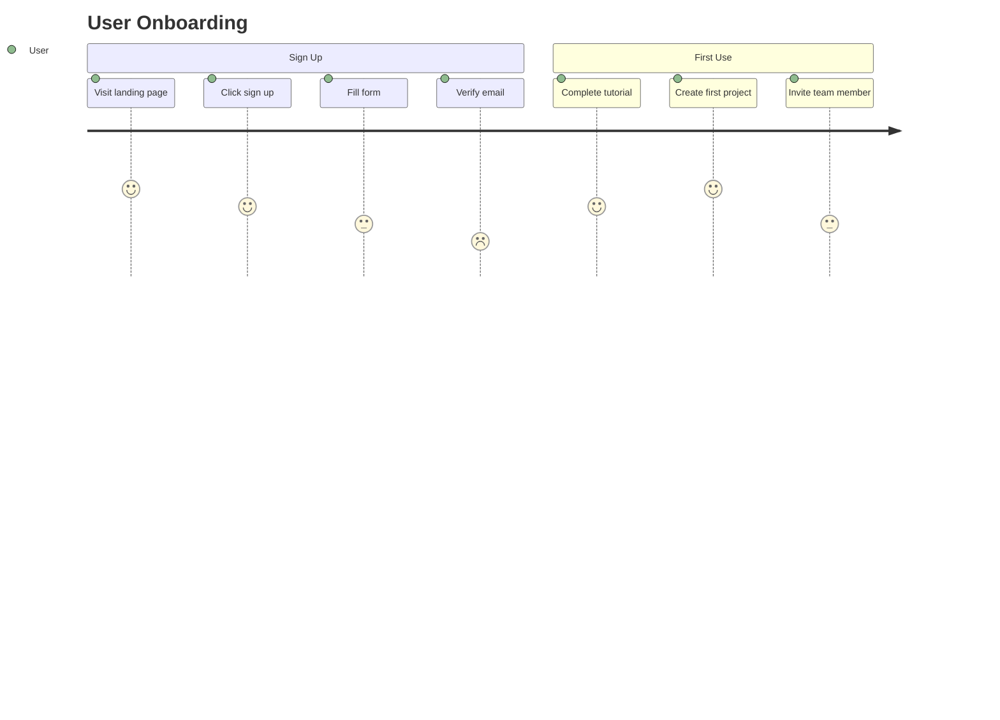

Tasks have a happiness score (1-5) and actor assignment.

---

### Pie Chart

**Directive:** `pie`

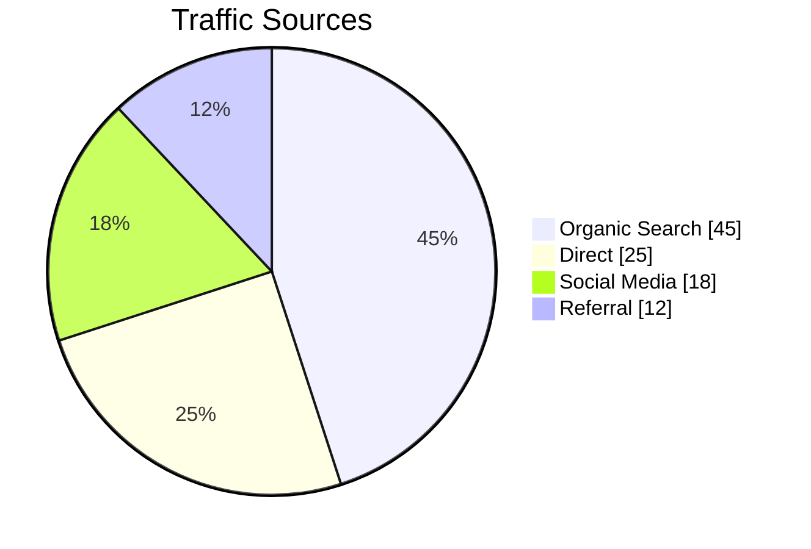

---

### Radar Diagram

**Directive:** `radar-beta`


Axes define the radar dimensions. Each data series is a named set of values mapping to the axes. Values must fall within the axis range.

---

### Requirement Diagram

**Directive:** `requirementDiagram`

```mermaid
requirementDiagram
    requirement high_availability {
        id: REQ-001
        text: System shall maintain 99.9% uptime
        risk: high
        verifymethod: test
    }
    requirement data_encryption {
        id: REQ-002
        text: All data at rest shall be encrypted
        risk: medium
        verifymethod: inspection
    }
    element load_balancer {
        type: service
    }
    element encryption_module {
        type: module
    }

    load_balancer - satisfies -> high_availability
    encryption_module - satisfies -> data_encryption
```

**Element types:** `requirement`, `functionalRequirement`, `interfaceRequirement`, `performanceRequirement`, `physicalRequirement`, `designConstraint`, `element`.

**Relationship types:** `contains`, `copies`, `derives`, `satisfies`, `verifies`, `refines`, `traces`.

**Risk levels:** `low`, `medium`, `high`.

**Verify methods:** `analysis`, `demonstration`, `inspection`, `test`.

---

### Block Diagram

**Directive:** `block-beta`

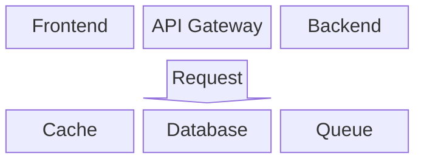

Block diagrams use a grid layout defined by `columns N`. Elements are placed left-to-right, top-to-bottom. Use `space` for empty cells. Arrows between blocks use `<["label"]>(direction)` syntax with directions: `up`, `down`, `left`, `right`.

---

## Theming and Configuration

### Built-in Themes

| Theme     | Use Case                                               |
| --------- | ------------------------------------------------------ |
| `default` | General purpose, good contrast                         |
| `forest`  | Green-toned, nature-inspired                           |
| `dark`    | Dark backgrounds / dark mode                           |
| `neutral` | Black and white, ideal for print                       |
| `base`    | Foundation for custom themes (only customizable theme) |

### Custom Theme via Frontmatter

```
---
config:
  theme: base
  themeVariables:
    primaryColor: "#4a90d9"
    primaryTextColor: "#ffffff"
    primaryBorderColor: "#2c5f8a"
    lineColor: "#333333"
    secondaryColor: "#f0f4f8"
    tertiaryColor: "#e8f5e9"
---
flowchart TD
    A --> B
```

**Important:** Theme engine only recognizes hex colors (`#ff0000`), not color names (`red`).

### Dark Mode with diagramkit

diagramkit handles dark mode automatically:

1. Renders with a separate dark theme configuration (dark background, light text, muted fills).
2. Post-processes dark SVGs with `postProcessDarkSvg()` to fix contrast:
   - Fill colors with high luminance (>0.4 WCAG) are darkened
   - Hue is preserved so colored nodes keep their visual identity
3. Outputs both `name-light.svg` and `name-dark.svg`.

You do NOT need to use Mermaid's `dark` theme -- diagramkit applies its own dark palette for consistency across engines.

## Quality Standards

1. **Max ~15 nodes per diagram** -- split complex systems into focused diagrams.
2. **Semantic IDs everywhere** -- `api_gateway` not `A`, `auth_service` not `B`.
3. **Use subgraphs** to group related components (3+ related nodes).
4. **Consistent edge styling** -- solid for synchronous, dotted for async, thick for critical path.
5. **Avoid custom colors** unless necessary -- diagramkit's dark mode contrast fix handles default theme colors well. Custom colors may not survive the transformation.
6. **Use `classDef`** for consistent styling when multiple nodes need the same appearance.

## Known Limitations

1. **Character/size limits**: Some platforms cap at ~5000 bytes.
2. **"Too many edges" error**: Very large flowcharts crash the renderer.
3. **Reserved words**: `end`, `default` cannot be bare node IDs -- capitalize or quote.
4. **Self-loops**: Render poorly compared to Graphviz.
5. **Beta types** (`sankey-beta`, `architecture-beta`, etc.): May have breaking changes.
6. **Theme engine**: Only accepts hex colors, not color names.

## Composability

This skill is called by:

- **`/diagrams`** orchestrator -- when Mermaid is the selected engine.
- Other skills that need structured diagrams.

Always render via `diagramkit render` -- never via `mmdc` or other tools.
