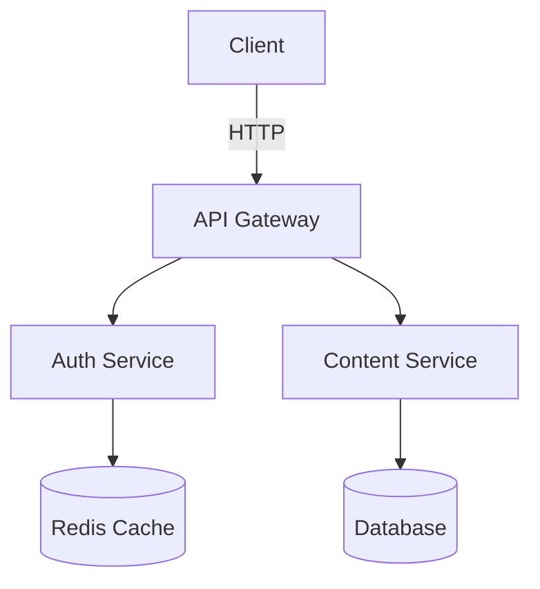

# diagramkit -- Diagram Rendering CLI & Library

You have access to `diagramkit`, a CLI tool and library for rendering `.mermaid`, `.excalidraw`, and `.drawio` files to images with automatic light/dark mode support.

## Quick Reference

```bash
# Render all diagrams in current directory
diagramkit render .

# Render a single file
diagramkit render path/to/diagram.mermaid

# Render raster output for email or Confluence
diagramkit render . --format png --theme light --scale 2

# Render as WebP when a compressed raster image is required
diagramkit render . --format webp --quality 85

# Watch for changes
diagramkit render . --watch

# Force re-render (ignore cache)
diagramkit render . --force

# Filter to specific type
diagramkit render . --type mermaid
diagramkit render . --type excalidraw
diagramkit render . --type drawio

# Custom output directory
diagramkit render . --output ./rendered

# Disable dark mode contrast optimization
diagramkit render . --no-contrast

# Pre-install Playwright chromium
diagramkit warmup

# Initialize a config file
diagramkit init

# Install Claude Code skills
diagramkit install-skills
diagramkit install-skills --global

# Dry run / quiet / JSON output
diagramkit render . --dry-run
diagramkit render . --quiet
diagramkit render . --json
```

## Supported File Extensions

| Extension     | Diagram Type | Notes                     |
| ------------- | ------------ | ------------------------- |
| `.mermaid`    | Mermaid      | Primary extension         |
| `.mmd`        | Mermaid      | Short alias               |
| `.mmdc`       | Mermaid      | mermaid-cli compatibility |
| `.excalidraw` | Excalidraw   | Excalidraw JSON format    |
| `.drawio`     | Draw.io      | Primary extension         |
| `.drawio.xml` | Draw.io      | Explicit XML format       |
| `.dio`        | Draw.io      | Short alias               |

Custom extension mappings can be added via configuration (see Configuration section).

## Output Convention

Rendered images go to a `.diagrams/` hidden folder next to the source file:

```
content/posts/my-post/
  architecture.mermaid          <- source
  network.drawio                <- source
  system.excalidraw             <- source
  .diagrams/
    architecture-light.svg      <- rendered (auto-generated)
    architecture-dark.svg       <- rendered (auto-generated)
    network-light.svg           <- rendered (auto-generated)
    network-dark.svg            <- rendered (auto-generated)
    system-light.svg            <- rendered (auto-generated)
    system-dark.svg             <- rendered (auto-generated)
    diagrams.manifest.json      <- cache manifest
```

## Supported Output Formats

| Format | Flag                     | Notes                                                 |
| ------ | ------------------------ | ----------------------------------------------------- |
| SVG    | `--format svg` (default) | Vector, preferred default for most workflows          |
| PNG    | `--format png`           | Raster, use when email/Confluence need images         |
| JPEG   | `--format jpeg`          | Raster, white background, use for email embeds        |
| WebP   | `--format webp`          | Raster, modern option when a raster asset is required |

### Format Selection Guide

| Use Case                                | Recommended Format   |
| --------------------------------------- | -------------------- |
| Web / GitHub / markdown                 | SVG                  |
| Docs sites / developer docs             | SVG                  |
| Documentation (Confluence, Google Docs) | PNG or JPEG          |
| Email / newsletters                     | PNG or JPEG          |
| Presentations / slides                  | PNG or JPEG          |
| Maximum compression, modern browsers    | WebP                 |
| Print / high-DPI displays               | PNG with `--scale 3` |

## Theme Options

| Theme      | Flag                     | Output                             |
| ---------- | ------------------------ | ---------------------------------- |
| Both       | `--theme both` (default) | `name-light.ext` + `name-dark.ext` |
| Light only | `--theme light`          | `name-light.ext`                   |
| Dark only  | `--theme dark`           | `name-dark.ext`                    |

## Linking in Markdown

Reference the rendered SVGs in markdown with a `<picture>` element for automatic light/dark switching:

```html
<picture>
  <source srcset=".diagrams/architecture-dark.svg" media="(prefers-color-scheme: dark)" />
  
</picture>
```

Or use two `` tags with CSS classes:

```html


```

## Configuration

diagramkit supports three configuration layers (highest priority first):

### 1. CLI Flags (highest priority)

```bash
diagramkit render . --theme light --force
```

### 2. Local Config (per-directory)

Create a `.diagramkitrc.json` in your project root:

```json
{
  "outputDir": ".diagrams",
  "defaultFormat": "svg",
  "defaultTheme": "both",
  "useManifest": true,
  "sameFolder": false,
  "extensionMap": {
    ".custom-diagram": "mermaid"
  }
}
```

### 3. Global Config

Global defaults from `~/.config/diagramkit/config.json`.

### Configuration Options

| Option          | Type    | Default                  | Description                                              |
| --------------- | ------- | ------------------------ | -------------------------------------------------------- |
| `outputDir`     | string  | `.diagrams`              | Output folder name, created next to source files         |
| `manifestFile`  | string  | `diagrams.manifest.json` | Manifest filename inside output folder                   |
| `useManifest`   | boolean | `true`                   | Enable incremental builds via SHA-256 hashing            |
| `sameFolder`    | boolean | `false`                  | Place outputs next to source (no subfolder)              |
| `defaultFormat` | string  | `svg`                    | Default output format                                    |
| `defaultTheme`  | string  | `both`                   | Default theme mode                                       |
| `extensionMap`  | object  | `{}`                     | Custom extension-to-type mappings (merged with built-in) |

## Dark Mode Contrast

Dark SVGs are automatically post-processed to fix color contrast:

- Fill colors with high luminance (>0.4 WCAG) are darkened
- Hue is preserved so colored nodes keep their visual identity
- Disable with `--no-contrast` if you want raw dark theme output

## JS/TS API

```typescript
import { render, renderFile, renderAll, warmup, dispose } from 'diagramkit'

// Render from string
const result = await render(mermaidSource, 'mermaid', {
  format: 'svg',
  theme: 'both',
})

// Render from file
const result = await renderFile('./diagram.excalidraw', {
  format: 'svg',
})

// Batch render directory
await renderAll({
  dir: './content',
  format: 'svg',
  force: false,
})

// Browser lifecycle
await warmup() // Pre-install chromium
await dispose() // Clean up browser
```

## Writing Good Mermaid Diagrams

When generating mermaid diagrams:

1. **Use semantic node IDs** -- `A[Web Server]` not `A[Node 1]`
2. **Keep it readable** -- max ~15 nodes per diagram, split complex systems
3. **Use subgraphs** for logical grouping
4. **Avoid bright/neon colors** in custom styles -- they won't pass dark mode contrast checks
5. **Prefer neutral fill colors** -- the dark mode post-processor adjusts high-luminance fills
6. **Use `flowchart`** (not `graph`) for modern features

Example:



## Writing Good Excalidraw Diagrams

When generating excalidraw JSON:

1. **Use the standard JSON format** with `elements`, `appState`, and `files` keys
2. **Set `viewBackgroundColor`** to `#ffffff` (dark mode is handled automatically)
3. **Use the default color palette** -- avoid custom colors that may not contrast well in dark mode
4. **Keep elements spaced** -- at least 20px padding between elements
5. **Labels require TWO elements** -- a shape with `boundElements` and a text with `containerId`
6. **Never use diamond shapes** -- arrow connections are broken for diamonds in raw JSON

## Writing Good Draw.io Diagrams

When generating draw.io XML:

1. **Use mxGraphModel format** with proper `<diagram>` wrapper
2. **Use standard mxCell styles** -- stick to built-in shape names for compatibility
3. **Keep edge routing clean** -- use `edgeStyle=orthogonalEdgeStyle` for elbow routing
4. **Set geometry explicitly** -- always provide `<mxGeometry>` with x, y, width, height
5. **Use layers for complex diagrams** -- group related elements on separate layers
6. **Avoid custom fonts** -- stick to system fonts for rendering reliability
7. **Test dark mode** -- use neutral fill colors; dark mode inverts high-luminance fills

Example minimal draw.io:

```xml
<mxfile>
  <diagram name="Page-1">
    <mxGraphModel>
      <root>
        <mxCell id="0"/>
        <mxCell id="1" parent="0"/>
        <mxCell id="2" value="Service A" style="rounded=1;whiteSpace=wrap;" vertex="1" parent="1">
          <mxGeometry x="100" y="100" width="120" height="60" as="geometry"/>
        </mxCell>
        <mxCell id="3" value="Service B" style="rounded=1;whiteSpace=wrap;" vertex="1" parent="1">
          <mxGeometry x="300" y="100" width="120" height="60" as="geometry"/>
        </mxCell>
        <mxCell id="4" style="edgeStyle=orthogonalEdgeStyle;" edge="1" source="2" target="3" parent="1">
          <mxGeometry relative="1" as="geometry"/>
        </mxCell>
      </root>
    </mxGraphModel>
  </diagram>
</mxfile>
```

## Manifest & Caching

diagramkit uses SHA-256 content hashing for incremental builds:

- Only re-renders files whose content has changed
- Manifest stored in `.diagrams/diagrams.manifest.json`
- Use `--force` to bypass and re-render everything
- Orphaned outputs (source file deleted) are automatically cleaned up

## Watch Mode

```bash
diagramkit render . --watch
```

Uses chokidar to watch for changes to diagram source files and automatically re-renders on save. Press Ctrl+C to stop.
