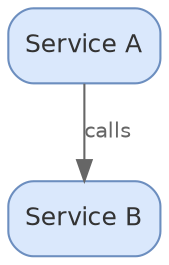

# diagramkit — Graphviz Engine

## When To Use

Choose Graphviz when the diagram needs:

- Dependency graphs (package, module, import)
- Call graphs and control flow
- Strict algorithmic layout where the engine determines positioning
- Hierarchical DAGs (directed acyclic graphs)
- Rank-constrained visualizations (force certain nodes to align)
- Existing `.dot` or `.gv` source files that need rendering
- Record nodes with ports for structured data

Graphviz uses WASM via `@viz-js/viz` — no browser or Chromium needed. This makes it faster to start and lighter weight than browser-based engines.

If the diagram needs cloud vendor icons, swimlanes, or precise manual positioning, use `diagramkit-draw-io` instead. If it's a text-first structured diagram (flowchart, sequence, ER), use `diagramkit-mermaid` instead.

## 1 — Resolve diagramkit (always prefer the local install)

Anchor on the locally installed CLI/API so this skill targets the version pinned in this repo. Do NOT fall back to a globally installed `diagramkit`.

1. **Read** `node_modules/diagramkit/REFERENCE.md` first — it is version-pinned to the installed package.
2. Check for the local install:

   ```bash
   if [ ! -x ./node_modules/.bin/diagramkit ]; then
     npm add diagramkit
   fi
   ```

3. Always invoke through `npx` so the local bin is used:

   ```bash
   npx diagramkit --version    # confirms the LOCAL install
   ```

**Graphviz does NOT need `diagramkit warmup`.** The Graphviz engine uses `@viz-js/viz` (WASM), not Playwright Chromium. No browser installation required.

## 2 — Read Project Config

Check for existing project configuration before creating diagrams:

```bash
# Look for project config
ls diagramkit.config.* 2>/dev/null || ls .diagramkitrc.json 2>/dev/null

# Check package.json for render scripts
grep -q "diagramkit" package.json 2>/dev/null && echo "diagramkit configured"
```

If a config exists, respect its `outputDir`, `sameFolder`, `theme`, and `extensionMap` settings.

## 3 — Create The Diagram

### Minimal DOT Skeleton



### Build Rules

1. **`digraph` for directed, `graph` for undirected** — use `digraph` for most architectural and dependency diagrams. Use `graph` only for truly undirected relationships.
2. **Set graph/node/edge defaults** — define shared attributes at the top to avoid repetition on every element.
3. **Semantic IDs** — use descriptive node IDs like `auth_service`, `postgres_db`, not `a` or `n1`.
4. **`subgraph cluster_*`** — prefix must be `cluster_` for Graphviz to draw a bounding box. `subgraph backend` without the prefix renders no box.
5. **`bgcolor="transparent"`** — let diagramkit control the background. Never set an opaque graph background.
6. **Hex colors only** — use hex codes like `"#dae8fc"`, not named colors like `"lightblue"`.
7. **`fontcolor="#333333"`** — default text color for light mode. Gets adapted automatically for dark mode.
8. **Semicolons after statements** — technically optional in DOT but recommended for clarity. Missing semicolons can cause ambiguous parsing in edge cases.
9. **Quote attribute values** — always quote strings that contain spaces, special characters, or start with digits.

### Full Reference

Read `references/dot-reference.md` for complete DOT syntax, all node shapes, record nodes, cluster patterns, layout engines, layout controls, edge styles, HTML labels, and best practices.

## 4 — Color Palette

### Pastel Palette (use with `fontcolor="#1a1a1a"`)

These light fills work best with **dark text** in light mode. The dark
adapter automatically lightens any low-luminance `fontcolor` (e.g.
`#333333`) to `#e5e7eb` for dark mode, so you don't have to manage two
sets of colors.

| Purpose | Fill      | Stroke    |
| ------- | --------- | --------- |
| Blue    | `#dae8fc` | `#6c8ebf` |
| Green   | `#d5e8d4` | `#82b366` |
| Orange  | `#ffe6cc` | `#d6b656` |
| Red     | `#f8cecc` | `#b85450` |
| Purple  | `#e1d5e7` | `#9673a6` |
| Yellow  | `#fff2cc` | `#d6b656` |
| Gray    | `#f5f5f5` | `#666666` |

In DOT, `fillcolor` is the fill and `color` is the stroke:

```dot
node_a [fillcolor="#dae8fc", color="#6c8ebf", fontcolor="#1a1a1a"];
node_b [fillcolor="#d5e8d4", color="#82b366", fontcolor="#1a1a1a"];
```

### AA-compliant Mid-Tone Palette (use with `fontcolor="#ffffff"`)

When you want a darker fill that works with white text in both modes,
pick from this WCAG 2.2 AA-verified palette. Each pair below clears
4.5:1 contrast for normal text:

| Purpose             | Fill      | Stroke    | Fontcolor | Contrast |
| ------------------- | --------- | --------- | --------- | -------- |
| Primary / API       | `#2E5A88` | `#1F4870` | `#ffffff` | 7.1:1    |
| Secondary / Service | `#1F6E68` | `#155752` | `#ffffff` | 5.9:1    |
| Accent / Alert      | `#B43A3A` | `#8E2828` | `#ffffff` | 5.5:1    |
| Storage / Data      | `#8B5E15` | `#6E4810` | `#ffffff` | 5.4:1    |
| Success             | `#2D7A2D` | `#1E5A1E` | `#ffffff` | 5.4:1    |
| Neutral             | `#5A5A5A` | `#3D3D3D` | `#ffffff` | 7.0:1    |

```dot
node_a [fillcolor="#2E5A88", color="#1F4870", fontcolor="#ffffff"];
```

### Colors To Avoid

- `#ffffff` or near-white fills — disappear on light backgrounds
- `#000000` or near-black fills — disappear on dark backgrounds
- Named colors (`red`, `blue`) — behavior varies; always use hex
- Very saturated neon colors — poor contrast in both modes
- White text on the lighter pastel palette — fails WCAG 2.2 AA

After rendering, validate the SVGs to catch any contrast regressions:

```bash
npx diagramkit validate ./.diagramkit --recursive --json
```

Look for `LOW_CONTRAST_TEXT` warnings; they list each (text color,
background color) pair and the measured ratio.

Read `references/color-and-theming.md` for the full color reference including dark mode behavior.

## 5 — Render

```bash
# Render a single file (SVG, both themes)
npx diagramkit render graph.dot

# Render with raster output
npx diagramkit render graph.dot --format svg,png

# Render all diagrams in directory
npx diagramkit render .

# Force re-render (ignore cache)
npx diagramkit render graph.dot --force
```

### Validate

After rendering, verify the output:

```bash
# Validate generated SVGs
npx diagramkit validate .diagramkit/
```

### Iterative Error Correction

If rendering fails, check for these common issues:

1. **Missing semicolons** — DOT is lenient but ambiguous without them. Add semicolons after node definitions and edge statements.
2. **Unclosed braces** — every `{` needs a matching `}`. Check nested subgraphs carefully.
3. **Reserved keywords as IDs** — `node`, `edge`, `graph`, `digraph`, `subgraph`, `strict` are reserved. Quote them or use different IDs: `"node"` or `node_service`.
4. **Missing `cluster_` prefix** — subgraph names must start with `cluster_` for Graphviz to draw a bounding box. `subgraph backend` silently renders without a box.
5. **Unquoted special characters** — labels with spaces, newlines (`\n`), or HTML need quoting: `label="Multi\nLine"`.
6. **Port syntax errors** — record labels use `|` for field separators and `<port>` for port names. Mismatched braces in record labels cause parse failures.
7. **Wrong graph type for edges** — `->` in `graph` (undirected) or `--` in `digraph` (directed) cause syntax errors.

Fix the issue, re-render, and validate again. Repeat until validation passes.

### Validation issues to watch for

| Code                   | Severity | Meaning                                                                                                                                                                                              |
| ---------------------- | -------- | ---------------------------------------------------------------------------------------------------------------------------------------------------------------------------------------------------- |
| `LOW_CONTRAST_TEXT`    | warning  | `fillcolor` + `fontcolor` pair fails WCAG 2.2 AA. Swap to the AA palette in [Color Palette](#4--color-palette) above.                                                                                |
| `ASPECT_RATIO_EXTREME` | warning  | Layout is too wide/tall (outside `[1:1.9, 3.3:1]`). See [Readability](#readability-budget-and-aspect-ratio) below — graphviz lets you set `ratio=` directly, which is the most powerful single knob. |
| `NO_VISUAL_ELEMENTS`   | error    | Almost always a syntax error — unclosed brace, missing semicolon, reserved keyword, or wrong arrow operator.                                                                                         |
| `MISSING_SVG_CLOSE`    | error    | Same root cause as `NO_VISUAL_ELEMENTS`; check `failedDetails[]` from the render JSON for the parse error line.                                                                                      |

## Readability budget and aspect ratio

Graphviz computes layout for you, but you can shape the result. Apply these limits:

| Dimension       | Hard ceiling                                     | Why                                                                                                                                                               |
| :-------------- | :----------------------------------------------- | :---------------------------------------------------------------------------------------------------------------------------------------------------------------- |
| Nodes per graph | **≤ 50 dense / ≤ 100 sparse** (target ≤ 30)      | Past these caps comprehension drops sharply.                                                                                                                      |
| Edges per graph | **≤ 100**                                        | Visual graph density past this point exceeds underlying logic density.                                                                                            |
| Branching width | **≤ 8 parallel children** off any single node    | Wider fans force the reader to lose their place. Cluster wide fans under a synthetic parent or split the graph.                                                   |
| Aspect ratio    | **inside `[1:1.9, 3.3:1]`** against a 4:3 target | Diagrams overflowing typical doc widths (~650–800 px) get scaled down and lose ~39% text legibility. The validator emits `ASPECT_RATIO_EXTREME` when this breaks. |

### Visual encoding

- **Use shape semantics consistently.** `shape=box` for processes, `shape=cylinder` for storage, `shape=hexagon` for external systems / queues, `shape=diamond` only for decisions, `shape=parallelogram` for I/O. Mixing shapes for the same role slows comprehension ~4×.
- **Never rely on colour alone.** Pair every fill with a shape, label, position, or `style=` (dashed / bold). ~8% of male engineers have red-green colour-vision deficiency.
- **Reserve red (`#B43A3A`) for errors / alerts.**

### Aspect-ratio control — graphviz's superpower

Unlike Mermaid, graphviz exposes direct aspect-ratio control. When `ASPECT_RATIO_EXTREME` fires, the fix is usually a one-attribute change on the `graph [...]` block:

| Attribute                         | Effect                                                            | When to use                                                             |
| :-------------------------------- | :---------------------------------------------------------------- | :---------------------------------------------------------------------- |
| `ratio="0.75"`                    | Target a specific width / height ratio (4:3 ≈ 0.75 height/width). | Default knob — set this on every `graph [...]` block.                   |
| `ratio="compress"`                | Compress the layout to fit a defined `size`.                      | When you also set `size="8,6"` and want the layout to honour both axes. |
| `ratio="fill"`                    | Stretch nodes to fill `size`.                                     | Rarely; produces uneven node sizes.                                     |
| `nodesep="0.4"` / `ranksep="0.6"` | Tighten or loosen spacing between nodes / ranks.                  | Tune after `ratio=` if individual axes still feel off.                  |
| `{rank=same; a; b; c}`            | Force nodes onto the same rank.                                   | When a deep DAG should compress vertically.                             |

### When `ASPECT_RATIO_EXTREME` fires

Apply the steps in this order — re-render with `--force` after each step and re-validate. Cap at 8 iterations per file.

1. **Set `ratio=` on the graph.** Add `ratio="0.75"` (or `ratio="compress"` if you also set `size=`) to the `graph [...]` defaults. This is graphviz's direct knob — most cases resolve here.
2. **Flip `rankdir`.** If the natural shape doesn't fit the target, swap `rankdir=LR` ↔ `rankdir=TB`. Combine with `ratio=` for best results.
3. **Constrain ranks / cluster wide fans.** Use `{rank=same; …}` to compress wide fans onto a single row, or wrap them in a `subgraph cluster_*` block to bound them visually.
4. **Reduce node count / split.** Pull dense subsections into separate `.dot` files; cross-reference from the surrounding markdown. This is the right move when a single graph is conceptually two or three diagrams.
5. **Swap engine (last resort).** If algorithmic layout isn't the value being added, convert to `.mermaid` (with `mermaidLayout: { mode: 'auto' }`) or `.drawio` (for icon/precision-heavy layouts). Follow the corresponding engine SKILL.md for the rewrite.
6. **Record residual** in the review report if the loop hasn't cleared the warning.

## 6 — Raster / Embed / Dark Mode

### Raster Output (PNG / JPEG / WebP / AVIF)

The locally installed `diagramkit` CLI handles SVG → raster in a single command — no separate image tool needed:

```bash
# PNG for email/Confluence
npx diagramkit render . --format png --scale 2

# WebP for web
npx diagramkit render . --format webp --quality 85

# JPEG with quality
npx diagramkit render . --format jpeg --quality 85

# Multiple formats in one pass
npx diagramkit render . --format svg,png,webp,avif
```

Raster requires `sharp` as a peer dependency: `npm add -D sharp`

### Embedding In Markdown

**GitHub README / generic markdown:**

```html
<picture>
  <source media="(prefers-color-scheme: dark)" srcset="./diagrams/.diagramkit/graph-dark.svg" />
  <source media="(prefers-color-scheme: light)" srcset="./diagrams/.diagramkit/graph-light.svg" />
  
</picture>
```

**Pagesmith docs:**

```html
<figure>
  
  
  <figcaption>Dependency graph</figcaption>
</figure>
```

### Dark Mode

diagramkit renders both light and dark variants by default. Graphviz dark mode uses a two-step process:

**Step 1 — WCAG contrast post-processing:**

`postProcessDarkSvg()` runs first, scanning inline fill/stroke colors and darkening any with WCAG luminance > 0.4 to lightness 0.25 in HSL space (preserving hue, capping saturation at 0.6).

**Step 2 — Dark adaptation:**

After WCAG processing, dark-specific adaptations are applied:

- Black strokes (`#000000`) → `#94a3b8`
- Black fills (`#000000`) → `#94a3b8`
- Black text (`#000000`) → `#e5e7eb`
- Any text whose hex `fill` has WCAG luminance below 0.5 (e.g.
  `#333333`, `#444`, dark greys/colors) → `#e5e7eb`. This last rule
  exists because authors commonly set `fontcolor="#333333"` for
  light-mode legibility — without auto-promotion that text vanishes
  on the dark surface.

Note the order: WCAG contrast runs **before** dark adaptation. This ensures fills are properly darkened before black elements are lightened.

This means you never need to manage dark mode colors in your DOT source. Use `bgcolor="transparent"` and `fontcolor="#1a1a1a"` (or `#333333`) and let diagramkit handle the rest.

## 7 — Review Mode

Use this section when invoked from [`diagramkit-review`](../diagramkit-review/SKILL.md) (or whenever the user asks to audit/fix existing `.dot` / `.gv` / `.graphviz` sources rather than create new ones).

### Source-file audit (per `.dot`)

For each source, verify in order — apply the minimum textual fix for each rule that fails:

1. **Correct graph type** — `digraph` for directed (`->` edges), `graph` for undirected (`--` edges). Mismatched edges cause parse errors.
2. **Default attribute blocks at the top** — `graph [...]`, `node [...]`, `edge [...]`. Per-node attrs should be the exception, not the rule.
3. **`bgcolor="transparent"`** on the graph — never an opaque background. Let diagramkit inject the theme background.
4. **Cluster prefix** — `subgraph cluster_*` for any subgraph that should render a bounding box. `subgraph backend { ... }` silently renders without a box.
5. **No reserved keywords as IDs** — `node`, `edge`, `graph`, `digraph`, `subgraph`, `strict`. Quote (`"node"`) or rename (`node_service`).
6. **Statement terminators** — every node and edge statement ends in `;`. Without them DOT parsing is ambiguous in edge cases.
7. **Quoted strings for special chars** — labels with spaces, `\n`, `:`, parens, or HTML must be quoted.
8. **Hex colours only** — no named colours (`lightblue`, `red`, …); use `fillcolor` / `color` / `fontcolor` with hex values.
9. **Palette / fontcolor coupling** — pastel fills (`#dae8fc`, `#d5e8d4`, …) pair with `fontcolor="#1a1a1a"` (or `#333333`); AA-compliant darker fills (`#2E5A88`, `#1F6E68`, …) pair with `fontcolor="#ffffff"`. Never pair white text with the pastel palette.
10. **Record nodes** — `|` separates fields, `<port>` declares a port; mismatched braces in record labels cause parse failures.
11. **Readability budget** — graph has ≤ 50 nodes (dense) / ≤ 100 (sparse), ≤ 100 edges, ≤ 8 parallel children off any node.
12. **Aspect-ratio knob set** — `ratio="0.75"` (or another targeted value) is on the `graph [...]` defaults block. Without it, very wide / tall graphs hit `ASPECT_RATIO_EXTREME`.
13. **Shape semantics consistent** — `shape=box` for processes, `cylinder` for storage, `hexagon` for external/queues, `diamond` only for decisions.
14. **Colour is not the only differentiator** — every colour-coded role also has a shape, position, or `style=` cue.

### Validation issue → fix mapping

| Code                   | Fix                                                                                                                                                                                                                                              |
| ---------------------- | ------------------------------------------------------------------------------------------------------------------------------------------------------------------------------------------------------------------------------------------------ |
| `LOW_CONTRAST_TEXT`    | Update the offending node's `fillcolor=` to the AA-compliant hex and ensure `fontcolor="#ffffff"`. If the design intent is dark text, switch `fillcolor` to a pastel and `fontcolor="#1a1a1a"`. Re-render with `--force`.                        |
| `ASPECT_RATIO_EXTREME` | Run the [aspect-ratio escalation ladder](#when-aspect_ratio_extreme-fires): set `ratio=` → flip `rankdir` → constrain ranks / cluster wide fans → split into multiple `.dot` files → swap to `.mermaid`/`.drawio`. Cap at 8 iterations per file. |
| `NO_VISUAL_ELEMENTS`   | Almost always a syntax error — check for unclosed braces, missing semicolons, reserved-keyword IDs, or wrong arrow operator for the graph type.                                                                                                  |
| `MISSING_SVG_CLOSE`    | Same as `NO_VISUAL_ELEMENTS` — read `failedDetails[]` from the render JSON for the parse error line.                                                                                                                                             |
| `EXTERNAL_RESOURCE`    | Rare; usually an `image=` attribute pointing at an external URL or HTML label with ``. Replace with an inlined element or remove.                                                                                           |

### Single-file repair loop

Graphviz uses WASM, so renders are fast — no `warmup` needed:

```bash
npx diagramkit render <file>.dot --force --json
npx diagramkit validate <file's .diagramkit dir> --json
```

Stop on first clean run, or mark as residual after 8 iterations.

## 8 — References

- `references/dot-reference.md` — full DOT syntax, node shapes, record nodes, clusters, layout engines, edge styles, HTML labels
- `references/color-and-theming.md` — complete color palettes, dark mode behavior, WCAG contrast rules
