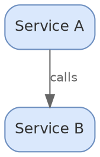

# diagramkit — Graphviz Engine

## When To Use

Choose Graphviz when the diagram needs:

- Dependency graphs (package, module, import)
- Call graphs and control flow
- Strict algorithmic layout where the engine determines positioning
- Hierarchical DAGs (directed acyclic graphs)
- Rank-constrained visualizations (force certain nodes to align)
- Existing `.dot` or `.gv` source files that need rendering
- Record nodes with ports for structured data

Graphviz uses WASM via `@viz-js/viz` — no browser or Chromium needed. This makes it faster to start and lighter weight than browser-based engines.

If the diagram needs cloud vendor icons, swimlanes, or precise manual positioning, use `diagramkit-draw-io` instead. If it's a text-first structured diagram (flowchart, sequence, ER), use `diagramkit-mermaid` instead.

## 1 — Resolve diagramkit (always prefer the local install)

Anchor on the locally installed CLI/API so this skill targets the version pinned in this repo. Do NOT fall back to a globally installed `diagramkit`.

1. **Read** `node_modules/diagramkit/REFERENCE.md` first — it is version-pinned to the installed package.
2. Check for the local install:

   ```bash
   if [ ! -x ./node_modules/.bin/diagramkit ]; then
     npm add diagramkit
   fi
   ```

3. Always invoke through `npx` so the local bin is used:

   ```bash
   npx diagramkit --version    # confirms the LOCAL install
   ```

**Graphviz does NOT need `diagramkit warmup`.** The Graphviz engine uses `@viz-js/viz` (WASM), not Playwright Chromium. No browser installation required.

## 2 — Read Project Config

Check for existing project configuration before creating diagrams:

```bash
# Look for project config
ls diagramkit.config.* 2>/dev/null || ls .diagramkitrc.json 2>/dev/null

# Check package.json for render scripts
grep -q "diagramkit" package.json 2>/dev/null && echo "diagramkit configured"
```

If a config exists, respect its `outputDir`, `sameFolder`, `theme`, and `extensionMap` settings.

## 3 — Create The Diagram

### Minimal DOT Skeleton



### Build Rules

1. **`digraph` for directed, `graph` for undirected** — use `digraph` for most architectural and dependency diagrams. Use `graph` only for truly undirected relationships.
2. **Set graph/node/edge defaults** — define shared attributes at the top to avoid repetition on every element.
3. **Semantic IDs** — use descriptive node IDs like `auth_service`, `postgres_db`, not `a` or `n1`.
4. **`subgraph cluster_*`** — prefix must be `cluster_` for Graphviz to draw a bounding box. `subgraph backend` without the prefix renders no box.
5. **`bgcolor="transparent"`** — let diagramkit control the background. Never set an opaque graph background.
6. **Hex colors only** — use hex codes like `"#dae8fc"`, not named colors like `"lightblue"`.
7. **`fontcolor="#333333"`** — default text color for light mode. Gets adapted automatically for dark mode.
8. **Semicolons after statements** — technically optional in DOT but recommended for clarity. Missing semicolons can cause ambiguous parsing in edge cases.
9. **Quote attribute values** — always quote strings that contain spaces, special characters, or start with digits.

### Full Reference

Read `references/dot-reference.md` for complete DOT syntax, all node shapes, record nodes, cluster patterns, layout engines, layout controls, edge styles, HTML labels, and best practices.

## 4 — Color Palette

### Pastel Palette

| Purpose | Fill      | Stroke    |
| ------- | --------- | --------- |
| Blue    | `#dae8fc` | `#6c8ebf` |
| Green   | `#d5e8d4` | `#82b366` |
| Orange  | `#ffe6cc` | `#d6b656` |
| Red     | `#f8cecc` | `#b85450` |
| Purple  | `#e1d5e7` | `#9673a6` |
| Yellow  | `#fff2cc` | `#d6b656` |
| Gray    | `#f5f5f5` | `#666666` |

In DOT, `fillcolor` is the fill and `color` is the stroke:

```dot
node_a [fillcolor="#dae8fc", color="#6c8ebf"];
node_b [fillcolor="#d5e8d4", color="#82b366"];
```

### Colors To Avoid

- `#ffffff` or near-white fills — disappear on light backgrounds
- `#000000` or near-black fills — disappear on dark backgrounds
- Named colors (`red`, `blue`) — behavior varies; always use hex
- Very saturated neon colors — poor contrast in both modes

Read `references/color-and-theming.md` for the full color reference including dark mode behavior.

## 5 — Render

```bash
# Render a single file (SVG, both themes)
npx diagramkit render graph.dot

# Render with raster output
npx diagramkit render graph.dot --format svg,png

# Render all diagrams in directory
npx diagramkit render .

# Force re-render (ignore cache)
npx diagramkit render graph.dot --force
```

### Validate

After rendering, verify the output:

```bash
# Validate generated SVGs
npx diagramkit validate .diagramkit/
```

### Iterative Error Correction

If rendering fails, check for these common issues:

1. **Missing semicolons** — DOT is lenient but ambiguous without them. Add semicolons after node definitions and edge statements.
2. **Unclosed braces** — every `{` needs a matching `}`. Check nested subgraphs carefully.
3. **Reserved keywords as IDs** — `node`, `edge`, `graph`, `digraph`, `subgraph`, `strict` are reserved. Quote them or use different IDs: `"node"` or `node_service`.
4. **Missing `cluster_` prefix** — subgraph names must start with `cluster_` for Graphviz to draw a bounding box. `subgraph backend` silently renders without a box.
5. **Unquoted special characters** — labels with spaces, newlines (`\n`), or HTML need quoting: `label="Multi\nLine"`.
6. **Port syntax errors** — record labels use `|` for field separators and `<port>` for port names. Mismatched braces in record labels cause parse failures.
7. **Wrong graph type for edges** — `->` in `graph` (undirected) or `--` in `digraph` (directed) cause syntax errors.

Fix the issue, re-render, and validate again. Repeat until validation passes.

## 6 — Raster / Embed / Dark Mode

### Raster Output (PNG / JPEG / WebP / AVIF)

The locally installed `diagramkit` CLI handles SVG → raster in a single command — no separate image tool needed:

```bash
# PNG for email/Confluence
npx diagramkit render . --format png --scale 2

# WebP for web
npx diagramkit render . --format webp --quality 85

# JPEG with quality
npx diagramkit render . --format jpeg --quality 85

# Multiple formats in one pass
npx diagramkit render . --format svg,png,webp,avif
```

Raster requires `sharp` as a peer dependency: `npm add -D sharp`

### Embedding In Markdown

**GitHub README / generic markdown:**

```html
<picture>
  <source media="(prefers-color-scheme: dark)" srcset="./diagrams/.diagramkit/graph-dark.svg" />
  <source media="(prefers-color-scheme: light)" srcset="./diagrams/.diagramkit/graph-light.svg" />
  
</picture>
```

**Pagesmith docs:**

```html
<figure>
  
  
  <figcaption>Dependency graph</figcaption>
</figure>
```

### Dark Mode

diagramkit renders both light and dark variants by default. Graphviz dark mode uses a two-step process:

**Step 1 — WCAG contrast post-processing:**

`postProcessDarkSvg()` runs first, scanning inline fill/stroke colors and darkening any with WCAG luminance > 0.4 to lightness 0.25 in HSL space (preserving hue, capping saturation at 0.6).

**Step 2 — Dark adaptation:**

After WCAG processing, dark-specific adaptations are applied:

- Black strokes (`#000000`) → `#94a3b8`
- Black text (`#000000`) → `#e5e7eb`
- Black fills (`#000000`) → `#94a3b8`

Note the order: WCAG contrast runs **before** dark adaptation. This ensures fills are properly darkened before black elements are lightened.

This means you never need to manage dark mode colors in your DOT source. Use `bgcolor="transparent"` and `fontcolor="#333333"` and let diagramkit handle the rest.

## 7 — References

- `references/dot-reference.md` — full DOT syntax, node shapes, record nodes, clusters, layout engines, edge styles, HTML labels
- `references/color-and-theming.md` — complete color palettes, dark mode behavior, WCAG contrast rules
