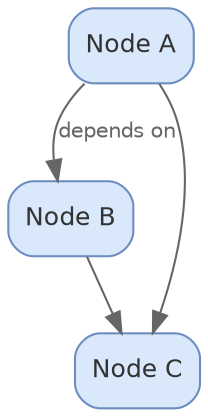
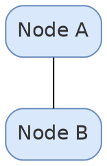
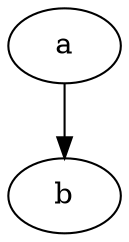
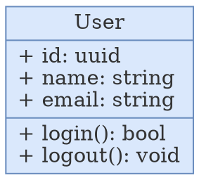
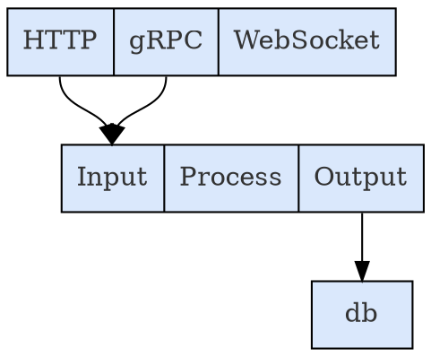
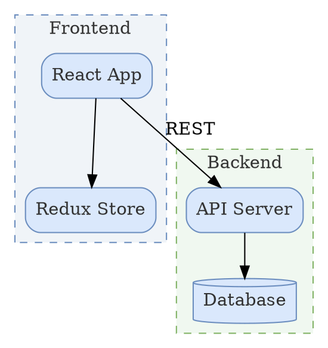
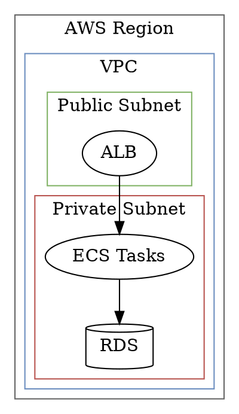
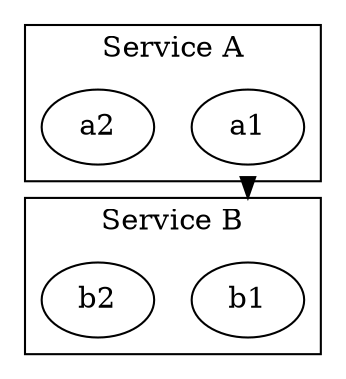

# Graphviz DOT Reference

Complete reference for Graphviz DOT `.dot` / `.gv` / `.graphviz` diagram source files.

## Full DOT Syntax

### Directed Graph



Use `digraph` for directed graphs (most common). Edges use `->`.

### Undirected Graph



Use `graph` for undirected graphs. Edges use `--`.

### Strict Graphs



`strict` prevents duplicate edges between the same pair of nodes.

## Graph Attributes

Set on the `graph` statement or at the top level:

| Attribute   | Values                                                 | Purpose                          |
| ----------- | ------------------------------------------------------ | -------------------------------- |
| `rankdir`   | `TB`, `BT`, `LR`, `RL`                                 | Direction of rank layout         |
| `bgcolor`   | hex color                                              | Background (use `"transparent"`) |
| `fontname`  | font name string                                       | Default font                     |
| `fontsize`  | number                                                 | Default font size                |
| `fontcolor` | hex color                                              | Graph-level label color          |
| `nodesep`   | float (default 0.25)                                   | Minimum space between nodes      |
| `ranksep`   | float (default 0.5)                                    | Minimum space between ranks      |
| `splines`   | `ortho`, `polyline`, `curved`, `line`, `true`, `false` | Edge routing                     |
| `compound`  | `true`                                                 | Allow edges between clusters     |
| `newrank`   | `true`                                                 | Use newer rank assignment        |
| `label`     | string                                                 | Graph title                      |
| `labelloc`  | `t`, `b`                                               | Title position (top/bottom)      |

## Node Definitions

```dot
node_id [label="Display Name", shape=box, fillcolor="#dae8fc", color="#6c8ebf"];
```

### Node Attributes

| Attribute   | Values          | Purpose                |
| ----------- | --------------- | ---------------------- |
| `label`     | string          | Display text           |
| `shape`     | see table below | Node shape             |
| `style`     | see table below | Fill/border style      |
| `fillcolor` | hex color       | Background fill        |
| `color`     | hex color       | Border/outline color   |
| `fontcolor` | hex color       | Text color             |
| `fontname`  | font name       | Font family            |
| `fontsize`  | number          | Font size              |
| `width`     | float (inches)  | Minimum width          |
| `height`    | float (inches)  | Minimum height         |
| `fixedsize` | `true`          | Use exact width/height |
| `tooltip`   | string          | Hover tooltip          |
| `URL`       | string          | Clickable link         |
| `penwidth`  | float           | Border thickness       |
| `margin`    | float or "x,y"  | Internal padding       |

### Node Shapes

| Shape          | DOT Value                 | Best For                     |
| -------------- | ------------------------- | ---------------------------- |
| Box            | `box`                     | Services, modules, processes |
| Rounded box    | `box` + `style="rounded"` | Softer presentation          |
| Ellipse        | `ellipse`                 | Default shape, general nodes |
| Circle         | `circle`                  | States, decision points      |
| Double circle  | `doublecircle`            | Terminal/accept states       |
| Diamond        | `diamond`                 | Decision points              |
| Triangle       | `triangle`                | Directional indicators       |
| Cylinder       | `cylinder`                | Databases, storage           |
| Record         | `record`                  | Structured fields with ports |
| Plain text     | `plaintext`               | Labels without borders       |
| Point          | `point`                   | Invisible junction nodes     |
| Folder         | `folder`                  | Packages, directories        |
| Component      | `component`               | UML components               |
| Note           | `note`                    | Annotations                  |
| Tab            | `tab`                     | Tabbed containers            |
| Box3d          | `box3d`                   | 3D effect boxes              |
| House          | `house`                   | Top-level or root nodes      |
| Inverted house | `invhouse`                | Sink or output nodes         |
| Parallelogram  | `parallelogram`           | I/O operations               |
| Trapezium      | `trapezium`               | Transformations              |
| Pentagon       | `pentagon`                | Special process types        |
| Hexagon        | `hexagon`                 | Preparation steps            |
| Septagon       | `septagon`                | Complex process steps        |
| Octagon        | `octagon`                 | Decision alternatives        |
| Star           | `star`                    | Important/highlighted nodes  |
| None           | `none`                    | Invisible node (text only)   |

### Node Style Values

Combine with commas: `style="rounded,filled,dashed"`

| Style       | Effect                         |
| ----------- | ------------------------------ |
| `filled`    | Fill with `fillcolor`          |
| `rounded`   | Round corners (with `box`)     |
| `dashed`    | Dashed border                  |
| `dotted`    | Dotted border                  |
| `bold`      | Thick border                   |
| `invis`     | Invisible (for layout spacing) |
| `diagonals` | Diagonal lines in corners      |
| `striped`   | Striped fill (with colorList)  |
| `wedged`    | Wedge-shaped fill segments     |

## Record Nodes

Record nodes display structured data with named ports for precise edge attachment.

### Basic Record



The `\l` produces left-aligned text. Use `\r` for right-aligned.

### Records With Ports



Port syntax: `<port_name> Display Text`. Reference with `node_id:port_name`.

### Nested Records

```dot
struct [label="{{<a> A | <b> B} | {<c> C | <d> D}}"];
```

Braces `{}` alternate between horizontal and vertical layout within the record.

## Subgraph Clusters

Clusters group nodes inside a bordered box. The name **must** start with `cluster_`.

### Basic Cluster



### Cluster Attributes

| Attribute   | Purpose                               |
| ----------- | ------------------------------------- |
| `label`     | Cluster title                         |
| `style`     | `dashed`, `dotted`, `bold`, `filled`  |
| `color`     | Border color                          |
| `bgcolor`   | Background color                      |
| `fontcolor` | Label text color                      |
| `fontname`  | Label font                            |
| `fontsize`  | Label font size                       |
| `penwidth`  | Border thickness                      |
| `labeljust` | `l` (left), `r` (right), `c` (center) |
| `labelloc`  | `t` (top), `b` (bottom)               |

### Nested Clusters



### Edges Between Clusters

Use `compound=true` and `lhead`/`ltail`:



## Layout Engines

Specify the engine via diagramkit config or the `layout` graph attribute.

| Engine  | Best For                                 | Edge Type |
| ------- | ---------------------------------------- | --------- |
| `dot`   | Hierarchical DAGs, call trees (default)  | Directed  |
| `neato` | Undirected, network-style, spring model  | Both      |
| `fdp`   | Larger undirected graphs, force-directed | Both      |
| `circo` | Ring/circular layouts                    | Both      |
| `twopi` | Radial hub-and-spoke                     | Both      |

### Engine Selection

```dot
digraph G {
    layout=dot;    // explicit engine selection
    // ...
}
```

In most cases, omit `layout` and let `dot` (the default) handle it.

## Layout Controls

### Rank Direction

```dot
graph [rankdir=TB];   // top to bottom (default)
graph [rankdir=BT];   // bottom to top
graph [rankdir=LR];   // left to right
graph [rankdir=RL];   // right to left
```

### Rank Constraints

Force nodes to the same horizontal band:

```dot
{ rank=same; node_a; node_b; node_c; }
```

Force to first or last rank:

```dot
{ rank=min; start_node; }
{ rank=max; end_node; }

{ rank=source; input; }   // absolute first rank
{ rank=sink; output; }    // absolute last rank
```

### Edge Weight

Higher weight edges are kept shorter and straighter:

```dot
a -> b [weight=10];    // strongly prefer straight
a -> c [weight=1];     // default weight
```

### Invisible Edges

Force layout without visible connections:

```dot
a -> b [style=invis];
```

### Spacing

```dot
graph [nodesep=0.5];   // horizontal space between nodes (inches)
graph [ranksep=1.0];   // vertical space between ranks (inches)
```

### Minimum Node Size

```dot
node [width=1.5, height=0.75];         // minimum size
node [width=1.5, height=0.75, fixedsize=true];  // exact size
```

## Edge Definitions

### Directed Edges

```dot
a -> b;                          // simple
a -> b [label="calls"];          // labeled
a -> b -> c;                     // chained
a -> {b; c; d};                  // fan-out
```

### Edge Attributes

| Attribute    | Values                                       | Purpose                             |
| ------------ | -------------------------------------------- | ----------------------------------- |
| `label`      | string                                       | Edge label text                     |
| `color`      | hex color                                    | Line color                          |
| `fontcolor`  | hex color                                    | Label text color                    |
| `style`      | `solid`, `dashed`, `dotted`, `bold`, `invis` | Line style                          |
| `arrowhead`  | see below                                    | Target arrow shape                  |
| `arrowtail`  | see below                                    | Source arrow shape                  |
| `dir`        | `forward`, `back`, `both`, `none`            | Arrow direction                     |
| `penwidth`   | float                                        | Line thickness                      |
| `weight`     | integer                                      | Layout priority (higher=straighter) |
| `minlen`     | integer                                      | Minimum edge length in ranks        |
| `headlabel`  | string                                       | Label near arrowhead                |
| `taillabel`  | string                                       | Label near tail                     |
| `constraint` | `false`                                      | Don't use for ranking               |
| `xlabel`     | string                                       | External label (no overlap)         |

### Edge Styles

```dot
a -> b;                         // solid (default)
a -> b [style=dashed];          // dashed
a -> b [style=dotted];          // dotted
a -> b [style=bold];            // bold/thick
a -> b [style=invis];           // invisible (layout only)
a -> b [penwidth=2.0];          // custom thickness
a -> b [color="#E45756"];        // colored
```

### Arrowhead Types

| Type       | Appearance                |
| ---------- | ------------------------- |
| `normal`   | Filled triangle (default) |
| `none`     | No arrowhead              |
| `diamond`  | Filled diamond            |
| `odiamond` | Open diamond              |
| `dot`      | Filled circle             |
| `odot`     | Open circle               |
| `empty`    | Open triangle             |
| `crow`     | Crow's foot (ER many)     |
| `tee`      | T-shape (ER one)          |
| `vee`      | V-shape                   |
| `inv`      | Inverted triangle         |
| `box`      | Box shape                 |
| `obox`     | Open box                  |

Combine modifiers: `arrowhead=odiamond` for open diamond.

### Bidirectional Edges

```dot
a -> b [dir=both];                                     // arrows on both ends
a -> b [dir=both, arrowhead=normal, arrowtail=empty];  // different arrow types
a -> b [dir=none];                                     // no arrows (line only)
```

## HTML-Like Labels

For rich formatting, use HTML-like labels with `<` and `>` delimiters (not quotes):

```dot
node_a [label=<
    <TABLE BORDER="0" CELLBORDER="1" CELLSPACING="0" CELLPADDING="6">
        <TR><TD BGCOLOR="#4C78A8"><FONT COLOR="#ffffff"><B>API Gateway</B></FONT></TD></TR>
        <TR><TD ALIGN="LEFT">Port: 8080</TD></TR>
        <TR><TD ALIGN="LEFT">Protocol: HTTPS</TD></TR>
    </TABLE>
>];
```

### HTML Label Elements

| Element | Purpose                                                                    |
| ------- | -------------------------------------------------------------------------- |
| `TABLE` | Container (BORDER, CELLBORDER, CELLSPACING, CELLPADDING, BGCOLOR)          |
| `TR`    | Table row                                                                  |
| `TD`    | Table cell (COLSPAN, ROWSPAN, ALIGN, VALIGN, BGCOLOR, PORT, WIDTH, HEIGHT) |
| `FONT`  | Text styling (COLOR, FACE, POINT-SIZE)                                     |
| `B`     | Bold text                                                                  |
| `I`     | Italic text                                                                |
| `U`     | Underlined text                                                            |
| `BR/`   | Line break                                                                 |
| `SUB`   | Subscript                                                                  |
| `SUP`   | Superscript                                                                |

### HTML Label With Ports

```dot
node_a [label=<
    <TABLE BORDER="0" CELLBORDER="1" CELLSPACING="0">
        <TR><TD PORT="header" BGCOLOR="#4C78A8"><FONT COLOR="#ffffff">Service</FONT></TD></TR>
        <TR><TD PORT="http">HTTP :8080</TD></TR>
        <TR><TD PORT="grpc">gRPC :9090</TD></TR>
    </TABLE>
>];

node_b [label="Client"];
node_b -> node_a:http [label="REST"];
```

## Best Practices

1. **Set defaults first** — define `graph`, `node`, and `edge` attributes at the top level to avoid repetitive per-element styling.
2. **Use semantic IDs** — `auth_service` not `n1`. IDs appear in SVG output and aid debugging.
3. **Use `bgcolor="transparent"`** — diagramkit handles background colors for light/dark mode.
4. **Use `fontcolor="#333333"`** — gets adapted automatically for dark mode.
5. **Prefer `rankdir=TB`** for hierarchical diagrams, `rankdir=LR` for pipelines.
6. **Use `rank=same`** sparingly — only when nodes truly need to be aligned.
7. **Use invisible edges** for layout control when rank constraints aren't enough.
8. **Keep graphs under ~30 nodes** — split larger systems into multiple diagrams.
9. **Use clusters for logical grouping** — always prefix with `cluster_`.
10. **Avoid manual positioning** — trust the layout engine. Add constraints only when the default layout isn't right.

## Common Gotchas

- `**subgraph` without `cluster_` prefix\*\* — renders without a bounding box, looks broken
- `**->` in undirected `graph`\*\* — syntax error; use `--` instead
- `**--` in `digraph**` — syntax error; use `->` instead
- **Reserved words as bare IDs** — `node`, `edge`, `graph`, `digraph`, `subgraph`, `strict` must be quoted if used as node names
- **Unescaped special chars in labels** — use `\"` for quotes, `\n` for newlines, `\l` for left-aligned newlines, `\r` for right-aligned
- **HTML labels with wrong delimiters** — use `label=<...>` not `label="<...>"`
- **Missing `style="filled"` with `fillcolor`** — the fill won't render without the style
- **Cluster bgcolor with transparency** — some engines ignore cluster bgcolor; test with your target engine
