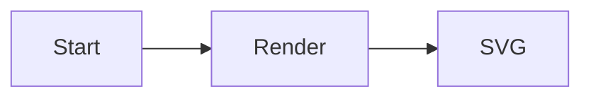

# diagramkit Setup

Goal: take a repo from nothing to fully working diagramkit with one agent pass.

## Anchor on the locally installed CLI

Always prefer the locally installed CLI/API over a globally installed `diagramkit`. Concretely:

- Read `node_modules/diagramkit/REFERENCE.md` (and `node_modules/diagramkit/llms.txt`) before running any command, so the CLI/API surface you assume matches the version installed in this repo.
- Run `npx diagramkit ...` rather than `diagramkit ...` so npm auto-resolves `./node_modules/.bin/diagramkit`. Equivalent: `./node_modules/.bin/diagramkit ...` or `node ./node_modules/diagramkit/dist/cli/bin.mjs ...`.
- If `node_modules/diagramkit/` does not exist yet, install it first (step 1 below) instead of falling back to a global install.

## Detect existing state

Before changing anything, check:

1. Is `diagramkit` already in `package.json` `dependencies` or `devDependencies`?
2. Is there a `diagramkit.config.json5` or `diagramkit.config.ts` at the repo root?
3. Are there any diagram source files already (`.mermaid`, `.excalidraw`, `.drawio*`, `.dot`, `.gv`, `.graphviz`)? If yes, list a few paths so the user knows what will be rendered.
4. Are `diagramkit-*` skill pointers already installed? Look for any of:
   - `.agents/skills/diagramkit-*/SKILL.md` (canonical pointer location)
   - `.claude/skills/diagramkit-*/SKILL.md`
   - `.cursor/skills/diagramkit-*/SKILL.md`
   - `.codex/skills/diagramkit-*/SKILL.md`
   - `.continue/skills/diagramkit-*/SKILL.md`

   If pointers exist but a new skill has been added to `node_modules/diagramkit/skills/` since the last install (compare directory listings), only write the missing pointers — do not overwrite existing ones.

Skip any step whose outcome already exists.

## Steps

### 1. Install

```bash
npm add diagramkit
```

Only add `sharp` if the user will render PNG/JPEG/WebP/AVIF:

```bash
npm add sharp
```

### 2. Warmup

Install the Playwright Chromium binary (needed for Mermaid, Excalidraw, and Draw.io; skip if Graphviz-only):

```bash
npx diagramkit warmup
```

### 3. Package scripts

Add these to the repo's `package.json` `scripts` (only those that are not present):

```json
{
  "scripts": {
    "render:diagrams": "diagramkit render .",
    "render:diagrams:watch": "diagramkit render . --watch",
    "render:diagrams:check": "diagramkit validate .diagramkit/ --recursive"
  }
}
```

Use the repo's existing naming convention if it has one (e.g. `diagrams:build` instead of `render:diagrams`).

### 4. Project config (only if non-default behavior is needed)

Ask the user if they need any of:

- Custom output directory (default: `.diagramkit/` next to each source).
- Custom default formats (default: `['svg']`).
- Custom default theme (default: `'both'`).
- Output prefix/suffix on filenames.
- A single output folder for all diagrams (`outputDir: './build/images'`).

If yes, create `diagramkit.config.json5`:

```bash
npx diagramkit init --yes
```

Or, for users who need programmatic config (function overrides):

```bash
npx diagramkit init --ts
```

### 5. Install project skills as local pointers into `node_modules`

diagramkit ships every skill inside the npm package at `node_modules/diagramkit/skills/<name>/SKILL.md`. The recommended install is to write **thin pointer SKILL.md files** in this repo that defer to the version-pinned originals — that way every agent reads exactly the skill that matches the installed CLI/API, with no separate fetch step.

**Skill set to install** (all live under `node_modules/diagramkit/skills/`):

| Skill                   | Capability                                                                  |
| ----------------------- | --------------------------------------------------------------------------- |
| `diagramkit-setup`      | Bootstrap (this skill)                                                      |
| `diagramkit-auto`       | Engine routing for new diagram requests                                     |
| `diagramkit-mermaid`    | Authoring + image generation (vector + raster) — Mermaid                    |
| `diagramkit-excalidraw` | Authoring + image generation (vector + raster) — Excalidraw                 |
| `diagramkit-draw-io`    | Authoring + image generation (vector + raster) — Draw.io                    |
| `diagramkit-graphviz`   | Authoring + image generation (vector + raster) — Graphviz                   |
| `diagramkit-review`     | Validation (SVG structure, ``-embed safety) **+ WCAG 2.2 AA contrast** |

#### 5a. Detect target harness folders

Always create the canonical pointer at `.agents/skills/diagramkit-<name>/SKILL.md`. Then mirror it into each harness folder the repo (or the user's tooling) already uses:

| Harness         | Folder              | Detect by                                                |
| --------------- | ------------------- | -------------------------------------------------------- |
| Claude Code     | `.claude/skills/`   | `.claude/` exists, or user mentions Claude / Claude Code |
| Cursor          | `.cursor/skills/`   | `.cursor/` exists, or user mentions Cursor               |
| Codex           | `.codex/skills/`    | `.codex/` exists, or user mentions Codex                 |
| Continue        | `.continue/skills/` | `.continue/` exists, or user mentions Continue           |
| OpenCode / etc. | `.agents/skills/`   | Generic fallback (always written)                        |

If unsure, ask the user once which harness(es) to target. Do not silently create folders for harnesses the repo isn't using.

#### 5b. Write the canonical pointer (`.agents/skills/diagramkit-<name>/SKILL.md`)

For every skill in the table above, create a file at `.agents/skills/diagramkit-<name>/SKILL.md` with this exact template (substituting `<name>` and copying the `description` line from `node_modules/diagramkit/skills/diagramkit-<name>/SKILL.md` so harnesses that index by description still match):

```markdown
---
name: diagramkit-<name>
description: <copy the description line from node_modules/diagramkit/skills/diagramkit-<name>/SKILL.md>
---

# diagramkit-<name>

Follow the version-pinned skill that ships with the locally installed `diagramkit` package:

→ [`node_modules/diagramkit/skills/diagramkit-<name>/SKILL.md`](../../../node_modules/diagramkit/skills/diagramkit-<name>/SKILL.md)

Always anchor on the local install (`npx diagramkit ...`, never a global one). Read `node_modules/diagramkit/REFERENCE.md` first if you have not already.
```

The relative path `../../../node_modules/...` resolves correctly from `.agents/skills/diagramkit-<name>/SKILL.md`.

#### 5c. Mirror into each detected harness folder

For every harness folder detected in 5a, write `<harness>/skills/diagramkit-<name>/SKILL.md` that points at the canonical `.agents/skills/...` file (matches the convention this project already uses for `prj-*` skills):

```markdown
---
name: diagramkit-<name>
description: <same description as above>
---

# diagramkit-<name>

Follow [`.agents/skills/diagramkit-<name>/SKILL.md`](../../../.agents/skills/diagramkit-<name>/SKILL.md). Do not duplicate its content here.
```

(The relative path `../../../.agents/...` works from `.claude/skills/diagramkit-<name>/SKILL.md`, `.cursor/skills/...`, `.codex/skills/...`, and `.continue/skills/...`.)

#### 5d. Commit the pointers

Pointers are tiny and stable across `diagramkit` upgrades — commit them. The actual skill body lives in `node_modules/` (which is gitignored), so the team always reads the version that matches their installed `diagramkit`.

#### 5e. Alternative: GitHub-published skills via `npx skills`

If the repo prefers skills that update **independently** of the installed `diagramkit` package, use the standalone [`skills`](https://github.com/vercel-labs/skills) CLI instead of writing local pointers:

```bash
npx skills add sujeet-pro/diagramkit                       # all diagramkit-* skills, all detected harnesses
npx skills add sujeet-pro/diagramkit -a claude-code -a cursor -a codex
npx skills add sujeet-pro/diagramkit -s diagramkit-setup -s diagramkit-review
npx skills update sujeet-pro/diagramkit                    # refresh later
```

Pick **one** mechanism per repo (local pointers OR `npx skills`) so skills don't drift against each other.

### 6. First render

If diagram source files exist:

```bash
npx diagramkit render .
```

Otherwise, create a hello-world fixture at `diagrams/hello.mermaid`:



Then run:

```bash
npx diagramkit render diagrams/hello.mermaid
ls diagrams/.diagramkit
```

### 7. Embed example

Show the user the `<picture>` pattern for theme-aware embedding in markdown:

```html
<picture>
  <source media="(prefers-color-scheme: dark)" srcset=".diagramkit/hello-dark.svg" />
  <source media="(prefers-color-scheme: light)" srcset=".diagramkit/hello-light.svg" />
  
</picture>
```

### 8. CI hook (optional)

If the repo has CI, recommend adding a render step that fails on drift:

```yaml
- name: Render diagrams
  run: |
    npx diagramkit warmup
    npx diagramkit render . --force
    git diff --exit-code -- '*.svg' '*/.diagramkit/**'
```

## References to read for deeper work

Always resolve these from `node_modules/diagramkit/` (the locally installed copy), not from the global PATH:

- `node_modules/diagramkit/REFERENCE.md` — landing page; **read first** so you anchor on the exact installed version.
- `node_modules/diagramkit/ai-guidelines/usage.md` — agent setup prompts and CLI quick reference.
- `node_modules/diagramkit/ai-guidelines/diagram-authoring.md` — per-engine authoring details (color palettes, theming, embedding patterns).
- `node_modules/diagramkit/llms.txt` — compact CLI reference.
- `node_modules/diagramkit/llms-full.txt` — full CLI + API reference.

## Related skills (installed in step 5)

All of these ship inside `node_modules/diagramkit/skills/` and are surfaced into the repo as thin pointers (step 5b/5c). Every one of them defers image conversion to the same locally installed `diagramkit` CLI — so SVG (vector) and PNG/JPEG/WebP/AVIF (raster) outputs all flow through one tool.

| Skill                   | What it owns                                                                                                                                                       |
| ----------------------- | ------------------------------------------------------------------------------------------------------------------------------------------------------------------ |
| `diagramkit-auto`       | Picks the best engine for a new diagram request, then delegates.                                                                                                   |
| `diagramkit-mermaid`    | Mermaid (flowchart, sequence, class, state, ER, gantt, …) + render to SVG / PNG / JPEG / WebP / AVIF.                                                              |
| `diagramkit-excalidraw` | Excalidraw hand-drawn freeform diagrams + render to SVG / PNG / JPEG / WebP / AVIF.                                                                                |
| `diagramkit-draw-io`    | Draw.io (cloud vendor icons, BPMN, swimlanes) + render to SVG / PNG / JPEG / WebP / AVIF.                                                                          |
| `diagramkit-graphviz`   | Graphviz DOT algorithmic layouts + render to SVG / PNG / JPEG / WebP / AVIF (WASM; no browser).                                                                    |
| `diagramkit-review`     | Validate every SVG (structure, ``-embed safety) **and fix WCAG 2.2 AA contrast** (text vs background). Use for pre-merge / pre-release diagram health checks. |

## Rules

- **Always prefer the locally installed CLI** (`npx diagramkit`, not a globally installed `diagramkit`). If `node_modules/diagramkit/REFERENCE.md` is missing, run `npm add diagramkit` first.
- Never overwrite an existing config file or an existing skill pointer without explicit confirmation.
- Do not install `sharp` unless raster output is required.
- Do not run `warmup` if the project is Graphviz-only (WASM, no browser needed).
- Commit diagram source files (`.mermaid`, etc.) alongside rendered outputs. Never hand-edit SVGs in `.diagramkit/`.
- Default skill-install mechanism is **local pointers** into `node_modules/diagramkit/skills/` (step 5). Only fall back to `npx skills add sujeet-pro/diagramkit` (step 5e) when the user explicitly wants skills that update independently of the installed `diagramkit` package. Never mix both in the same repo.
