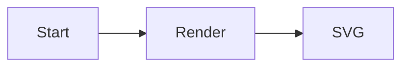

# diagramkit Setup

Goal: take a repo from nothing to fully working diagramkit with one agent pass.

## Anchor on the locally installed CLI

Always prefer the locally installed CLI/API over a globally installed `diagramkit`. Concretely:

- Read `node_modules/diagramkit/REFERENCE.md` (and `node_modules/diagramkit/llms.txt`) before running any command, so the CLI/API surface you assume matches the version installed in this repo.
- Run `npx diagramkit ...` rather than `diagramkit ...` so npm auto-resolves `./node_modules/.bin/diagramkit`. Equivalent: `./node_modules/.bin/diagramkit ...` or `node ./node_modules/diagramkit/dist/cli/bin.mjs ...`.
- If `node_modules/diagramkit/` does not exist yet, install it first (step 1 below) instead of falling back to a global install.

## Detect existing state

Before changing anything, check:

1. Is `diagramkit` already in `package.json` `dependencies` or `devDependencies`?
2. Is there a `diagramkit.config.json5` or `diagramkit.config.ts` at the repo root?
3. Are there any diagram source files already (`.mermaid`, `.excalidraw`, `.drawio*`, `.dot`, `.gv`, `.graphviz`)? If yes, list a few paths so the user knows what will be rendered.
4. Are diagramkit-_ skills already installed (e.g. `.claude/skills/diagramkit-setup/SKILL.md`, `.cursor/skills/diagramkit-mermaid/SKILL.md`, `.codex/skills/diagramkit-auto/SKILL.md`, `.agents/skills/diagramkit-_`)?

Skip any step whose outcome already exists.

## Steps

### 1. Install

```bash
npm add diagramkit
```

Only add `sharp` if the user will render PNG/JPEG/WebP/AVIF:

```bash
npm add sharp
```

### 2. Warmup

Install the Playwright Chromium binary (needed for Mermaid, Excalidraw, and Draw.io; skip if Graphviz-only):

```bash
npx diagramkit warmup
```

### 3. Package scripts

Add these to the repo's `package.json` `scripts` (only those that are not present):

```json
{
  "scripts": {
    "render:diagrams": "diagramkit render .",
    "render:diagrams:watch": "diagramkit render . --watch",
    "render:diagrams:check": "diagramkit validate .diagramkit/ --recursive"
  }
}
```

Use the repo's existing naming convention if it has one (e.g. `diagrams:build` instead of `render:diagrams`).

### 4. Project config (only if non-default behavior is needed)

Ask the user if they need any of:

- Custom output directory (default: `.diagramkit/` next to each source).
- Custom default formats (default: `['svg']`).
- Custom default theme (default: `'both'`).
- Output prefix/suffix on filenames.
- A single output folder for all diagrams (`outputDir: './build/images'`).

If yes, create `diagramkit.config.json5`:

```bash
npx diagramkit init --yes
```

Or, for users who need programmatic config (function overrides):

```bash
npx diagramkit init --ts
```

### 5. Install project skills via the standalone `skills` CLI

diagramkit does not ship its own "install skill" command. Use the standalone [`skills`](https://github.com/vercel-labs/skills) CLI — it works for Claude Code, Cursor, Codex, Continue, OpenCode, and 41+ other agents:

```bash
# Default: install every diagramkit-* skill into the agents this repo already supports
npx skills add sujeet-pro/diagramkit

# Target specific agent(s) (any combination)
npx skills add sujeet-pro/diagramkit -a claude-code -a cursor -a codex

# Install only specific skills
npx skills add sujeet-pro/diagramkit -s diagramkit-setup -s diagramkit-mermaid

# Use --copy if symlinks are not desirable (e.g. Windows / committed skills)
npx skills add sujeet-pro/diagramkit --copy

# Refresh later without bumping diagramkit
npx skills update sujeet-pro/diagramkit
```

If `npx skills` is unavailable (older toolchains), copy the folders manually from `node_modules/diagramkit/skills/diagramkit-*/` into the agent skill directory the project uses (`.claude/skills/`, `.cursor/skills/`, `.codex/skills/`, `.continue/skills/`, or `.agents/skills/`).

### 6. First render

If diagram source files exist:

```bash
npx diagramkit render .
```

Otherwise, create a hello-world fixture at `diagrams/hello.mermaid`:



Then run:

```bash
npx diagramkit render diagrams/hello.mermaid
ls diagrams/.diagramkit
```

### 7. Embed example

Show the user the `<picture>` pattern for theme-aware embedding in markdown:

```html
<picture>
  <source media="(prefers-color-scheme: dark)" srcset=".diagramkit/hello-dark.svg" />
  <source media="(prefers-color-scheme: light)" srcset=".diagramkit/hello-light.svg" />
  
</picture>
```

### 8. CI hook (optional)

If the repo has CI, recommend adding a render step that fails on drift:

```yaml
- name: Render diagrams
  run: |
    npx diagramkit warmup
    npx diagramkit render . --force
    git diff --exit-code -- '*.svg' '*/.diagramkit/**'
```

## References to read for deeper work

Always resolve these from `node_modules/diagramkit/` (the locally installed copy), not from the global PATH:

- `node_modules/diagramkit/REFERENCE.md` — landing page; **read first** so you anchor on the exact installed version.
- `node_modules/diagramkit/ai-guidelines/usage.md` — agent setup prompts and CLI quick reference.
- `node_modules/diagramkit/ai-guidelines/diagram-authoring.md` — per-engine authoring details (color palettes, theming, embedding patterns).
- `node_modules/diagramkit/llms.txt` — compact CLI reference.
- `node_modules/diagramkit/llms-full.txt` — full CLI + API reference.

## Related skills (installed via `npx skills`)

The following per-engine authoring skills ship in `node_modules/diagramkit/skills/` and are also published in the diagramkit GitHub repo so `npx skills add sujeet-pro/diagramkit` can install them into any agent:

- `diagramkit-auto` — routing skill that picks the best engine for a task.
- `diagramkit-mermaid` — Mermaid (flowchart, sequence, class, state, ER, gantt, ...) + render to SVG/PNG/JPEG/WebP/AVIF.
- `diagramkit-excalidraw` — Excalidraw hand-drawn freeform diagrams + render to SVG/PNG/JPEG/WebP/AVIF.
- `diagramkit-draw-io` — Draw.io (cloud vendor icons, BPMN, swimlanes) + render to SVG/PNG/JPEG/WebP/AVIF.
- `diagramkit-graphviz` — Graphviz DOT algorithmic layouts + render to SVG/PNG/JPEG/WebP/AVIF.

All of them defer image conversion to the same locally installed diagramkit CLI, so SVG, PNG, JPEG, WebP, and AVIF outputs all flow through one tool.

## Rules

- **Always prefer the locally installed CLI** (`npx diagramkit`, not a globally installed `diagramkit`). If `node_modules/diagramkit/REFERENCE.md` is missing, run `npm add diagramkit` first.
- Never overwrite an existing config file without explicit confirmation.
- Do not install `sharp` unless raster output is required.
- Do not run `warmup` if the project is Graphviz-only (WASM, no browser needed).
- Commit diagram source files (`.mermaid`, etc.) alongside rendered outputs. Never hand-edit SVGs in `.diagramkit/`.
- Skill installation is delegated to `npx skills` (Vercel Labs); diagramkit does not ship its own install command.
